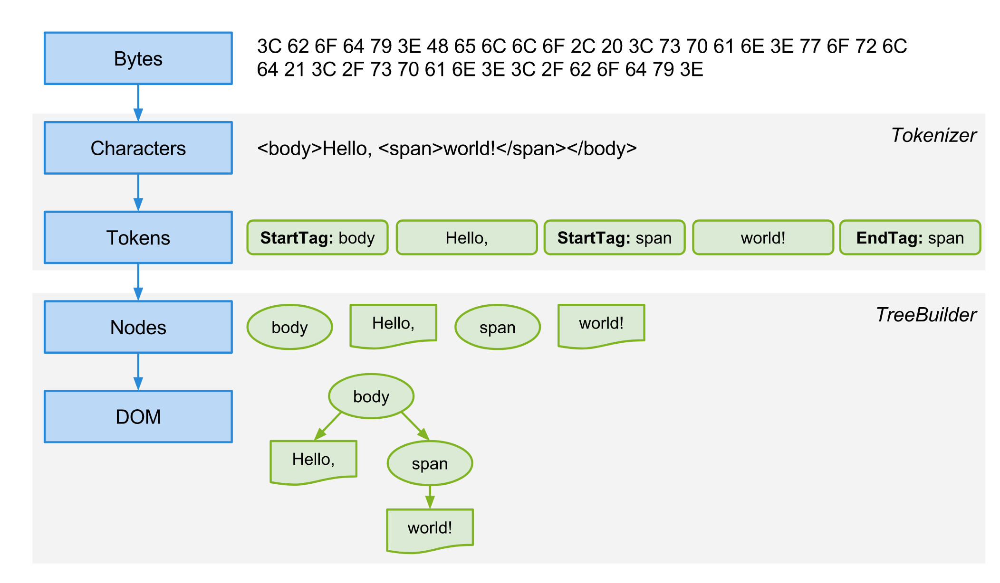
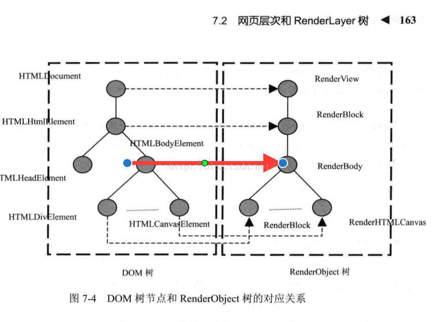
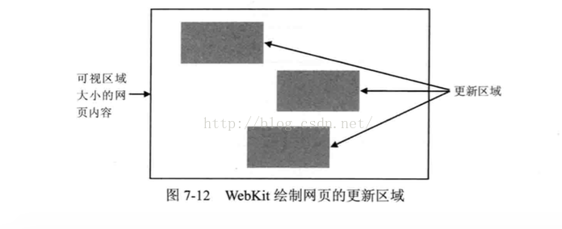

#### 主要内容
在本章节，主要是一些渲染引擎相关内容。通过这部分内容我希望自己能够更多的了解浏览器，不仅仅是JS引擎，也包括渲染引擎。这样对于很多优化的手段也能有更深入的了解。如果你有任何问题欢迎issue,同时也欢迎star！

#### 1.Webkit的渲染过程
下面围绕的DOM内容结构为如下形式:
```html
<body>Hello,<span>world!</span></body>
```
##### 1.1 第一阶段：从网页的url到构建完DOM树
网页在加载和渲染过程中会发出DOMcontent事件和DOM的onload事件，分别在DOM树构建完成以及DOM树构建完并且网页所依赖的资源都加载完成之后。具体过程如下：


1.网页输入URL时候，Webkit调用其资源加载器（总共有三类：特定资源加载器如**ImageLoader**,资源缓存机制的资源加载器如**CachedResourceLoader**,通用资源加载器**ResourceLoader**）加载该URL对应的网页


2.加载器依赖网页模块建立连接，发起请求并接受回复

3.Webkit接受到各种网页或者资源的数据，其中某些资源可能是异步的或者同步的

4.网页被加载给html解释器变成一系列的词语（token）

5.解析器根据词语构建节点node,形成DOM树

6.如果节点是js代码的话，调用**js引擎**解释并执行

7.js代码可能会修改DOM树的结构

8.如果节点需要依赖其他资源，例如图片，css，视频等，调用资源加载器加载他们，但是他们是异步的，不会阻碍当前DOM树的构建。如果是js资源，那么需要**停止**当前DOM树的构建，直到js资源加载并将被js引擎执行后才继续DOM树的构建。我们看看html解析器的解析过程：



该图中可以看到:网络字节流通过**Tokenizer**和**TreeBuilder**两个主要过程转化为了最终的DOM树结构。

##### 1.2 第二阶段：CSS和DOM树构建RenderOject树
下面先讲述下基本的概念:
- RenderObject对象

  对于所有的**可视节点**（script,meta,head等除外）Webkit都会建立RenderObject对象，该对象保存了为绘制DOM节点所必需的各种信息，例如样式布局信息，经过Webkit处理后RenderObject对象知道如何绘制自己。下面情况都会为DOM节点建立RenderObject对象：

  DOM树的`document`节点;DOM树中的可视节点，如html，div等，Webkit不会为非可视节点创建RenderObject对象；某些情况下需要创建匿名的RenderObject对象，其不对应DOM树中任何节点，只是Webkit处理上的需要，典型的就是匿名的RenderBlock节点

- RenderObject树

  上述RenderObject对象同DOM节点类似，也构成一棵树，称为RenderObject树。RenderObject树是基于DOM树建立的一颗新树，是为了**布局计算**和**渲染**等机制建立的一种新的内部表示。如果DOM树中被动态添加了新的节点，Webkit也需要创建相应的RenderObject对象。RenderObject树的建立并**不**表示DOM树被销毁，事实上上面四个内部表示结构一直存在，直到网页被销毁，因为他们对于网页的渲染起了很大的作用。下面是一个RenderObject树的实例:

  

   注意：从上图可以看出HTMLDocument节点对应于RenderView节点，RenderView节点是RenderObject树的根节点。同时head元素也没有创建RenderObject对象。

- RenderObject树与元素具体位置

  当Webkit创建了RenderObject对象后每个对象都是**不知道**自己的位置，大小等信息的（实际的布局计算在RenderObject类中），Webkit根据**框模型**计算他们的位置大小等信息的过程称为**布局计算或者排版**。布局计算分为两类：第一类是对整个RenderObject树进行计算。第二类是对RenderObject中某个子树的计算(常见于文本元素或者overflow：auto块的计算，这种情况一般是子树布局的改变不会影响其周围元素的布局，因此不需要计算更大范围内的布局)。

  布局计算是一个递归的过程，这是因为一个节点的大小通常需要计算他的子女节点的位置大小等信息。步骤如下：

  (1)首先，函数（RenderObject的layout函数）判断RenderObject节点**是否需要**重新计算。通常需要检查位数组中的相应标记位，子女是否要重新计算等

  (2)其次，函数确定网页的宽度和垂直方向上的**外边距**，这是因为网页通常是在垂直方向上滚动而水平方向上尽量不需要滚动。

  (3)再次，函数会**遍历每一个子女节点**，依次计算他们的布局。每一个元素会实现自己的layout函数，根据特定的算法来计算该类型元素的布局，如果页面元素定义了自身的宽高。那么Webkit按照定义的宽高来确定元素的大小，而对于文字节点这样的内联元素需要结合字号大小和文字的多少来确定对应的宽高。如果页面元素所确定的宽高超出了布局容器所提供的宽高，同时overflow为visible或者auto，Webkit会提供滚动条显示所有内容。除非网页定义了页面元素的宽高，一般来说页面元素的宽高是在布局的时候通过**计算得到**的。如果元素有子女元素那么需要递归这个过程。

  (4)最后，节点依据子女们的大小计算的高度得到自己的高度，整个过程结束

  那么哪些情况下需要重新计算：

   (1)首先，网页首次打开的时候，浏览器设置网页的可视区域，并调用计算布局的方法。这也是一个可见的场景，就是当可视区域发生变化的时候，Webkit都需要重新计算布局，这是因为网页块大小发生了变化（rem时候很显然）

   (2)其次，网页的动画会触发布局计算，当网页显示结束后动画可能改变样式属性，那么Webkit需要重新计算

   (3)然后，js代码通过cssom等直接修改样式信息，也会触发Webkit重新计算布局

   (4)最后，用户的交互也会触发布局计算，如翻滚网页，这会触发新区域布局的计算
   注意：布局计算相对比较耗时，一旦布局发生变化，Webkit就需要后面的重绘制操作。另一方面，减少样式的变动而依赖现在html5新功能可能有效的提高网页的渲染效率。

##### 1.3 进行渲染的RenderLayer树
创建的RenderLayers树能**映射**到RenderObject中，这个映射是一对多的行为，因为某一个RenderObject要么有自己的RenderLayer，要么属于它父级节点的RenderLayer。
- 网页分层原理

享有**相同坐标空间**(比如设置了相同的css transform)的RenderObject通常都属于同一个RenderLayer。RenderLayer之所以存在是为了页面中的元素能够按照正确的顺序来展示，如当内容存在**重叠**的情况，或者存在**半透明**元素等的时候。RenderLayer也是一个树形结构，RenderLayer的根节点对应于页面的根节点，而页面中其他元素创建的RenderLayer对应于根节点的RenderLayer的子级节点。每一个RenderLayer的子级RenderLayer节点都被保存到两个有序集合中，并按照z-index的顺序排序。对于那些处于当前RenderLayer下面的子级RenderLayer被放到negZOrderList集合中，而那些处于当前RenderLayer之上的子级layer将会放在posZOrderList集合中。之所以引入RenderLayer有以下两个原因:
<pre>
原因之一是方便网页开发者开发网页并设置网页的层次
原因之二是为了Webkit处理上的便利，也就是说为了简化渲染的逻辑。
</pre>
Webkit会为网页的层次创建相应的RenderLayer对象。当某些类型的RenderObject的节点或者具有某些css样式的RenderObject节点出现的时候，Webkit就会为这些节点创建RenderLayer对象。RenderLayer树是基于RenderObject树建立起来的一颗**新**树，而且RenderLayer节点和RenderObject节点不是一一对应关系，而是一对多的关系。某一个[RenderObject要么属于自己的RenderLayer，要么就属于它的父级的RenderLayer](https://www.chromium.org/developers/design-documents/gpu-accelerated-compositing-in-chrome)。

- 网页分层的具体情况

下面的情况RenderObject对象需要建立新的RenderLayer节点:
<pre>
(1)It's the root object for the page
(2)It has explicit CSS position properties (relative, absolute or a transform)
(3)It is transparent
(4)Has overflow, an alpha mask or reflection
(5)Has a CSS filter
(6)Corresponds to <canvas> element that has a 3D (WebGL) context or an accelerated 2D context
(7)Corresponds to a <video> element
</pre>
下面是做的简单翻译：
<pre>
（1）dom树的document节点对应的renderview节点
（2）dom树中的document的子女节点，也就是html节点对应的renderblock节点
（3）显式地指定css位置的RenderObject对象
（4）有透明效果(transparent)的RenderObject对象
（5）有节点溢出（overflow），alpha或者反射等效果的RenderObject对象
（6）使用canvas2d和3d(webgl)技术的RenderObject对象
（7）video节点对应的RenderObject对象
</pre>

- 我对RenderLayer的理解

  浏览器渲染引擎并不是直接使用RenderObject树进行绘制,虽然RenderObject树中每一个元素都明确的知道其在页面中的位置。但是为了方便处理 Positioning（定位），Clipping（裁剪），Overflow-scroll（页內滚动），CSS Transform/Opacity/Animation/Filter，Mask or Reflection，Z-indexing（Z排序）等，浏览器需要生成另外一棵树RenderLayer树。顾名思义:它是一棵**层级树(按照z-index排序的树)**!根据上面对于negZOrderList,posZOrderList的说明:首先是针对document创建了一个RenderLayer节点，然后将小于当前z-index的放在negZOrderList，而将大于当前z-index的元素放在了posZOrderList中，并依次按此处理子级的元素并创建RenderLayer。最后按照整棵RenderLayer树去渲染网页就能够有效的处理定位等元素重叠或者存在半透明的情况!


##### 1.4 RenderLayer树到GraphicsLayers树
- 什么是独立后端存储以及创建条件

  为了有效的使用合成器，有些RenderLayers会有自己的后端存储，具有自己后端存储的RenderLayer叫做合成层。每一个RenderLayer要么有自己的GraphicsLayer(它本身就是合成层)，要么使用它最近的父节点的GraphicsLayer(这也意味着该元素会和其父元素一起重绘)。他们的关系与RenderObject和RenderLayers的关系一样。

  每一个GraphicsLayer有自己的GraphicsContext，这样相应的RenderLayers就可以直接把渲染内容推入到GraphicsContext里面。最后合成器负责将GraphicsContexts的bitmap通过一系列的过程转化为屏幕中的最终图像。

  虽然理论上说，每一个RenderLayer都可以有一个单独的后端存储GraphicsLayer，但是在实际情况下这样非常消耗内存资源，特别是VRAM。在chrome的当前blink实现中，满足下面条件就会有自己的后端存储,你可以[点击这里](http://blog.csdn.net/liangklfang/article/details/52074738)查看:
  <pre>
    Layer has 3D or perspective transform CSS properties   
    Layer is used by <video> element using accelerated video decoding  
    Layer is used by a <canvas> element with a 3D context or accelerated 2D context
    Layer is used for a composited plugin
    Layer uses a CSS animation for its opacity or uses an animated Webkit transform
    Layer uses accelerated CSS filters 
    Layer has a descendant that is a compositing layer  
    Layer has a sibling with a lower z-index which has a compositing layer (in other words the layer overlaps a composited layer and should be rendered on top of it)
  </pre>
   这里也给出一个[完整例子](http://blog.csdn.net/liangklfang/article/details/52074738):

```html
    <h1>Poster Circle</h1>
    <p>This is a simple example of how to use CSS transformation and animations to get interesting-looking behavior.</p>
    <p>The three rings are constructed using a simple JavaScript function that creates elements and assigns them a transform
      that describes their position in the ring. CSS animations are then used to rotate each ring, and to spin the containing
      element around too.</p>
    <p>Note that you can still select the numbers on the ring; everything remains clickable.</p>
    <div id="stage">
      <div id="rotate">
        <div id="ring-1" class="ring"></div>
        <div id="ring-2" class="ring"></div>
        <div id="ring-3" class="ring"></div>
      </div>
    </div>
```

  默认情况下negZOrderList,posZOrderList已经被排列好，html的z-index默认为auto，而stage创建了层叠上下文，所以他被分配到posZOrderList中。而当你把p标签的z-index设置为1,同时position为relative，那么它也会比html的层叠上下文高，所以它也会被分配到posZOrderList，而且其z-index的值比stage还高，所以chrome为了安全起见也会给p元素创建一个独立的图层，这就是官方文档说的[Layer Squashing](https://www.chromium.org/developers/design-documents/gpu-accelerated-compositing-in-chrome)，而且只有这样，我们的p元素因为z-index的设置才会覆盖在stage的上面，这也是符合RenderLayer的Layer的意思的。

- chrome网页渲染的方式

  构建完了dom树之后，Webkit所要做的事情就是构建渲染的内部表达并使用图形库将这些模型绘制出来。网页的渲染方式有两种，第一种是**软件渲染**，第二种是**硬件加速**渲染。每一个层对应于网页中的一个或者一些可视元素，这些元素绘制内容到这个层中。如果绘图操作使用CPU来完成就叫做软件绘图，
  如果绘图操作使用gpu来完成，那么就叫做gpu硬件加速绘图。

  理想情况下每一个层都有一个绘制的存储区域(后端存储GraphicsLayer)，这个存储区域用于**保存**绘图的结果。最后需要把这些层的内容合并到同一个图像之中，叫做**合成**（compositing）。使用了合成技术的渲染称之为合成化渲染。

  在RenderObject树和RenderLayer树之后，Webkit的内部操作将内部模型转化为可视结果分为两个阶:**每层的内容进行绘图工作**以及之后将这些绘图的结果**合并**为一个图像。如果对于软件渲染，那么需要使用CPU来绘制每一层的内容，但是他是**没有合成阶段**的，因为在软件渲染中，渲染的结果就是一个位图，绘制每一层的时候**都使用**这个位图，区别在于绘制的位置可能不一样，当然每一层都是按照从后到前的顺序。当然你也可以为每一层分配一个位图，但是一个位图已经可以解决所有的问题了。

  

- 各种渲染方式的比较

   软件渲染中网页使用的一个位图，实际上是一块CPU使用**内存**。第二种和第三种方式都是使用了合成化的渲染技术，也就是使用gpu硬件加速来合成这些网页，合成的技术都是使用gpu来做的，所以叫做硬件加速。但是，对于每一个层这两种方式有不同的选择。如第二种方式，某些层使用gpu而某些层使用CPU，对于CPU绘制的层，该层的结果首先当然保存在CPU内存中，之后被传输到gpu的内存中，这主要是为了后面的合成工作。第三种方式使用gpu来绘制所有的合成层。第二种和第三种方式都属于硬件加速渲染方式。那么上面三种绘图有什么区别？

   首先，对于常见的2d绘图操作，使用gpu来绘图不一定比CPU绘图在性能上有优势，因为CPU的使用**缓存**机制有效减少了重复绘制的开销而且不需要**gpu并行性**。

   其次，gpu的内存资源相对于CPU的**内存资源**来说比较紧张，而且网页的分层使得gpu的内存使用相对比较多。

   然后,软件渲染是浏览器最早的渲染机制，比较节省内存特别是宝贵的gpu内存，但是软件渲染**只能处理2d**方面的操作。简单的网页没有复杂绘图或者多媒体方面的需求，软件渲染就适合处理这种类型的网页。但是如果遇到html5新技术那么软件渲染就无能为力，一是因为`能力不足`，如css3d，webGL;二是因为`性能不好`，如canvas2d和视频。因此软件渲染被用的越来越少，特别是移动领域。

   然后,软件渲染和硬件加速渲染另外一个很不同的地方在于对**更新区域**的处理，当网页有一个更小型区域的请求如动画时(这种方式一般会采用独立的合成层，该问题就能够解决)，软件渲染只要**计算极小的区域**，而硬件渲染可能需要重绘其中的`一层或者多层`，然后再`合成`这些层，硬件渲染的代价可能大得多。

   最后，硬件加速的合成：每一个层的绘制和所有层的合成均使用gpu硬件来完成，这对需要使用3d绘图的操作来说特别合适。在这种方式下，在RenderLayer树之后，Webkit和chromium还需要建立更多的内部表示，例如graphiclayer。但是，一方面，硬件加速能够支持现在所有的html5定义的2d或者3d绘图标准；另外一方面，关于更新区域的讨论，如果需要更新**某个层的一个区域**，因为软件渲染没有为每一层提供后端存储，因而它需要将和这个区域有重叠部分的所有的层次相关区域依次从后向前重新绘制一遍，而硬件加速渲染只是需要重新绘制更新发生的层次，因而在某些情况下，软件渲染的代价更大，当然，这取决于网页的结构和渲染策略。

- chrome并非全量更新渲染

  很多情况下，也就是没有**硬件加速**内容的时候（css3变形，变换，webgl，视频），Webkit可以使用软件渲染来完成页面的绘制工作。软件渲染需要关注两个方面，分别是RenderLayer树和RenderObject树。那么Webkit如何遍历RenderLayer树来绘制每一个层？对于每一个RenderObject对象，需要三个阶段绘制自己。

  第一阶段：绘制该层中的所有块的**背景**和**边框** 

  第二阶段：绘制`浮动`内容 

  第三阶段：前景也就是**内容**部分，**轮廓**等部分。注意：`内联元素的背景，边框，前景都是在第三阶段被绘制的`，这是不同之处。

  注意：在最开始的时候，也就是Webkit**第一次**绘制网页的时候，Webkit绘制的
  区域等同于可视区域的大小，而在这之后，Webkit只是首先**计算需要更新的区域**，然后绘制同这些区域有**交集**的RenderObject节点。这也就是说，如果更新区域跟某个
  RenderLayer节点有交集，Webkit会继续查找Renderlayer树中包含deRenderObject子树中的特定的一个或者一些节点而不是绘制整个RenderLayer对应的RendeObject子树。
  
  
 

#### 2.那些还在思考的问题
##### 2.1 image加载会走事件循环吗,DOM树中的请求是并发发出去的吗
目前从我的理解来说，image加载虽然是通过chrome一个单独的线程发送出去的，但是它并不需要走事件循环。页面UI渲染是通过事件循环来调度的，但是image本身下载完成后插入的过程并不需要事件循环来介入。所以image的加载和插入都是通过chrome渲染引擎来完成的,而不受到js引擎事件循环的调度!


参考资料:

[Webkit技术内幕ppt](https://docs.google.com/presentation/d/1ZRIQbUKw9Tf077odCh66OrrwRIVNLvI_nhLm2Gi__F0/embed?start=false&loop=false&delayms=3000&slide=id.g312aaaf6_1_148)

[关于硬件加速哪些优秀的资源总结](http://blog.csdn.net/liangklfang/article/details/52074738)

[GPU硬件加速的那些优秀的资源总结－续](http://blog.csdn.net/liangklfang/article/details/51638130)

[GPU Accelerated Compositing in Chrome](https://www.chromium.org/developers/design-documents/gpu-accelerated-compositing-in-chrome)

[WebKit for Developers](https://www.paulirish.com/2013/Webkit-for-developers/)

[Blink Compositing Update: Recap and Squashing](https://docs.google.com/presentation/d/1WOhbWLkhMyo4vZUaHq-FO-mt0B2sejXw-lMwohD5iUo/edit#slide=id.g2a8a2080a_022)

[Compositing in Blink / WebCore: From WebCore::RenderLayer to cc:Layer](https://docs.google.com/presentation/d/1dDE5u76ZBIKmsqkWi2apx3BqV8HOcNf4xxBdyNywZR8/edit#slide=id.gccb6cccc_072)

[Accelerated Rendering in Chrome](https://www.html5rocks.com/en/tutorials/speed/layers/)
