#### 主要内容
在本章节，主要是一些渲染引擎相关内容。通过这部分内容我希望自己能够更多的了解浏览器，不仅仅是JS引擎，也包括渲染引擎。这样对于很多优化的手段也能有更深入的了解。如果你有任何问题欢迎issue,同时也欢迎star！

#### 1.Webkit的渲染过程
下面围绕的DOM内容结构为如下形式:
```html
<body>Hello,<span>world!</span></body>
```
##### 1.1 第一阶段：从网页的url到构建完DOM树
网页在加载和渲染过程中会发出DOMcontent事件和DOM的onload事件，分别在DOM树构建完成以及DOM树构建完并且网页所依赖的资源都加载完成之后。具体过程如下：

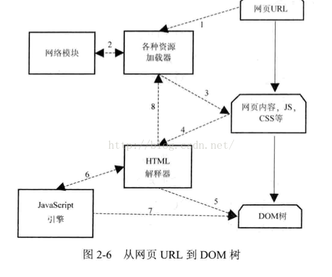

1.网页输入URL时候，Webkit调用其资源加载器。总共有三类：特定资源加载器如**ImageLoader**,资源缓存机制的资源加载器如**CachedResourceLoader**,通用资源加载器[**ResourceLoader**](https://sites.google.com/a/chromium.org/dev/developers/design-documents/multi-process-resource-loading)加载该URL对应的网页。其中里面的**ResourceRequest**值得说一下，每发个请求会生成一个ResourceRequest对象，这个对象包含了http请求的所有信息,包括url、http header、http body等，还有请求的优先级信息等,然后会根据页面的`加载策略`对这个请求做一些预处理。

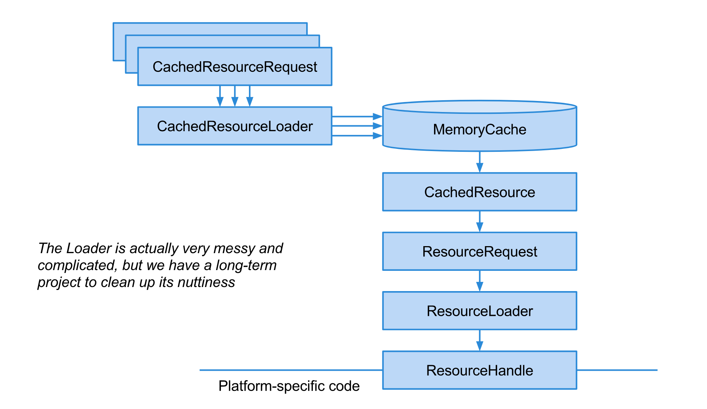

如下是预处理的逻辑:
```c
PrepareRequestResult result = PrepareRequest(params, factory, substitute_datc                             identifier, blocked_reason);
  if (result == kAbort)
    return nullptr;
  if (result == kBlock)
    return ResourceForBlockedRequest(params, factory, blocked_reason);
```
prepareRequest会做两件事情，一件是检查请求是否合法，第二件是把请求做些修改。如果检查合法性返回`kAbort`或者`kBlock`，说明资源被废弃了或者被阻止了，就不去加载了。被block的原因可能有以下几种：
```c
enum class ResourceRequestBlockedReason {
  kCSP,              
  // CSP内容安全策略检查，通过指定Content-Security-Policy为upgrade-insecure-requests
  // 解决https与http混合问题
  kMixedContent,     
  // mixed content，包括主动混合和被动混合
  kOrigin,           // secure origin
  kInspector,        // devtools的检查器
  kSubresourceFilter,
  kOther,
  kNone
};
```
下面是官方给出的图解:

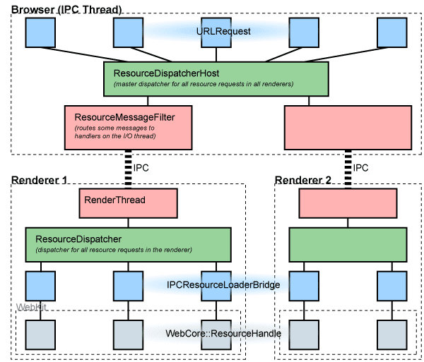

其中需要注意的是**ResourceDispatcher**(每一个渲染进程都有一个实例)与**ResourceDispatcherHost**，其中ResourceDispatcher会创建一个唯一的请求ID，然后将这个请求通过IPC通道传递给Browser进程(请查看本文后面部分)，因此请求最后是通过Browser[进程发布出去的](https://sites.google.com/a/chromium.org/dev/developers/design-documents/multi-process-resource-loading)。

2.加载器依赖网页模块建立连接，发起请求并接受回复

3.Webkit接受到各种网页或者资源的数据，其中某些资源可能是异步的或者同步的

4.网页被加载给html解释器变成一系列的词语（token）

5.解析器根据词语构建节点node,形成DOM树

6.如果节点是js代码的话，调用**js引擎**解释并执行

7.js代码可能会修改DOM树的结构

8.如果节点需要依赖其他资源，例如图片，css，视频等，调用资源加载器加载他们，但是他们是异步的，不会阻碍当前DOM树的构建。如果是js资源，那么需要**停止**当前DOM树的构建，直到js资源加载并将被js引擎执行后才继续DOM树的构建。我们看看html解析器的解析过程：


该图中可以看到:网络字节流通过**Tokenizer**和**TreeBuilder**两个主要过程转化为了最终的DOM树结构。

##### 1.2 第二阶段：CSS和DOM树构建RenderOject树
下面先讲述下基本的概念:
- RenderObject对象

  对于所有的**可视节点**（script,meta,head等除外）Webkit都会建立RenderObject对象，该对象保存了为绘制DOM节点所必需的各种信息，例如样式布局信息，经过Webkit处理后RenderObject对象知道如何绘制自己。下面情况都会为DOM节点建立RenderObject对象：

  DOM树的`document`节点;DOM树中的可视节点，如html，div等，Webkit不会为非可视节点创建RenderObject对象；某些情况下需要创建匿名的RenderObject对象，其不对应DOM树中任何节点，只是Webkit处理上的需要，典型的就是匿名的RenderBlock节点

- RenderObject树

  上述RenderObject对象同DOM节点类似，也构成一棵树，称为RenderObject树。RenderObject树是基于DOM树建立的一颗新树，是为了**布局计算**和**渲染**等机制建立的一种新的内部表示。如果DOM树中被动态添加了新的节点，Webkit也需要创建相应的RenderObject对象。RenderObject树的建立并**不**表示DOM树被销毁，事实上上面四个内部表示结构一直存在，直到网页被销毁，因为他们对于网页的渲染起了很大的作用。下面是一个RenderObject树的实例:

  

   注意：从上图可以看出HTMLDocument节点对应于RenderView节点，RenderView节点是RenderObject树的根节点。同时head元素也没有创建RenderObject对象。

- RenderObject树与元素具体位置

  当Webkit创建了RenderObject对象后每个对象都是**不知道**自己的位置，大小等信息的（实际的布局计算在RenderObject类中），Webkit根据**框模型**计算他们的位置大小等信息的过程称为**布局计算或者排版**。布局计算分为两类：第一类是对整个RenderObject树进行计算。第二类是对RenderObject中某个子树的计算(常见于文本元素或者overflow：auto块的计算，这种情况一般是子树布局的改变不会影响其周围元素的布局，因此不需要计算更大范围内的布局)。

  布局计算是一个递归的过程，这是因为一个节点的大小通常需要计算他的子女节点的位置大小等信息。步骤如下：

  (1)首先，函数（RenderObject的layout函数）判断RenderObject节点**是否需要**重新计算。通常需要检查位数组中的相应标记位，子女是否要重新计算等

  (2)其次，函数确定网页的宽度和垂直方向上的**外边距**，这是因为网页通常是在垂直方向上滚动而水平方向上尽量不需要滚动。

  (3)再次，函数会**遍历每一个子女节点**，依次计算他们的布局。每一个元素会实现自己的layout函数，根据特定的算法来计算该类型元素的布局，如果页面元素定义了自身的宽高。那么Webkit按照定义的宽高来确定元素的大小，而对于文字节点这样的内联元素需要结合字号大小和文字的多少来确定对应的宽高。如果页面元素所确定的宽高超出了布局容器所提供的宽高，同时overflow为visible或者auto，Webkit会提供滚动条显示所有内容。除非网页定义了页面元素的宽高，一般来说页面元素的宽高是在布局的时候通过**计算得到**的。如果元素有子女元素那么需要递归这个过程。

  (4)最后，节点依据子女们的大小计算的高度得到自己的高度，整个过程结束

  那么哪些情况下需要重新计算：

   (1)首先，网页首次打开的时候，浏览器设置网页的可视区域，并调用计算布局的方法。这也是一个可见的场景，就是当可视区域发生变化的时候，Webkit都需要重新计算布局，这是因为网页块大小发生了变化（rem时候很显然）

   (2)其次，网页的动画会触发布局计算，当网页显示结束后动画可能改变样式属性，那么Webkit需要重新计算

   (3)然后，js代码通过cssom等直接修改样式信息，也会触发Webkit重新计算布局

   (4)最后，用户的交互也会触发布局计算，如翻滚网页，这会触发新区域布局的计算
   注意：布局计算相对比较耗时，一旦布局发生变化，Webkit就需要后面的重绘制操作。另一方面，减少样式的变动而依赖现在html5新功能可能有效的提高网页的渲染效率。

##### 1.3 进行渲染的RenderLayer树
创建的RenderLayers树能**映射**到RenderObject中，这个映射是一对多的行为，因为某一个RenderObject要么有自己的RenderLayer，要么属于它父级节点的RenderLayer。

- 网页分层原理

享有**相同坐标空间**(比如设置了相同的css transform)的RenderObject通常都属于同一个RenderLayer。RenderLayer之所以存在是为了页面中的元素能够按照正确的顺序来展示，如当内容存在**重叠**的情况，或者存在**半透明**元素等的时候。RenderLayer也是一个树形结构，RenderLayer的根节点对应于页面的根节点，而页面中其他元素创建的RenderLayer对应于根节点的RenderLayer的子级节点。每一个RenderLayer的子级RenderLayer节点都被保存到两个有序集合中，并按照z-index的顺序排序。对于那些处于当前RenderLayer下面的子级RenderLayer被放到negZOrderList集合中，而那些处于当前RenderLayer之上的子级layer将会放在posZOrderList集合中。之所以引入RenderLayer有以下两个原因:
<pre>
原因之一是方便网页开发者开发网页并设置网页的层次
原因之二是为了Webkit处理上的便利，也就是说为了简化渲染的逻辑。
</pre>
Webkit会为网页的层次创建相应的RenderLayer对象。当某些类型的RenderObject的节点或者具有某些css样式的RenderObject节点出现的时候，Webkit就会为这些节点创建RenderLayer对象。RenderLayer树是基于RenderObject树建立起来的一颗**新**树，而且RenderLayer节点和RenderObject节点不是一一对应关系，而是一对多的关系。某一个[RenderObject要么属于自己的RenderLayer，要么就属于它的父级的RenderLayer](https://www.chromium.org/developers/design-documents/gpu-accelerated-compositing-in-chrome)。

- 网页分层的具体情况

下面的情况RenderObject对象需要建立新的RenderLayer节点:
<pre>
(1)It's the root object for the page
(2)It has explicit CSS position properties (relative, absolute or a transform)
(3)It is transparent
(4)Has overflow, an alpha mask or reflection
(5)Has a CSS filter
(6)Corresponds to canvas element that has a 3D (WebGL) context or an accelerated 2D context
(7)Corresponds to a video element
</pre>
下面是做的简单翻译：
<pre>
（1）dom树的document节点对应的RenderView节点
（2）dom树中的document的子女节点，也就是html节点对应的renderblock节点
（3）显式地指定css位置的RenderObject对象
（4）有透明效果(transparent)的RenderObject对象
（5）有节点溢出（overflow），alpha或者反射等效果的RenderObject对象
（6）使用canvas2d和3d(webgl)技术的RenderObject对象
（7）video节点对应的RenderObject对象
</pre>

- 我对RenderLayer的理解

  浏览器渲染引擎并不是直接使用RenderObject树进行绘制,虽然RenderObject树中每一个元素都明确的知道其具体的样式信息。但是为了方便处理 Positioning（定位），Clipping（裁剪），Overflow-scroll（页內滚动），CSS Transform/Opacity/Animation/Filter，Mask or Reflection，Z-indexing（Z排序）等，浏览器需要生成另外一棵树RenderLayer树。顾名思义:它是一棵**层级树(按照z-index排序的树)**!根据上面对于negZOrderList,posZOrderList的说明:首先是针对document创建了一个RenderLayer节点，然后将小于当前z-index的放在negZOrderList，而将大于当前z-index的元素放在了posZOrderList中，并依次按此处理子级的元素并创建RenderLayer。最后按照整棵RenderLayer树去渲染网页就能够有效的处理定位等元素重叠或者存在半透明的情况!


##### 1.4 [RenderLayer树到GraphicsLayers树](https://sites.google.com/a/chromium.org/dev/developers/design-documents/gpu-accelerated-compositing-in-chrome)
##### 1.4.1 什么是独立后端存储以及创建条件
为了有效的使用合成器，有些RenderLayers会有自己的后端存储，具有自己后端存储的RenderLayer叫做合成层。每一个RenderLayer要么有自己的GraphicsLayer(它本身就是合成层)，要么使用它最近的父节点的GraphicsLayer(**这也意味着该元素会和其父元素一起重绘**)。他们的关系与RenderObject和RenderLayers的关系一样。

每一个GraphicsLayer有自己的**GraphicsContext**，这样相应的RenderLayers就可以直接把渲染内容推入到GraphicsContext里面(子级可能使用父级的GraphicsContext)。最后合成器负责将GraphicsContexts的bitmap通过一系列的过程转化为屏幕中的最终图像。

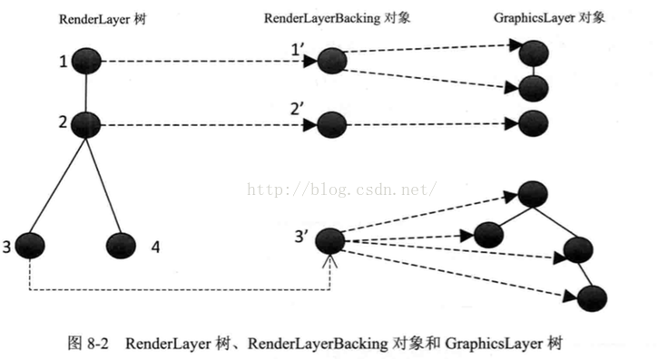

而上图中的RenderLayerBacking的内容如下:

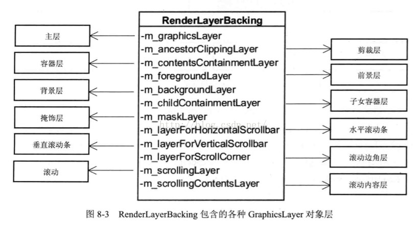

那么为什么一个renderlayerbacking对象需要那么多层?**原因有很多**，例如webkit需要将滚动条独立开来称为一个层，需要两个容器层来表示RenderLayer对应的z坐标为正数和z坐标为负数的子女，需要为滚动的内容建立新层，还可能需要剪裁层和反射层，这些层绘制和组织的顺序如下图（图中每一个层就是一个graphiclayer对象）:

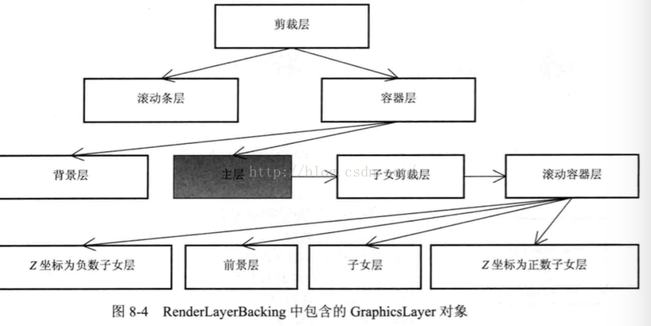

对于每一个RenderLayerBacking对象来说，其主层肯定是存在的，其它层不一定存在，因为不是每一个RenderLayer对象都需要用到他们。管理这些层的工作是RenderLayerCompositor类，这个类可以说是大管家，它不仅决定哪些RenderLayer对象是合成层，而且为合成层创建GraphicLayer对象。**每个RenderView对象包含一个RendeLayerCompositor，这个对象仅在硬件加速机制下才会被创建**。RenderLayerCompositor类本身也类似于一个RenderLayerBacking,也就是说它也包含一些GraphicLayer对象，这些对象对应于整个网页所需要的后端存储。

在Chromium中，所有使用GPU硬件加速的操作都是由一个进程也就是GPU进程来完成的，这其中包括使用GPU硬件来进行绘图和合成。chromium是多进程的，每一个网页的Render进程都是将之前介绍的3d绘图和合成操作通过ipc传递给GPU进程，由他来统一调度和执行。事实上每一个Render进程都依赖GPU进程来渲染网页，当然browser进程也会同GPU进程进行通信，其作用是创建该进程并提供网页渲染过程最后绘制的目标存储。

虽然理论上说，每一个RenderLayer都可以有一个单独的后端存储GraphicsLayer，但是在实际情况下这样非常消耗内存资源，特别是VRAM。在chrome的当前blink实现中，满足下面条件就会有自己的后端存储,你可以[点击这里](http://blog.csdn.net/liangklfang/article/details/52074738)查看:

<pre>
    Layer has 3D or perspective transform CSS properties   
    Layer is used by video element using accelerated video decoding  
    Layer is used by a canvas element with a 3D context or accelerated 2D context
    Layer is used for a composited plugin
    Layer uses a CSS animation for its opacity or uses an animated Webkit transform
    Layer uses accelerated CSS filters 
    Layer has a descendant that is a compositing layer  
    Layer has a sibling with a lower z-index which has a compositing layer (in other words the layer overlaps a composited layer and should be rendered on top of it)
</pre>

这里也给出一个[完整例子](http://blog.csdn.net/liangklfang/article/details/52074738):

```html
    <h1>Poster Circle</h1>
    <p>This is a simple example of how to use CSS transformation and animations to get interesting-looking behavior.</p>
    <p>The three rings are constructed using a simple JavaScript function that creates elements and assigns them a transform
      that describes their position in the ring. CSS animations are then used to rotate each ring, and to spin the containing
      element around too.</p>
    <p>Note that you can still select the numbers on the ring; everything remains clickable.</p>
    <div id="stage">
      <div id="rotate">
        <div id="ring-1" class="ring"></div>
        <div id="ring-2" class="ring"></div>
        <div id="ring-3" class="ring"></div>
      </div>
    </div>
```

默认情况下negZOrderList,posZOrderList已经被排列好，html的z-index默认为auto，而stage创建了层叠上下文，所以他被分配到posZOrderList中。而当你把p标签的z-index设置为1,同时position为relative，那么它也会比html的层叠上下文高，所以它也会被分配到posZOrderList，而且其z-index的值比stage还高，所以chrome为了安全起见也会给p元素创建一个独立的图层，这就是官方文档说的[Layer Squashing](https://www.chromium.org/developers/design-documents/gpu-accelerated-compositing-in-chrome)，而且只有这样，我们的p元素因为z-index的设置才会覆盖在stage的上面，这也是符合RenderLayer的Layer的意思的。

##### 1.4.2 chrome网页渲染的方式
构建完了dom树之后，Webkit所要做的事情就是构建渲染的内部表达并使用图形库将这些模型绘制出来。网页的渲染方式有两种，第一种是**软件渲染**，第二种是**硬件加速**渲染。每一个层对应于网页中的一个或者一些可视元素，这些元素绘制内容到这个层中。如果绘图操作使用CPU来完成就叫做软件绘图，如果绘图操作使用gpu来完成，那么就叫做gpu硬件加速绘图。

理想情况下每一个层都有一个绘制的存储区域(后端存储GraphicsLayer)，这个存储区域用于**保存**绘图的结果。最后需要把这些层的内容合并到同一个图像之中，叫做**合成**（compositing）。使用了合成技术的渲染称之为合成化渲染。

在RenderObject树和RenderLayer树之后，Webkit的内部操作将内部模型转化为可视结果分为两个阶:**每层的内容进行绘图工作**以及之后将这些绘图的结果**合并**为一个图像。如果对于软件渲染，那么需要使用CPU来绘制每一层的内容，但是他是**没有合成阶段**的，因为在软件渲染中，渲染的结果就是一个位图，绘制每一层的时候**都使用**这个位图，区别在于绘制的位置可能不一样，当然每一层都是按照从后到前的顺序。当然你也可以为每一层分配一个位图，但是一个位图已经可以解决所有的问题了。

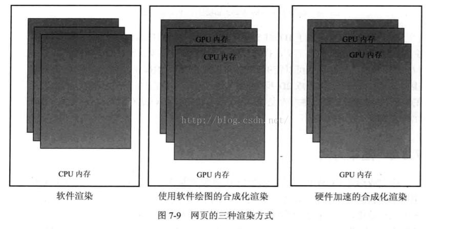

##### 1.4.3 各种渲染方式的比较
软件渲染中网页使用的一个位图，实际上是一块CPU使用**内存**。第二种和第三种方式都是使用了合成化的渲染技术，也就是使用gpu硬件加速来合成这些网页，合成的技术都是使用gpu来做的，所以叫做硬件加速。但是，对于每一个层这两种方式有不同的选择。如第二种方式，某些层使用gpu而某些层使用CPU，对于CPU绘制的层，该层的结果首先当然保存在CPU内存中，之后被传输到gpu的内存中，这主要是为了后面的合成工作。第三种方式使用gpu来绘制所有的合成层。第二种和第三种方式都属于硬件加速渲染方式。那么上面三种绘图有什么区别？

首先，对于常见的2d绘图操作，使用gpu来绘图不一定比CPU绘图在性能上有优势，因为CPU的使用**缓存**机制有效减少了重复绘制的开销而且不需要**gpu并行性**。

其次，gpu的内存资源相对于CPU的**内存资源**来说比较紧张，而且网页的分层使得gpu的内存使用相对比较多。

然后,软件渲染是浏览器最早的渲染机制，比较节省内存特别是宝贵的gpu内存，但是软件渲染**只能处理2d**方面的操作。简单的网页没有复杂绘图或者多媒体方面的需求，软件渲染就适合处理这种类型的网页。但是如果遇到html5新技术那么软件渲染就无能为力，一是因为`能力不足`，如css3d，webGL;二是因为`性能不好`，如canvas2d和视频。因此软件渲染被用的越来越少，特别是移动领域。

然后,软件渲染和硬件加速渲染另外一个很不同的地方在于对**更新区域**的处理，当网页有一个更小型区域的请求如动画时(这种方式一般会采用独立的合成层，该问题就能够解决)，软件渲染只要**计算极小的区域**，而硬件渲染可能需要重绘其中的`一层或者多层`，然后再`合成`这些层，硬件渲染的代价可能大得多。

最后，硬件加速的合成：每一个层的绘制和所有层的合成均使用gpu硬件来完成，这对需要使用3d绘图的操作来说特别合适。在这种方式下，在RenderLayer树之后，Webkit和chromium还需要建立更多的内部表示，例如graphiclayer。但是，一方面，硬件加速能够支持现在所有的html5定义的2d或者3d绘图标准；另外一方面，关于更新区域的讨论，如果需要更新**某个层的一个区域**，因为软件渲染没有为每一层提供后端存储，因而它需要将和这个区域有重叠部分的所有的层次相关区域依次从后向前重新绘制一遍，而硬件加速渲染只是需要重新绘制更新发生的层次，因而在某些情况下，软件渲染的代价更大，当然，这取决于网页的结构和渲染策略。

##### 1.4.4 chrome[并非全量更新渲染](https://sites.google.com/a/chromium.org/dev/developers/design-documents/gpu-accelerated-compositing-in-chrome)
很多情况下，也就是没有**硬件加速**内容的时候（css3变形，变换，webgl，视频），Webkit可以使用软件渲染来完成页面的绘制工作。软件渲染需要关注两个方面，分别是RenderLayer树和RenderObject树。那么Webkit如何遍历RenderLayer树来绘制每一个层？对于每一个RenderObject对象，需要三个阶段绘制自己。

第一阶段：绘制该层中的所有块的**背景**和**边框** 

第二阶段：绘制`浮动`内容 

第三阶段：前景也就是**内容**部分，**轮廓**等部分。注意：`内联元素的背景，边框，前景都是在第三阶段被绘制的`，这是不同之处。

注意：在最开始的时候，也就是Webkit**第一次**绘制网页的时候，Webkit绘制的区域等同于可视区域的大小，而在这之后，Webkit只是首先**计算需要更新的区域**，然后绘制同这些区域有**交集**的RenderObject节点。这也就是说，如果更新区域跟某个RenderLayer节点有交集，Webkit会继续查找Renderlayer树中包含deRenderObject子树中的特定的一个或者一些节点而不是绘制整个RenderLayer对应的RendeObject子树。
  

 

#### 2.浏览器解析DOM时候不会开始加载后面资源吗？
##### 2.1 浏览器后面资源加载不会等待script脚本执行完成
其实一直有一个疑问:浏览器在解析DOM的时候，如果它命中了script(同步脚本)脚本的时候，会等待script加载并解析执行完成。那么后面的如image,iframe,css等可以并行加载的资源就没法加载了吗？也就是说浏览器必须等到script执行完毕后才能发送新的网络请求去加载这些资源吗？我们给出下面的[例子](./examples/download.html):
```html
<body>
   我是body的开始
 <script type="text/javascript" src="http://apps.bdimg.com/libs/jquery/1.11.1/jquery.min.js"></script>
  我是script的后面内容
  
  <link rel='stylesheet type='text/css' href='https://ss1.bdstatic.com/5eN1bjq8AAUYm2zgoY3K/r/www/cache/static/protocol/https/soutu/css/soutu.css'>
  我是内容~~~~~~
</body>
```
我们可以在控制台中看看资源加载的瀑布流:


从瀑布流中可以看到，后面image,css的资源加载并没有等到script加载完成并执行结束。

##### 2.2 DOM停止构建但是资源继续加载
早在2008年的时候浏览器出了一个**推测加载(speculative preload)策略**，即遇到script的时候，**DOM会停止构建(执行脚本时构建DOM是不安全的)**，但是会继续去搜索页面需要加载的资源，如看后续的html有没有img/script标签，先进行预加载，而`不用等到构建DOM的时候才去加载`。这样大大提高了页面整体的加载速度。

##### 2.3 chrome中资源加载优先级
下面是chrome中资源加载的优先级:
```c
ResourceLoadPriority TypeToPriority(Resource::Type type) {
  switch (type) {
    case Resource::kMainResource:
    case Resource::kCSSStyleSheet:
    case Resource::kFont:
      // Also parser-blocking scripts (set explicitly in loadPriority)
      //1.MainResouce,CSS,Font资源优先级为VeryHigh
      return kResourceLoadPriorityVeryHigh;
    case Resource::kXSLStyleSheet:
      DCHECK(RuntimeEnabledFeatures::XSLTEnabled());
    case Resource::kRaw:
    case Resource::kImportResource:
    case Resource::kScript:
      // Also visible resources/images (set explicitly in loadPriority)
      //2.Script等，包括通过loadPriority设置的image/resources
      return kResourceLoadPriorityHigh;
    case Resource::kManifest:
    case Resource::kMock:
      //3.Manifest,Mock资源，以及通过loadPriority方法加载的js资源
      // Also late-body scripts discovered by the preload scanner (set
      // explicitly in loadPriority)
      return kResourceLoadPriorityMedium;
    case Resource::kImage:
    case Resource::kTextTrack:
    case Resource::kMedia:
    case Resource::kSVGDocument:
       //4.Image,TextTrack(字幕),Media,SVG和loadPriority设置的异步脚本
      // Also async scripts (set explicitly in loadPriority)
      return kResourceLoadPriorityLow;
    case Resource::kLinkPrefetch:
      //5.预加载的css资源
      return kResourceLoadPriorityVeryLow;
  }

  return kResourceLoadPriorityUnresolved;
}
```
可以看到优先级总共分为五级：very-high、high、medium、low、very-low，其中MainRescource页面、CSS、字体这三个的优先级是最高的，然后就是Script、Ajax这种，而图片、音视频的默认优先级是比较低的，最低的是prefetch预加载的资源。

注意上面的switch-case设定资源优先级有一个**顺序**，如果既是script又是prefetch的话得到的优化级是high，而不是prefetch的very low，因为prefetch是最后一个判断。所以在设定了资源默认的优先级之后，会再对一些情况做一些调整，主要是对prefetch/preload的资源。包括以下几个部分:

- 降低preload的字体的优先级
  
```c
   // A preloaded font should not take precedence over critical CSS or
  // parser-blocking scripts.
  if (type == Resource::kFont && is_link_preload)
    priority = kResourceLoadPriorityHigh;
```
  对于字体文件，默认是VeryHigh,但是如果是preload的字体文件，那么它的优先级会被设置为High，而不是默认的VeryHigh,所以其优先级会降低

- 降低defer/async的script的优先级
```c
     if (type == Resource::kScript) {
        // Async/Defer: Low Priority (applies to both preload and parser-inserted)
        if (FetchParameters::kLazyLoad == defer_option) {
          priority = kResourceLoadPriorityLow;
        }
    }
```
  script脚本的优先级本来是High，但是如果它被设置了defer/async，那么它会被设置为**Low**级别,即它的优先级也会被降低。

- 页面底部preload的script优先级变成medium
```c
  if (type == Resource::kScript) {
    // Special handling for scripts.
    // Default/Parser-Blocking/Preload early in document: High (set in
    // typeToPriority)
    // Async/Defer: Low Priority (applies to both preload and parser-inserted)
    // Preload late in document: Medium
    if (FetchParameters::kLazyLoad == defer_option) {
      priority = kResourceLoadPriorityLow;
    } else if (speculative_preload_type ==
                   FetchParameters::SpeculativePreloadType::kInDocument &&
               image_fetched_) {
      // Speculative preload is used as a signal for scripts at the bottom of
      // the document.
      priority = kResourceLoadPriorityMedium;
    }
}
```
  上一点说过:如果是defer的script那么优先级调成`最低`，否则如果是preload的script，并且如果页面已经加载了一张图片就认为这个script是在页面偏底部的位置(否则不会先有图片加载，因为script默认是阻塞加载的)，就把它的优先级调成**medium**。通过一个flag决定是否已经加载过第一张图片了。
```c
// Resources before the first image are considered "early" in the document and
  // resources after the first image are "late" in the document.  Important to
  // note that this is based on when the preload scanner discovers a resource
  // for the most part so the main parser may not have reached the image element
  // yet.
  if (type == Resource::kImage && !is_link_preload)
    image_fetched_ = true;
```
  资源在第一张非preload的图片前认为是early，而在后面认为是late，late的script的优先级会偏低。

  什么叫preload呢？**preload不同于prefetch**的，在早期浏览器，script资源是阻塞加载的，当页面遇到一个script，那么要等这个script下载和执行完了，才会继续解析剩下的DOM结构，也就是说script是串行加载的，并且会堵塞页面其它资源的加载，这样会导致页面整体的加载速度很慢，所以早在2008年的时候浏览器出了一个推测加载(speculative preload)策略，即遇到script的时候，DOM会停止构建，但是会继续去搜索页面需要加载的资源，如看下后续的html有没有img/script标签，先进行预加载，而不用等到构建DOM的时候才去加载。这样大大提高了页面整体的加载速度。

- 把同步即堵塞加载的资源的优先级调成最高
```c
// A manually set priority acts as a floor. This is used to ensure that
// synchronous requests are always given the highest possible priority
return std::max(priority, resource_request.Priority());
```
  如果是同步加载的资源，那么它的request对象里面的优先最级是最高的，所以本来是hight的ajax同步请求在最后return的时候会变成very-high。

  这里是取了两个值的最大值，第一个值是上面进行各种判断得到的priority，第二个在初始这个ResourceRequest对象本身就有的一个优先级属性，返回最大值后再重新设置resource_request的优先级属性。

  在构建resource request对象时所有资源都是最低的，这个可以从构造函数里面知道：
```c
ResourceRequest::ResourceRequest(const KURL& url)
    : url_(url),
      service_worker_mode_(WebURLRequest::ServiceWorkerMode::kAll),
      priority_(kResourceLoadPriorityLowest)
      /* 其它参数略 */ {}
```
  但是同步请求在初始化的时候会先设置成最高:
```c
void FetchParameters::MakeSynchronous() {
  // Synchronous requests should always be max priority, lest they hang the
  // renderer.
  resource_request_.SetPriority(kResourceLoadPriorityHighest);
  resource_request_.SetTimeoutInterval(10);
  options_.synchronous_policy = kRequestSynchronously;
}
```

##### 2.4 NET优先级
这个是在渲染线程里面进行的，上面提到的资源优先级在发请求之前会被转化成Net的优先级:
```c
resource_request->priority =
      ConvertWebKitPriorityToNetPriority(request.GetPriority());
```
资源优先级对应Net的优先级关系如下所示：

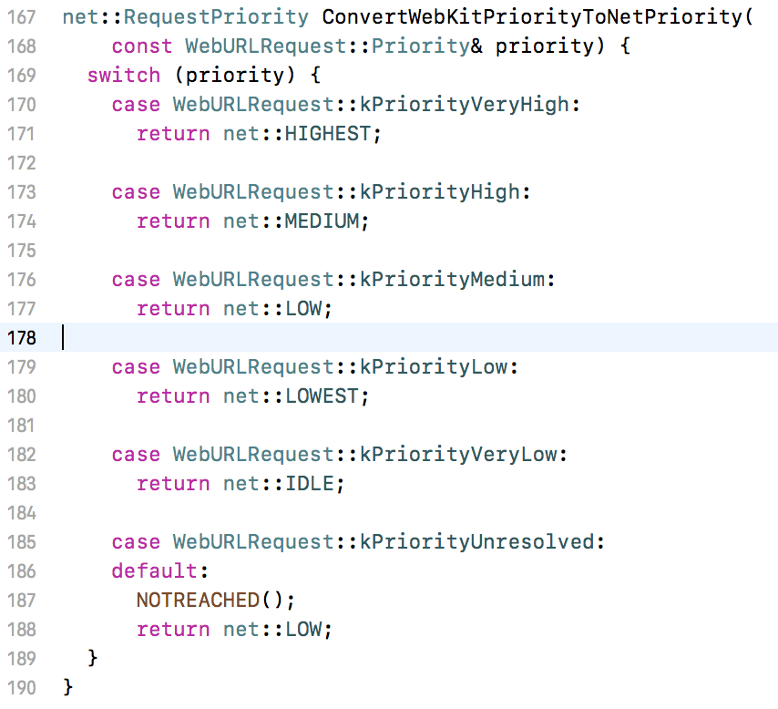

也可以通过下面的表格展示:


Net Priority是`请求资源`的时候使用的，这个是在Chrome的IO线程里面进行的。每个页面都有Renderer线程负责渲染页面，而浏览器有IO线程，用来负责请求资源等。为什么**IO线程不是放在每个页面里面而是放在浏览器框架**呢？因为这样的好处是如果两个页面请求了相同资源的话，如果有缓存的话就能避免重复请求了。这些都是在**渲染线程**里面debug操作得到的数据，为了能够观察资源请求的过程，需要切换到IO线程，而这两个线程间的通信是通过Chrome封装的**Mojo框架**进行的。在Renderer线程会发一个消息给IO线程通知它:
```c
 mojo::Message message(
      internal::kURLLoaderFactory_CreateLoaderAndStart_Name, kFlags, 0, 0, nullptr);
 // 对这个message进行各种设置后（代码略），调接收者的Accept函数 
 ignore_result(receiver_->Accept(&message));
```

##### 2.5 资源加载
此时需要判断当前资源是否能开始加载了，如果能的话就准备加载了，如果不能的话就继续把它放到pending request队列里面，如下代码所示：
```c
void ScheduleRequest(const net::URLRequest& url_request,
                       ScheduledResourceRequest* request) {
    SetRequestAttributes(request, DetermineRequestAttributes(request));
    ShouldStartReqResult should_start = ShouldStartRequest(request);
    if (should_start == START_REQUEST) {
      // New requests can be started synchronously without issue.
      StartRequest(request, START_SYNC, RequestStartTrigger::NONE);
    } else {
      pending_requests_.Insert(request);
    }
  }
```
一旦收到Mojo的加载资源消息就会调上面的**ScheduleRequest**函数，除了收到消息之外，还有一个地方也会调用：
```c
  void LoadAnyStartablePendingRequests(RequestStartTrigger trigger) {
    // We iterate through all the pending requests, starting with the highest
    // priority one. 
    RequestQueue::NetQueue::iterator request_iter =
        pending_requests_.GetNextHighestIterator();
    while (request_iter != pending_requests_.End()) {
      ScheduledResourceRequest* request = *request_iter;
      ShouldStartReqResult query_result = ShouldStartRequest(request);
      if (query_result == START_REQUEST) {
        pending_requests_.Erase(request);
        StartRequest(request, START_ASYNC, trigger);
      }
  }
```

这个函数的特点是遍历pending requests，每次取出优先级最高的一个request，然后调ShouldStartRequest判断是否能运行了，如果能的话就把它从pending requests里面删掉，然后运行。

而这个函数会有三个地方会调用，一个是IO线程的循环判断，只要还有未完成的任务，就会触发加载，第二个是当有请求完成时会调，第三个是要插入body标签的时候。所以主要总共有三个地方会触发加载：
<pre>
（1）收到来自渲染线程IPC::Mojo的请求加载资源的消息
（2）每个请求完成之后，触发加载pending requests里还未加载的请求
（3）IO线程定时循环未完成的任务，触发加载
</pre>

##### 2.6 资源加载实例分析
你可以查看如下[例子](./examples/index.html)的完整代码，直接进入这个目录，然后全局安装一个小型服务器anywhere(可以直接在npm中找到)，并在该目录下运行anywhere命令即可。如果你是直接在浏览器中打开该本地html，那么可能看不到相同的效果，因为此时是file协议打开的，而不是http协议，因此每个域名6条HTTP连接的现象你也就看不到了。
```html
<html>
<head>
    <meta charset="utf-8">
    <link rel="icon" href="./png/4.png">
    
    
    <link rel="stylesheet" href="./css/1.css">
    <link rel="stylesheet" href="./css/2.css">
    <link rel="stylesheet" href="./css/3.css">
    <link rel="stylesheet" href="./css/4.css">
    <link rel="stylesheet" href="./css/5.css">
    <link rel="stylesheet" href="./css/6.css">
    <link rel="stylesheet" href="./css/7.css">
</head>
<body>
    <p>hello</p>
    
    
    
    
    
    
    
    
    <script src="./js/1.js"></script>
    <script src="./js/2.js"></script>
    <script src="./js/3.js"></script>
    
<script>
!function(){
    let xhr = new XMLHttpRequest();
    xhr.open("GET", "https://baidu.com");
    xhr.send();
    document.write("hi");
}();
</script>
<link rel="stylesheet" href="./css/9.css">
</body>
</html>
```
下面是资源加载的图，我们将会围绕下面的图进行分析:

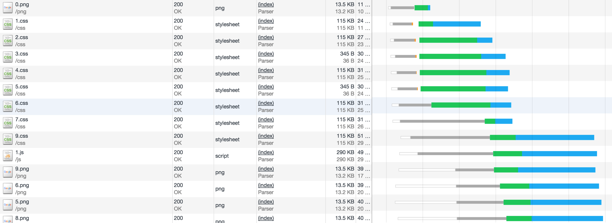


第一:你虽然可以看到某一个垂直线下很多资源都显示[Content Download状态](../chrome-command/readme.md)，表示正在接受服务端的响应数据。按理说某一个域名下的TCP连接最多是6条，但是很显然某些资源还在加载的时候，后面又有新的TCP连接建立了。这部分内容，我还没有弄清楚！下次会及时更新。但是我猜测是如下原理:

HTTP/1.1支持持续连接,通过这种连接,就有可能在建立一个TCP连接后,发送请求并得到回应,然后发送更多的请求并得到更多的回应。通过把建立和释放TCP连接的开销分摊到多个请求上,则对于每个请求而言,由于TCP而造成的相对开销被大大地降低了。而且,还可以发送**流水线(pipeline)**请求,也就是说在发送请求1之后的回应到来之前就可以发送请求2。这样，就会出现请求1和请求2资源同步接收数据的情况

第二:**CSS具有最高的优先级，最先加载**，即使是放在最后面9.css也是比前面资源先开始加载

第三:只有**等CSS都加载**完了，才能加载其它的资源(css放在head里面不阻塞CSSOM构建，同时不阻塞加载)，即使这个时候没有达到6个的限制

第四:**JS比图片优先加载**，即使出现得比图片晚

第五:head里面的**非高优化级**的资源最多能先加载一张（0.png）

优先级在Medium以下的为delayable，即可推迟的，而大于等于Medium的为不可delayable的。从上面总结的表可以看出：css/js是不可推迟的，而图片、preload的js为可推迟加载。


还有一种是layout-blocking的请求:
```c
// The priority level above which resources are considered layout-blocking if
// the html_body has not started.
static const net::RequestPriority
    kLayoutBlockingPriorityThreshold = net::MEDIUM;
```
就是当还没有渲染body标签，并且优先级在Medium之上的如CSS的请求。

然后，上面提到的ShouldStartRequest函数，这个函数是规划资源加载顺序最主要的函数，从源码注释可以知道它大概的过程：
```c
  // ShouldStartRequest is the main scheduling algorithm.
  // Requests are evaluated on five attributes:
  // 1. Non-delayable requests:
  //   * Synchronous requests.
  //   * Non-HTTP[S] requests.
  // 2. Requests to request-priority-capable origin servers.
  // 3. High-priority requests:
  //   * Higher priority requests (> net::LOW).
  // 4. Layout-blocking requests:
  //   * High-priority requests (> net::MEDIUM) initiated before the renderer has
  //     a <body>.
  //
  // 5. Low priority requests
  //
  //  The following rules are followed:
  //
  //  All types of requests:
  //   * Non-delayable, High-priority and request-priority capable requests are
  //     issued immediately.
  //   * Low priority requests are delayable.
  //   * While kInFlightNonDelayableRequestCountPerClientThreshold(=1)
  //     layout-blocking requests are loading or the body tag has not yet been
  //     parsed, limit the number of delayable requests that may be in flight
  //     to kMaxNumDelayableWhileLayoutBlockingPerClient(=1).
  //   * If no high priority or layout-blocking requests are in flight, start
  //     loading delayable requests.
  //   * Never exceed 10 delayable requests in flight per client.
  //   * Never exceed 6 delayable requests for a given host.
```
从上面的注释可以得到以下信息：
<pre>
（1）高优先级的资源(>=Medium)、同步请求和非http(s)的请求能够立刻加载
（2）只要有一个layout blocking的资源在加载，最多只能加载一个delayable的资源，这个就解释了为什么0.png能够先加载
（3）只有当layout blocking和high priority的资源加载完了，才能开始加载delayable的资源，这个就解释了为什么要等CSS加载完了才能加载其它的js/图片。
（4）同时加载的delayable资源同一个域只能有6个，同一个client即同一个页面最多只能有10个，否则要进行排队。
</pre>

注意这里说的开始加载，并不是说能够开始请求建立连接了。源码里面叫in flight，在飞行中，而不是叫in request之类的，能够进行in flight的请求是指那些不用queue的请求，如下图：

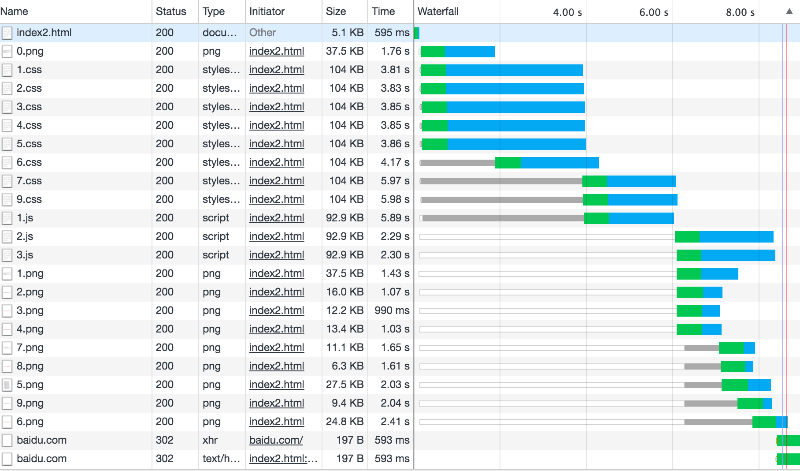

白色条是指queue的时间段;而灰色的是已经in flight了但受到同域只能最多只能建立6个TCP连接等的影响而进入的stalled状态;绿色是TTFB（Time to First Byte）从开始建立TCP连接到收到第一个字节的时间;蓝色是下载的时间。

#### 3.浏览器IO线程与Renderer线程关系
每个页面都有Renderer线程负责渲染页面，而浏览器有IO线程，用来负责请求资源等。为什么IO线程不是放在每个页面里面而是放在浏览器框架呢？因为这样的好处是如果两个页面请求了相同资源的话，如果有缓存的话就能**避免重复请求**了。而这两个线程间的通信是通过Chrome封装的Mojo框架进行的。在Renderer线程会发一个消息给IO线程通知它:
```c
  mojo::Message message(
      internal::kURLLoaderFactory_CreateLoaderAndStart_Name, kFlags, 0, 0, nullptr);
 // 对这个message进行各种设置后（代码略），调接收者的Accept函数 
 ignore_result(receiver_->Accept(&message));
```
上面提到的ShouldStartRequest这个函数是判断当前资源是否能开始加载了，如果能的话就准备加载了，如果不能的话就继续把它放到pending request队列里面，如下代码所示：
```c
 void ScheduleRequest(const net::URLRequest& url_request,
                       ScheduledResourceRequest* request) {
    SetRequestAttributes(request, DetermineRequestAttributes(request));
    ShouldStartReqResult should_start = ShouldStartRequest(request);
    if (should_start == START_REQUEST) {
      // New requests can be started synchronously without issue.
      StartRequest(request, START_SYNC, RequestStartTrigger::NONE);
    } else {
      pending_requests_.Insert(request);
    }
  }
```
一旦收到Mojo的加载资源消息就会调上面的**ScheduleRequest**函数，除了收到消息之外，还有一个地方也会调用：
```c
  void LoadAnyStartablePendingRequests(RequestStartTrigger trigger) {
    // We iterate through all the pending requests, starting with the highest
    // priority one. 
    RequestQueue::NetQueue::iterator request_iter =
        pending_requests_.GetNextHighestIterator();
    while (request_iter != pending_requests_.End()) {
      ScheduledResourceRequest* request = *request_iter;
      ShouldStartReqResult query_result = ShouldStartRequest(request);
      if (query_result == START_REQUEST) {
        pending_requests_.Erase(request);
        StartRequest(request, START_ASYNC, trigger);
      }
  }
```
这个函数的特点是遍历pending requests，每次取出优先级最高的一个request，然后调ShouldStartRequest判断是否能运行了，如果能的话就把它从pending requests里面删掉，然后运行。

而这个函数会有三个地方会调用，一个是**IO线程的循环判断**，只要还有未完成的任务，就会触发加载;第二个是当有**请求完成时**会调，第三个是要**插入body标签的时候**。所以主要总共有三个地方会触发加载：
<pre>
（1）收到来自渲染线程IPC::Mojo的请求加载资源的消息
（2）每个请求完成之后，触发加载pending requests里还未加载的请求
（3）IO线程定时循环未完成的任务，触发加载
</pre>

#### 4.页面渲染关键路径
##### 4.1 页面渲染关键路径理解
理解**关键渲染路径**是提高页面性能的关键所在。总体来说，**关键渲染路径**分为六步。

##### 4.1.1 创建DOM树(Constructing the DOM Tree)
HTML可以**部分执行并显示**，也就是说，浏览器并不需要等待整个HTML全部解析完毕才开始显示页面。但是，其他的资源有可能阻塞页面的渲染，比如CSS，JavaScript等。

##### 4.1.2 创建[CSSOM](https://developers.google.com/web/fundamentals/performance/critical-rendering-path/constructing-the-object-model)树

**(1)**[CSSOM](https://varvy.com/performance/cssom.html)（CSS对象模型）树是对附在DOM结构上的样式的一种表示方式。它与DOM树的呈现方式相似，只是每个节点都带上样式 ，包括明确定义的和隐式继承的(所有出现在DOM节点的样式)。CSS是一种**渲染阻塞资源(render blocking resource)**，它需要完全被解析完毕之后才能进入**生成渲染树**的环节。
 


CSS字节转换成字符，接着转换成令牌和节点，最后链接到一个称为“CSS 对象模型”(CSSOM) 的树结构内。


**(2)** CSS并不像HTML那样能执行部分并显示，因为CSS具有继承属性， 后面定义的样式会覆盖或者修改前面的样式。如果我们只使用样式表中部分解析好的样式，我们可能会得到错误的页面效果。所以，我们只能等待CSS完全解析之后，才能进入关键渲染路径的下一环节。

**(3)**需要注意的是:只有CSS文件适用于当前设备的时候，才能造成渲染阻塞。标签<link rel=”stylesheet”>接受media属性，该属性规定了此处的CSS文件适用于哪种设备。如果我们有个设备属性值为orientation: landscape(横向)的样式，当我们竖着浏览页面的时候，这个CSS资源是不会起作用的，也就不会阻塞渲染的过程了。因为**JavaScript脚本的执行**必须等到CSSOM生成之后，所以说CSS也会阻塞脚本(script blocking)。

##### 4.1.3 执行脚本(Running JavaScript)

JavaScript是一种**解析阻塞资源(parser blocking resource)**，它能阻塞HTML页面的解析。当页面解析到`<script>`标签，**不管脚本是內联的还是外联**，页面解析都会暂停，转而加载JavaScript文件（外联的话）并且执行JavaScript。这也是为什么如果JavaScript文件有引用HTML文档中的元素，JavaScript文件必须放在那个元素的[后面](./examples/block.html)。

页面的[JS脚本一般会阻塞CSSOM的构建](https://developers.google.com/web/fundamentals/performance/critical-rendering-path/adding-interactivity-with-javascript),如果浏览器尚未完成CSSOM的下载和构建，而我们却想在此时运行脚本操作CSSOM，会怎样？答案很简单，对性能不利:**浏览器将延迟脚本执行和DOM构建，直至其完成CSSOM的下载和构建**。为了在页面中展示内容，CSSOM是必须的，直到CSSOM构建完毕。如果你阻塞了CSSOM的构建，那么也意味着用户需要更长时间才能看到页面内容。所以尽量让你的js不要阻塞script。为了避免JavaScript文件阻塞页面的解析，我们可以在`<script>`标签上添加`async`属性，使得JavaScript文件异步加载。
```
<script async src="script.js">
```

##### 4.1.4 生成[渲染树,即RenderObject树](https://developers.google.com/web/fundamentals/performance/critical-rendering-path/render-tree-construction)

渲染树是DOM和CSSOM的结合，是最终能渲染到页面的元素的树形结构表示。也就是说，它包含能在页面中最终呈现的元素，而**不包含**那些用CSS样式隐藏的元素，比如带有`display: none;`属性的元素。所以，上述例子的渲染树如下所示。


##### 4.1.5 生成布局(Generating the Layout)

布局决定了视口的大小，为CSS样式提供了依据，比如百分比的换算或者视口的总像素值。视口大小是由meta标签的name属性为viewport的内容设置所决定的，如果缺少这个标签，默认的视口大小为980px。最常见的viewport设置是自适应于设备尺寸，设置如下：
```html
<meta name="viewport" content="width=device-width,initial-scale=1">
```
假设用户访问一个显示在设备宽度为1000px的页面，一半的视口大小就是500px，10%就是100px，以此类推。

##### 4.1.6 绘制(Painting)

最后，页面上可见的内容就会转化为屏幕上的像素点。绘制过程所需要花费的时间取决于DOM的大小以及元素的CSS样式。有些样式比较耗时，比如一个复杂的渐变背景色比起简单的单色背景需要更多的时间来渲染。 

##### 4.2 chrome查看渲染路径
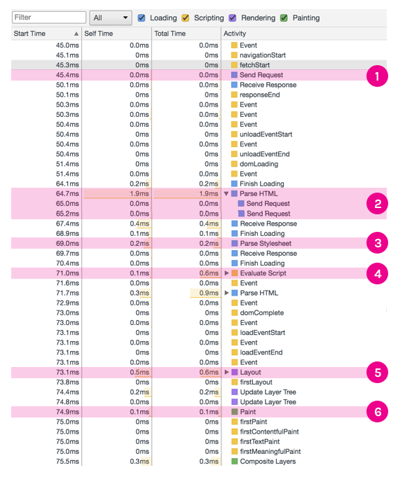

各个阶段的信息如下:

+ 发送请求(Send Request) —— 发送GET请求获取index.html
+ 解析HTML(Parse HTML)，再次发送请求 —— 开始解析HTML文件，创建DOM结构，发送请求获取style.css和main.js
+ 解析样式文件(Parse Stylesheet) —— 根据style.css生成CSSOM树
+ 执行脚本(Evaluate Script) —— 执行main.js
+ 生成布局(Layout) —— 基于HTML页面中的`meta viewport`标签生成布局
+ 绘制(Paint) —— 在浏览器页面绘制像素点

#### 5.Navigation Timing API分析关键渲染路径(CRP)
构建渲染树甚至绘制网页时**无需等待**页面上的每个资源,并非所有资源都对快速提供首次绘制具有关键作用。事实上，当我们谈论关键渲染路径时，通常谈论的是 HTML 标记、CSS 和 JavaScript。**图像不会阻止页面的首次渲染**，不过，我们当然也应该尽力确保系统尽快绘制图像！衡量页面的关键路径有以下两种方式:
##### 5.1 使用Navigation Timing API检测


[各个阶段](https://developers.google.com/web/fundamentals/performance/critical-rendering-path/measure-crp)的信息如下:
<pre>
domLoading:这是整个过程的起始时间戳，浏览器即将开始解析第一批收到的HTML文档字节。
domInteractive:表示浏览器完成对所有HTML的解析并且DOM构建完成的时间点。
domContentLoaded:此时DOM已经构建完成，同时js也能够执行了，即js不用等待样式表下载解析完成构建CSSOM的过程,此时可以构建RenderObject树，即渲染树了,这样domContentLoaded事件也能够`尽早执行`(即css不阻塞domContentLoaded事件)。许多JavaScript框架都会等待此事件发生后，才开始执行它们自己的逻辑。因此，浏览器会捕获EventStart和EventEnd时间戳，让我们能够追踪执行该事件处理所花费的时间。
domComplete:所有的处理已经完成，同时所有页面的资源，包括images等都已经下载完成，加载转环已停止旋转
loadEvent:作为每个网页加载的最后一步，浏览器会触发 onload 事件，以便触发额外的应用逻辑
</pre>

各个时间段捕捉的代码如下:
```html
<html>
  <head>
    <title>Critical Path: Measure</title>
    <meta name="viewport" content="width=device-width,initial-scale=1">
    <link href="style.css" rel="stylesheet">
    <script>
      function measureCRP() {
        var t = window.performance.timing,
          interactive = t.domInteractive - t.domLoading,
          dcl = t.domContentLoadedEventStart - t.domLoading,
          complete = t.domComplete - t.domLoading;
        var stats = document.createElement('p');
        stats.textContent = 'interactive: ' + interactive + 'ms, ' +
            'dcl: ' + dcl + 'ms, complete: ' + complete + 'ms';
        document.body.appendChild(stats);
      }
    </script>
  </head>
  <body onload="measureCRP()">
    <p>Hello <span>web performance</span> students!</p>
    <div></div>
  </body>
</html>
```

##### 5.2 使用[lighthouse](https://developers.google.com/web/fundamentals/performance/critical-rendering-path/measure-crp#lighthouse)检测
lightHouse会从页面性能，渐进式的Web应用程序，可用性，最佳实践，seo等[多角度来衡量页面的性能指标](https://developers.google.com/web/tools/lighthouse/audits/blocking-resources)并给出网页优化的点。


Lighthouse方法会对页面运行一系列自动化测试，然后生成关于页面的CRP(Critical Rendering Path)性能的报告。 这一方法对您的浏览器中加载的特定页面的CRP性能提供了快速且简单的高级概览，让您可以快速地测试、循环访问和提高其性能。


#### 6.页面脚本async与否的渲染路径差别
假如页面的DOM结构如下:
```html
<html>
  <head>
    <meta name="viewport" content="width=device-width,initial-scale=1">
    <link href="style.css" rel="stylesheet">
  </head>
  <body>
    <p>Hello <span>web performance</span> students!</p>
    <div></div>
    <script src="app.js"></script>
    // 此处DOM解析要等到上面的CSSOM完成，同时JS执行完成
  </body>
</html>
```
因为js本身是阻塞的，此时的页面加载逻辑大致如下:


此时Run JS必须等待**Build CSSOM**完成以后执行(需要稳定的CSSOM结构才能执行JS)，同时脚本后面DOM的解析必须等待Run JS执行完成(即DOM解析被Block掉了)，最后才能将网页渲染在屏幕中。但是如果将上面的js资源改成async，此时不再是关键路径资源，那么页面的加载逻辑将会如下:


首先Build DOM本身不会因为后面的JS存在而被Block掉;CSS下载被执行完成后能够用于构建CSSOM对象;JavaScript文本不再是关键资源的一部分，同时给script标签设置async属性，相当于向浏览器传递脚本不需要在引用位置执行的**信号**,这既可以让浏览器继续构建 DOM，也能够让脚本在就绪后执行，例如，在从缓存或远程服务器获取文件后执行。所以上图其实只是一种情况，JS执行并[**不一定**](https://developers.google.com/web/fundamentals/performance/critical-rendering-path/page-speed-rules-and-recommendations)会在CSSOM后面,但是一定在[onload之前](https://gist.github.com/jakub-g/5286483ff5f29e8fdd9f)(所有资源都下载完成，除了动态加载的。而且在执行的时候依然可能阻塞CSSOM或者DOM构建，因为浏览器只有一个调用栈控制JS执行与页面渲染)，下面是对async的说明:

<pre>
The boolean async attribute on script elements allows the external JavaScript file to run when it's available, without delaying page load first.
</pre>

我们更进一步，如果将css的media属性设置为media="print"后的路径如下:

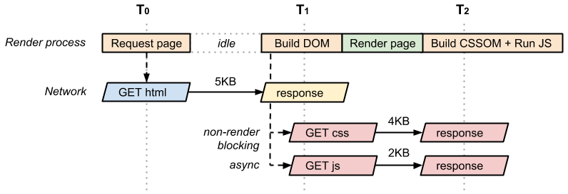

因为style.css资源只用于打印，浏览器不必阻止它便可渲染网页。所以，只要DOM构建完毕，浏览器便具有了渲染网页所需的足够信息,此时便可进行网页渲染工作了。因此，该网页只有一项关键资源（HTML 文档），并且最短关键渲染路径长度为一次往返。此时[**Run JS+Build CSSOM**](https://developers.google.com/web/fundamentals/performance/critical-rendering-path/analyzing-crp)将会在页面显示后执行~

#### 7.chrome内部架构原理学习
##### 7.1 chrome中的RootView分发消息
chrome中有一个比较特殊的View子类，叫做RootView，顾名思义，它是整个View控件树的根，在Chrome中，一个正确的树形的控件结构，必须由RootView作为根。之所以要这样设计，是因为RootView有一个比较特殊的功能，那就是**分发消息**。

一般的Windows控件，都有一个HWND，用于占据一块屏幕，`捕获系统消息`。Chrome中的View**只是保存控件相关信息和绘制控件，里面没有HWND句柄，因此不能够捕获系统消息**。在Chrome中，完整的控件架构是这样的:首先需要有一个ViewContainer，它里面包含一个RootView。ViewContainer是一个抽象类，在Window中的一个子类是HWNDViewContainer，同时，HWNDViewContainer还是MessageLoopForUI::Observer的子类，Observer是用于监听本线程内系统消息。

当有系统消息进入此线程消息循环后，HWNDViewContainer会监听到这个情况，`如果和View相关的消息，它就会调用RootView的相关方法，传递给控件`。在RootView的内部，会遍历整个控件树上的控件，将消息传递给各个控件。当然，有的消息是可以独占的，比如鼠标移动发送在某个View所管辖的范围 内，它会告知RootView（通过方法的返回值），这个消息我要了，那么RootView会停止遍历。


##### 7.2 chrome中的[进程](https://chromium.googlesource.com/chromium/src/+/master/docs/threading_and_tasks.md#Threads)
##### 7.2.1 chrome中主要进程
在chrome中主要包括**browser进程**与**renderer进程**，而每一个进程都包括两个主要的线程:

- 主线程
   在browser进程中的主线程主要用于更新UI(见1.5章节)，管理浏览器Tab和插件线程(Plugin Process);而renderer进程(对应上图的**Render Thread**)用于渲染页面，其使用Blink这个开源的排版引擎来解析和排版HTML，而且其和特定的浏览器tab有关。
- IO线程
  在browser进程中的IO线程主要用于IPC和网络请求，而renderer进程中的IO线程(对应于上图的Main Thread)主要处理IPC。

chrome除了这两个进程以外还会包括有特定功能的线程或者线程池。大多数的线程都有一个循环用于从队列中获取Task任务，然后执行。同时这些队列可能在多个线程之间共享。其图形表示如下:


##### 7.2.2 chrome中[主要进程职责](https://sites.google.com/a/chromium.org/dev/developers/design-documents/multi-process-architecture)
- 管理渲染进程
  每一个渲染进程都有一个**RenderProcess**对象，它用于管理与父级Browser进程通信，同时保存全局状态。相应的父级Browser进程会为每一个渲染进程维护一个**RenderProcessHost**，RenderProcessHost主要用于管理浏览器状态，同时和渲染进程进行IPC通信。
- 管理RenderView
  每一个渲染进程有一个或者多个**RenderView**对象，这些RenderView通过RenderProcess进行管理，每一个RenderView对应于每一个**Tab的内容**。而其父级的RenderProcessHost会为`每一个`渲染进程维护一个RenderViewHost。每一个RenderView会都有一个ID，其用于区别在同一个渲染进程中的RenderView。在每一个渲染进程中，这个ID是唯一的，但是在浏览器中并不是。因此为了区分某一个RenderView，我们**需要同时指定RenderProcessHost和该ID值**。
  Browser进程和某一个特定的tab页面的内容进行通信是通过RenderViewHost对象来完成的，这个RenderViewHost知道如何通过RenderProcessHost传递消息给RenderProcess进而传递给RenderView。
- 组件和接口
  **在渲染进程中**:RenderProcess通过IPC和相应的Browser进程的RenderProcessHost进行通信。也就是每一个渲染进程中都有一个RenderProcess，这也是Browser进程和渲染进程进行通信的方式。RenderView通过RenderProcess和相应的RenderViewHost进行通信，同时其和webkit的通信也是通过RenderProcess完成。RenderView代表某一个tab下的网页内容，或者**弹窗窗**。
  **Browser对象**:代表顶级的浏览器window。RenderProcessHost对象代表Browser进程中单个浏览器和渲染进程通过IPC连接进行通信。每一个渲染进程在Browser进程中都有一个相应的RenderProcessHost与其对应。RenderViewHost包装了和远程RenderView进行通信的机制，RenderWidgetHost用于处理`用户输入`和浏览器中的`RenderWidget`的渲染。更多内容[查看这里](https://sites.google.com/a/chromium.org/dev/developers/design-documents/displaying-a-web-page-in-chrome)。
- 共享渲染进程
  通常，每一个tab都会打开一个新的进程，浏览器将会产生一个新的进程，然后通知它创建一个RenderView。但是有时候我们需要在不同的tab中共享渲染进程。比如一个web应用打开一个新的窗口，并需要和这个打开的窗口进行同步通信，例如**window.open**。如果进程很多的情况下，我们甚至可以为某一个存在的进程创建一个新的tab页面。
- 检查崩溃进与无效渲染进程
  每一个渲染进程通过IPC连接和父级Browser进程建立了联系，其会监听进程句柄。如果这些句柄接受到信号，比如Render进程crash了，那么这个tab页面会接受到这个crash。比如以前经常看到的"页面崩溃了!"的界面。这时候用户可以点击重新加载或者刷新，此时当前页面没有新的进程就会创建一个。
- Render进程的sandbox化
  因为Render进程运行在一个独立的进程中，我们可以限制它访问系统资源。这样渲染进程就只能通过父级Browser进程来访问网络。同时我们也可以限制它访问文件系统。
- 内存释放
  因为渲染进程在一个独立的进程中，因此隐藏的Tab页面将会给出较低的优先级，而用户可见的部分将会给出较高的优先级。这在内存有限的情况下将会非常有用。
  
##### 7.3 chrome所有资源都在browser进程中下载
你键入一个Url并敲下回车后，Chrome会在Browser进程中下载Url对应的页面资源（**包括Web页面和Cookie**），而**不是**直接将Url发送给Render进程让它们自行下载（你会越来越发现，Render进程绝对是100%的名符其实，除了绘制，几乎啥多余的事情都不会干）。与各个Render进程各自为站，**各自管好自己所需的资源相比**，这种策略仿佛会增加大量的进程间通信。之所以采用，主要有三个优点:
<pre>
(1)避免子进程与网络通信，从而将网络通信的权限牢牢握在主进程手中，可以更好控制各个Render进程的权限
(2)另一个是有利于Cookie等持久化资源在不同页面中的共享，否则在不同Render进程中传递Cookie这样的事情，做起来更麻烦
(3)可以控制与网络建立HTTP连接的数量(浏览器作为一个整体可以打开的http连接数量)，以Browser为代表与网络各方进行通信，各种优化策略都比较好开展
</pre>

##### 7.4 共享内存减少进程通信
在Browser进程中进行统一的资源管理，也就意味着不再用WebKit进行资源下载（WebKit当然有此能力，不过再次被Chrome抛弃了），而是依托**WinHTTP**来做的。WinHTTP在接受数据的过程中，会不停的把数据和相关的消息通过IPC，发送给负责绘制此页面的Render进程中对应的RenderView。

RenderView接收到页面信息，会一边绘制一边等待更多的资源到来，在用户看来，所请求的页面正在一点一点显示出来。当然，如果是一个通知传输开始、传输结束这样的消息，通过序列化到消息参数里面，经由IPC发过来，代价还是可以承受的，但是，想资源内容这样大段大段的字节流，如果通过消息发过来，浪费两边进程大量空间和时间，就不合适了。于是这里用到了**共享内存**。Browser进程将下载到的资源写到共享内存中，并将共享内存的**句柄和共享区域的大小**序列化在消息中发送给Render进程。Render进程拿到这个句柄，就可以通过它访问到共享内存相关的区域，`读取信息并进行绘制`。通过这样的方式，即享用到了统一资源管理的优点，由避免了很高的进程通信开销，左右逢源，好不快活。

##### 7.5 Render进程中不包含HWND
[Render进程中不包含HWND](http://www.ha97.com/2913.html)，当你鼠标在页面上划来划去，点上点下，这些消息其实都**发到了Browser进程**，它们拥有页面呈现部分的HWND。Browser会将这些消息**转手**通过IPC发送给对应的Render进程中的RenderView，很多时候**WebKit会处理此类消息**，当它发现出现了某种值得告诉Browser进程的事情(比如cursor:pointer等系统设置的样式)，它会组个报文通知Browser进程。

举个例子，你打开一个页面，然后拿鼠标在页面上乱晃。Browser这时候就像一个碎嘴大婶，不厌其烦的告诉Render进程，“鼠标动了，鼠标动了”。如果Render对这个信息无所谓，就会很无聊的应答着：“哦，哦”（发送一个回包…）。但是，当鼠标划过链接的时候，矜持的Render进程坐不住了，会大声告诉Browser进程：“换鼠标，换鼠标~~”，Browser听到后，会将鼠标从箭头状换成手指状，然后继续以上过程。

为什么不让Render进程自己拥有HWND，自己管理自己的消息，既快捷又便利。在Chrome的官方Blog上，有[一篇解释的文章](https://blog.chromium.org/2008/10/responsiveness-for-plugins-and-renderer.html)， 基本上是这个意思:速度是必须快的，但是为了用户响应，放弃一些速度是必要的，毕竟，没有人喜欢总假死的浏览器。在Browser进程中，基本上是杜绝任何同步Render进程的工作，所有操作都是异步完成。因为Render进程是不靠谱的，随时可能牺牲掉，同步它们往往导致主进程停止响应，从而导致整个浏览器停下来甚至挂掉，`这个代价是不可以容忍的`。

##### 7.6 Render进程重绘
重新绘制页面是一个太频繁发生的事情，不可能重绘一次就序列化一堆字节流传递给Render进程。于是策略也很清楚了，就是**依然用共享内存读写**，用消息发句柄。在Render进程中，会有一个共享内存池（默认值为2），以size为key，以共享内存为值，简单的先入先出淘汰算法，利用局部性的特征，`避免反复的创建和销毁共享内存`（这和资源传递不一样，因为资源传递可以开一块固定大小的共享内存）。Render进程从共享内存池中拿起一块二维字节数组渲染到网页中。


#### 那些还在思考的问题
##### 1 image加载会走事件循环吗,DOM树中的请求是并发发出去的吗
目前从我的理解来说，image加载虽然是通过chrome一个单独的线程发送出去的，但是它并不需要走事件循环。页面UI渲染是通过事件循环来调度的，但是image本身下载完成后插入的过程并不需要事件循环来介入。所以image的加载和插入都是通过chrome渲染引擎来完成的,而不受到js引擎事件循环的调度!

##### 2.onload与[页面可见](https://segmentfault.com/q/1010000008734905)的时机
更多的时候我们关注的是DOMContentLoaded，因为此时DOM构建完成了，就可以操作页面元素了。但是操作元素以后，页面可能需要重绘或者重排。


参考资料:

[Webkit技术内幕ppt](https://docs.google.com/presentation/d/1ZRIQbUKw9Tf077odCh66OrrwRIVNLvI_nhLm2Gi__F0/embed?start=false&loop=false&delayms=3000&slide=id.g312aaaf6_1_148)

[关于硬件加速哪些优秀的资源总结](http://blog.csdn.net/liangklfang/article/details/52074738)

[GPU硬件加速的那些优秀的资源总结－续](http://blog.csdn.net/liangklfang/article/details/51638130)

[GPU Accelerated Compositing in Chrome](https://www.chromium.org/developers/design-documents/gpu-accelerated-compositing-in-chrome)

[WebKit for Developers](https://www.paulirish.com/2013/Webkit-for-developers/)

[Blink Compositing Update: Recap and Squashing](https://docs.google.com/presentation/d/1WOhbWLkhMyo4vZUaHq-FO-mt0B2sejXw-lMwohD5iUo/edit#slide=id.g2a8a2080a_022)

[Compositing in Blink / WebCore: From WebCore::RenderLayer to cc:Layer](https://docs.google.com/presentation/d/1dDE5u76ZBIKmsqkWi2apx3BqV8HOcNf4xxBdyNywZR8/edit#slide=id.gccb6cccc_072)

[Accelerated Rendering in Chrome](https://www.html5rocks.com/en/tutorials/speed/layers/)

[从Chrome源码看浏览器如何加载资源](https://fed.renren.com/2017/10/29/chrome-fetch-resource/)

[【译】更快地构建 DOM: 使用预解析, async, defer 以及 preload](https://juejin.im/entry/5a558e6ff265da3e243b6718)

[JS与多线程](https://fed.renren.com/2017/05/21/js-threads/)

[人人网FED博客](https://fed.renren.com/author/yincheng/)

[Perceived Web Performance – What is Blocking the DOM?](https://www.keycdn.com/blog/blocking-the-dom/)

[Why do big sites host their images/css on external domains?](https://webmasters.stackexchange.com/questions/26753/why-do-big-sites-host-their-images-css-on-external-domains)

[Network Performance Effects of HTTP/1.1, CSS1, and PNG](https://www.w3.org/Protocols/HTTP/Performance/Pipeline.html)

[Maximum concurrent connections to the same domain for browsers](http://sgdev-blog.blogspot.com/2014/01/maximum-concurrent-connection-to-same.html)

[Understanding the Critical Rendering Path](https://bitsofco.de/understanding-the-critical-rendering-path/)

[理解关键渲染路径](https://github.com/fezaoduke/TranslationInstitute/blob/master/%E7%90%86%E8%A7%A3%E5%85%B3%E9%94%AE%E6%B8%B2%E6%9F%93%E8%B7%AF%E5%BE%84.md)

[渲染树构建、布局及绘制](https://developers.google.com/web/fundamentals/performance/critical-rendering-path/render-tree-construction)

[CSSOM](https://varvy.com/performance/cssom.html)

[Critical rendering path](https://varvy.com/pagespeed/critical-render-path.html)

[使用 JavaScript 添加交互](https://developers.google.com/web/fundamentals/performance/critical-rendering-path/adding-interactivity-with-javascript)

[分析关键渲染路径性能](https://developers.google.com/web/fundamentals/performance/critical-rendering-path/analyzing-crp)

[PageSpeed 规则和建议](https://developers.google.com/web/fundamentals/performance/critical-rendering-path/page-speed-rules-and-recommendations)

[HTML5’s async Script Attribute](https://davidwalsh.name/html5-async)

[Google Chrome源码剖析【五】：插件模型](http://www.ha97.com/2914.html)

[Google Chrome源码剖析【四】：UI绘制](http://www.ha97.com/2913.html)

[Google Chrome源码剖析【一】：多线程模型](http://www.ha97.com/2908.html)

[Google Chrome源码剖析【二】：进程通信](http://www.ha97.com/2911.html)

[Google Chrome源码剖析【三】：进程模型](http://www.ha97.com/2912.html)

[HWND](https://baike.baidu.com/item/HWND/1397706?fr=aladdin)

[Threading and Tasks in Chrome](https://chromium.googlesource.com/chromium/src/+/master/docs/threading_and_tasks.md#Threads)

[Responsiveness for Plugins and the Renderer](https://blog.chromium.org/2008/10/responsiveness-for-plugins-and-renderer.html)

[Chromium Blog](https://blog.chromium.org/2008/10/)

[Multi-process Architecture](https://sites.google.com/a/chromium.org/dev/developers/design-documents/multi-process-architecture)

[How Chromium Displays Web Pages](https://sites.google.com/a/chromium.org/dev/developers/design-documents/displaying-a-web-page-in-chrome)

[Multi-process Resource Loading](https://sites.google.com/a/chromium.org/dev/developers/design-documents/multi-process-resource-loading)

[GPU Accelerated Compositing in Chrome](https://sites.google.com/a/chromium.org/dev/developers/design-documents/gpu-accelerated-compositing-in-chrome)
