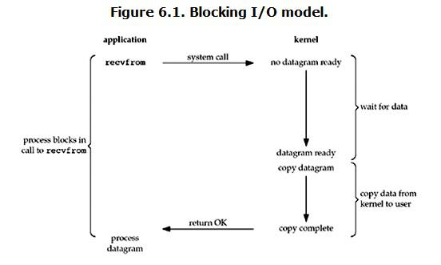
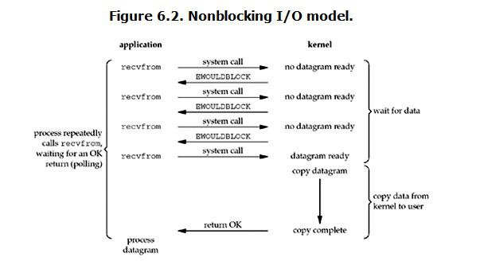
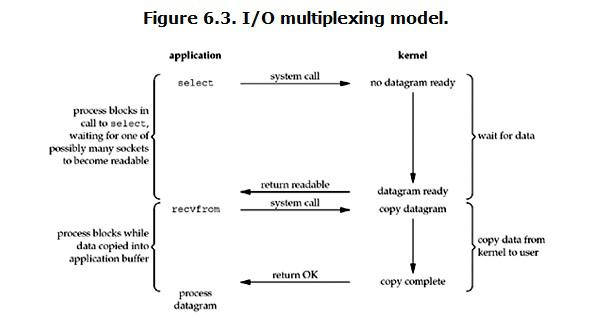
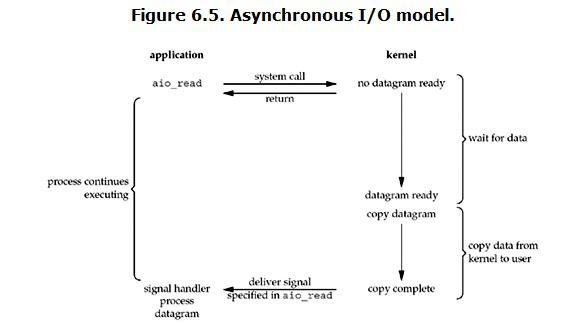

#### 前言
本部分主要说明一些计算机OS相关基础知识，后续会不断补充。文中部分内容可能来源于其他文章，所以你也可以参考文末的参考资料。

#### 1.进程 vs 线程
可以参考[进程与线程的一个简单解释](http://www.ruanyifeng.com/blog/2013/04/processes_and_threads.html),总结起来就是下面的内容:

(1)**地址空间和其它资源**:进程间相互独立，同一进程的各线程间共享。某进程内的线程在其它进程不可见。

(2)**通信**:进程间通信IPC，线程间可以直接读写进程数据段（如`全局变量`）来进行通信。但是需要借助于互斥锁或者型号量以保证数据的一致性。

(3)**调度和切换**：线程上下文切换比进程上下文切换要快得多(因为线程不拥有系统资源)。

(4)进程是**系统**进行资源分配和调度的一个独立单位。线程是进程的一个实体,是**CPU**调度和分派的基本单位,它是比进程更小的能独立运行的基本单位。线程自己基本上不拥有系统资源,只拥有一点在运行中必不可少的资源(如**程序计数器,一组寄存器和栈**),但是它可与同属一个进程的其他的线程共享进程所拥有的全部资源。

#### 2.进程同步与互斥的区别
互斥:是指**某一资源**同时只允许一个访问者对其进行访问，具有唯一性和排它性。但互斥无法限制访问者对资源的访问顺序，即访问是无序的。

同步：是指在互斥的基础上（大多数情况），通过其它机制实现访问者对资源的有序访问。在大多数情况下，同步已经实现了互斥，特别是所有写入资源的情况必定是互斥的。少数情况是指可以允许多个访问者同时访问资源。

简单地说：同步体现的是一种协作性，互斥体现的是一种排他性。

#### 3.进程间的通信方式有哪些？
管道(pipe)：管道是一种半双工的通信方式，数据只能单向流动，而且只能在具有**亲缘关系**的进程间使用。进程的亲缘关系通常是指父子进程关系。

有名管道 (named pipe) ： 有名管道也是半双工的通信方式，但是它**允许无亲缘关系**进程间的通信。

信号量(semophore) ： 信号量是一个计数器，可以用来**控制多个进程对共享资源的访问**。它常作为一种锁机制，防止某进程正在访问共享资源时，其他进程也访问该资源。因此，主要作为`进程间`以及`同一进程内不同线程之间`的同步手段。

消息队列(message queue) ： 消息队列是由消息的链表，存放在内核中并由消息队列标识符标识。消息队列克服了信号传递信息少、管道只能承载无格式字节流以及缓冲区大小受限等缺点。

信号 (sinal) ： 信号是一种比较复杂的通信方式，用于通知接收进程某个事件已经发生。

共享内存(shared memory) ：共享内存就是映射一段能被其他进程所访问的内存，这段共享内存由一个进程创建，但**多个进程都可以访问**。共享内存是最快的IPC方式，它是针对其他进程间通信方式运行效率低而专门设计的。它往往与其他通信机制，如信号量，配合使用，来实现进程间的同步和通信。

套接字( socket) ： 套解口也是一种进程间通信机制，与其他通信机制不同的是，它可用于**不同机器间**的进程通信。

#### 4.作业（或进程）的调度算法有哪些？
- 先来先服务（FCFS，First-Come-First-Served）: 
  此算法的原则是按照作业到达**后备作业队列**（或进程进入就绪队列）的先后次序来选择作业（或进程）。

- 短作业优先（SJF,Shortest Process Next）
  这种调度算法主要用于作业调度，它从作业后备队列中挑选所需运行时间（估计值）最短的作业进入主存运行。

- 时间片轮转调度算法（RR，Round-Robin）
  当某个进程执行的**时间片**用完时，调度程序便停止该进程的执行，并将它送**就绪队列**的末尾，**等待分配下一时间片**再执行。然后把处理机分配给就绪队列中新的队首进程，同时也让它执行一个时间片。这样就可以保证就绪队列中的所有进程，在一给定的时间内，均能获得一时间片处理机执行时间。

- 高响应比优先（HRRN，Highest Response Ratio Next）:
  按照高响应比（（已等待时间＋要求运行时间）/ 要求运行时间 = 1+(已等待时间/要求运行时间)）优先的原则，在每次选择作业投入运行时，先计算此时后备作业队列中每个作业的响应比RP然后选择其值最大的作业投入运行。

- 优先权(Priority)调度算法
  按照进程的优先权大小来调度，使**高优先权**进程得到优先处理的调度策略称为优先权调度算法。

- 多级队列调度算法
  多队列调度是根据作业的**性质**和**类型**的不同，将就绪队列再分为若干个子队列，所有的作业（或进程）按其性质排入相应的队列中，而不同的就绪队列采用不同的调度算法

#### 5.死锁产生的原因，死锁产生的必要条件是什么，如何预防死锁，如何避免死锁，死锁定理？
**死锁产生的原因**：
<pre>
1.竞争资源
2.进程推进顺序不当    
</pre>

**死锁产生的必要条件**：
<pre>
互斥条件：一个资源一次只能被一个进程所使用，即是排它性使用。
不剥夺条件：一个资源仅能被占有它的进程所释放，而不能被别的进程强占。
请求与保持条件：进程已经保持了至少一个资源，但又提出了新的资源要求，而该资源又已被其它进程占有，此时请求进程阻塞，但又对已经获得的其它资源保持不放。
环路等待条件：当每类资源只有一个时，在发生死锁时，必然存在一个进程-资源的环形链。
</pre>
**预防死锁**：

破坏四个必要条件之一。

死锁的避免：银行家算法，该方法允许**进程动态地申请资源**，系统在进行资源分配之前，先计算资源分配的安全性。若此次分配不会导致系统从安全状态向不安全状态转换，便可将资源分配给进程；否则不分配资源，进程必须阻塞等待。从而避免发生死锁。

**死锁定理**：S为死锁状态的充分条件是：尚且仅当S状态的资源分配图是不可完全简化的，该充分条件称为死锁定理。

**死锁的解除**：

方法1：**强制性**地从系统中**撤消**一个或多个死锁的进程以断开循环等待链，并收回分配给终止进程的全部资源供剩下的进程使用。

方法2：使用一个有效的挂起和解除机构来**挂起**一些死锁的进程，其实质是从被挂起的进程那里抢占资源以解除死锁。


#### 6.分段式存储管理、分页式存储管理，两个的区别？
分页式存储管理：分页存储管理是将一个进程的地址（**逻辑地址空间**）空间划分成若干个大小相等的区域，称为页，相应地，将内存空间划分成与页相同大小（为了保证页内偏移一致）的若干个物理块，称为块或页框（页架）。在为进程分配内存时，将进程中的若干页分别装入多个**不相邻接**的块中。

分段式存储管理：在分段存储管理方式中，作业的地址空间被划分为若干个段，每个段是**一组完整的逻辑信息**，如有主程序段、子程序段、数据段及堆栈段等，每个段都有自己的名字，都是从零开始编址的一段连续的地址空间，各段长度是不等的。

两者的区别：

页是信息的物理单位，分页是为了`实现非连续的分配，以便解决内存的碎片问题`，或者说分页是为了由于系统管理的需要。

页的大小固定是由系统确定的，`将逻辑地址划分为页号和页内地址是由机器硬件实现的`。而段的长度是不固定的，决定于用户的程序长度，通常由编译程序进行编译时根据信息的性质来划分。分页式存储管理的作业地址空间是一维的，分段式的存储管理的作业管理地址空间是`二维`的。

#### 7.页面置换算法有哪些？
(1)最佳置换算法（Optimal）：即选择那些`永不使用`的，或者是在`最长时间内`不再被访问的页面置换出去。（它是一种理想化的算法，性能最好，但在实际上难于实现）。

(2)先进先出置换算法FIFO：该算法总是淘汰最先进入内存的页面，即选择在内存中驻留时间最久的页面予以淘汰。

(3)最近最久未使用置换算法LRU（Least Recently Used）：该算法是选择最近最久未使用的页面予以淘汰，系统在每个页面设置一个访问字段，用以记录这个页面自上次被访问以来所经历的时间T，当要淘汰一个页面时，选择T最大的页面。

(4)Clock置换算法：也叫`最近未用算法NRU（Not RecentlyUsed）`。该算法为每个页面设置一位访问位，将内存中的所有页面都通过链接指针链成一个循环队列。当某页被访问时，其访问位置“1”。在选择一页淘汰时，就检查其访问位，如果是“0”，就选择该页换出；若为“1”，则重新置为“0”，暂不换出该页，在循环队列中检查下一个页面，直到访问位为“0”的页面为止。由于该算法`只有一位访问位`，只能用它表示该页是否已经使用过，而置换时是将未使用过的页面换出去，所以把该算法称为最近未用算法。最少使用置换算法LFU：该算法选择最近时期使用最少的页面作为淘汰页

#### 8.文件描述符？
**内核（kernel）**利用[文件描述符](http://blog.csdn.net/captain_mxd/article/details/52153233)（file descriptor）来访问文件。文件描述符是`非负整数`。打开现存文件或新建文件时，内核会返回一个文件描述符。读写文件也需要使用文件描述符来指定待读写的文件。

实际上，文件描述符是一个索引值，指向内核为每一个**进程**所维护的该进程打开文件的记录表。当程序打开一个现有文件或者创建一个新文件时，内核向进程返回一个文件描述符。在程序设计中，一些涉及底层的程序编写往往会围绕着文件描述符展开。但是文件描述符这一概念往往只适用于\*nix这样的操作系统。


在Linux系统中一切皆可以看成是文件，文件又可分为：普通文件、目录文件、链接文件和设备文件。文件描述符（file descriptor）是内核为了`高效管理已被打开的文件所创建的索引`，其是一个非负整数（通常是小整数），用于指代被打开的文件，所有执行I/O操作的系统调用都通过文件描述符。程序刚刚启动的时候，0是标准输入，1是标准输出，2是标准错误。如果此时去打开一个新的文件，它的文件描述符会是3。POSIX标准要求每次打开文件时（含socket）必须使用当前进程中最小可用的文件描述符号码。

每一个文件描述符会与一个打开文件相对应，同时，`不同的文件描述符也会指向同一个文件`。相同的文件可以被不同的进程打开`也可以在同一个进程中被多次打开`。系统为每一个进程维护了一个文件描述符表，该表的值都是从0开始的，所以在不同的进程中你会看到相同的文件描述符，这种情况下相同文件描述符有可能指向同一个文件，也有可能指向不同的文件。

#### 9.[网络IO模型：同步IO和异步IO，阻塞IO和非阻塞IO](https://www.cnblogs.com/Forever-Kenlen-Ja/p/4480718.html)
- recvfrom函数

[recvfrom](https://baike.baidu.com/item/recvfrom/4459985?fr=aladdin)用来接收远程主机经`指定的socket`传来的数据,并把数据传到由参数buf指向的内存空间,参数len为可接收数据的最大长度.参数flags一般设0,其他数值定义参考recv().参数from用来指定欲传送的网络地址,结构sockaddr请参考bind()函数.参数fromlen为sockaddr的结构长度。


- recv函数

[recv()](https://baike.baidu.com/item/recv%28%29/10082153?fr=aladdin&fromid=17200658&fromtitle=recv)
这里只描述同步Socket的recv函数的执行流程。当应用程序调用recv函数时：
（1）recv先`等待`s的发送缓冲中的数据被协议传送完毕，如果协议在传送s的发送缓冲中的数据时出现网络错误，那么recv函数返回SOCKET_ERROR；
（2）如果s的发送缓冲中`没有数据`或者`数据被协议成功发送完毕后`，recv先检查套接字s的接收缓冲区，如果s接收缓冲区中没有数据或者协议正在接收数据，那么recv就一直等待，直到协议把数据接收完毕。当协议把数据接收完毕，recv函数就把s的接收缓冲中的数据`copy到buf中`（注意协议接收到的数据可能大于buf的长度，所以在这种情况下要调用几次recv函数才能把s的接收缓冲中的数据copy完。recv函数仅仅是copy数据，真正的接收数据是协议来完成的）；
recv函数返回其实际copy的字节数。如果recv在copy时出错，那么它返回SOCKET_ERROR；如果recv函数在等待协议接收数据时网络中断了，那么它返回0。
注意：在Unix系统下，如果recv函数在等待协议接收数据时网络断开了，那么调用recv的进程会接收到一个SIGPIPE信号，进程对该信号的默认处理是进程终止。

- select函数

 select是一个计算机函数，位于头文件#include <sys/select.h>。该函数用于监视**文件描述符**的变化情况——读写或是异常。
```c
int select(int nfds, fd_set *readfds, fd_set *writefds, fd_set *exceptfds, 
    struct timeval *timeout) 
//一个指向timeval结构的指针，用于决定select等待I/o的最长时间。如果为空将一直等待
```
 这里，fd_set 类型可以简单的理解为按bit位标记句柄的队列，例如要在某fd_set 中标记一个值为16的句柄，则该fd_set的第16个bit位被标记为1。具体的置位、验证可使用FD_SET、FD_ISSET等宏实现。在select()函数中，readfds、writefds和exceptfds`同时作为输入参数和输出参数`。如果输入的readfds标记了16号句柄，则select()将检测16号句柄是否可读。在select()返回后，可以通过检查readfds有否标记16号句柄，来判断该“可读”事件是否发生。另外，用户可以设置timeout时间。

 Select在Socket编程中还是比较重要的，可是对于初学Socket的人来说都不太爱用Select写程序，他们只是习惯写诸如`connect、accept、recv或recvfrom`这样的阻塞程序（所谓阻塞方式block，顾名思义，就是进程或是线程执行到这些函数时必须等待某个事件的发生，如果事件没有发生，进程或线程就被阻塞，**函数不能立即返回**）。可是使用Select就可以完成`非阻塞`（所谓非阻塞方式non-block，就是进程或线程执行此函数时不必非要等待事件的发生，一旦执行肯定返回，`以返回值的不同来反映函数的执行情况`，如果事件发生则与阻塞方式相同(从内核copy数据到用户进程)，若事件没有发生则返回一个代码来告知事件未发生，而进程或线程继续执行，所以效率较高方式工作的程序，它能够监视我们需要监视的文件描述符的变化情况——读写或是异常。

- read/write非阻塞

  在Linux中，我们可以使用select函数实现I/O端口的复用，传递给select函数的参数会告诉内核：
  <pre>
  •我们所关心的文件描述符
  •对每个描述符，我们所关心的状态。(我们是要想从一个文件描述符中读或者写，还是关注一个描述符中是否出现异常)
  •我们要等待多长时间。(我们可以等待无限长的时间，等待固定的一段时间，或者根本就不等待)
  </pre>
   **每次**select函数返回后，内核告诉我们一下信息：
 <pre>
  •对我们的要求已经做好准备的描述符的个数
  •对于三种条件哪些描述符已经做好准备.(读，写，异常)
 </pre>
有了这些返回信息，我们可以调用合适的I/O函数(通常是 read 或 write)，并且这些函数[不会出现阻塞的情况](http://blog.csdn.net/u012317833/article/details/39343915)。如果在open一个设备时指定了`O_NONBLOCK`标志，read/write就不会阻塞。以read为例，如果设备暂时没有数据可读就返回-1，同时置errno为EWOULDBLOCK（或者EAGAIN，这两个宏定义的值相同），表示本来应该阻塞在这里（would block，虚拟语气），事实上并没有阻塞而是直接返回错误，调用者应该试着再读一次（again）。这种行为方式称为轮询（Poll），调用者只是查询一下，而不是阻塞在这里死等，这样可以同时监视多个设备:
```js
// 1.进程block，while(true)循环
// 2.但是process是被select这个函数block，而不是被socket IO给block。因此select()与非阻塞IO类似
// 3.select()接口可以同时对多个句柄进行读状态、写状态和错误状态的探测，所以可以很容易构建为多个客户端提供独立问答服务的
// 服务器系统
while(1) {  
    // 4.当用户进程调用了select，那么整个进程会被block，而同时，kernel会“监视”所有select负责的socket，当任何一个socket中的
    // 数据准备好了，select就会返回。这个时候用户进程再调用read操作，将数据从kernel拷贝到用户进程
    非阻塞read(设备1);  
    // 可以继续往下读取
    if(设备1有数据到达)  
        处理数据;  
    非阻塞read(设备2);  
    // 可以继续往下读取
    if(设备2有数据到达)  
        处理数据;  
    ...  
}  
```
如果read(设备1)是阻塞的，那么只要设备1没有数据到达就会`一直阻塞`在设备1的read调用上，即使设备2有数据到达也不能处理，使用非阻塞I/O就可以避免设备2得不到及时处理。

非阻塞I/O有一个**缺点**，如果所有设备都一直没有数据到达，调用者需要`反复查询`做无用功，如果阻塞在那里，操作系统可以调度别的进程执行，就不会做无用功了。在使用非阻塞I/O时，通常不会在一个while循环中一直不停地查询（这称为**Tight Loop**），而是每延迟等待一会儿来查询一下，以免做太多无用功，在延迟等待的时候可以调度其它进程执行。
```js
while(1) {  
    非阻塞read(设备1);  
    if(设备1有数据到达)  
        处理数据;  
    非阻塞read(设备2);  
    if(设备2有数据到达)  
        处理数据;  
    ...  
    sleep(n);  
}  
```
这样做的问题是，设备1有数据到达时可能不能及时处理，最长需延迟n秒才能处理，而且反复查询还是做了很多无用功。而select函数提供的最后一个参数可以`阻塞地`同时监视多个设备，还可以设定阻塞等待的超时时间，从而解决了这个问题。

**阻塞IO（blocking IO）**过程如下:

 

**非阻塞IO（non-blocking IO）**过程如下:



**多路复用IO（IO multiplexing）/select/epoll**过程如下:



**异步IO（Asynchronous I/O）**过程如下:



**同步IO/异步IO区别**:两者的区别就在于synchronous IO做”IO operation”的时候会将`process阻塞`。按照这个定义，之前所述的blocking IO，non-blocking IO，IO multiplexing都属于synchronous IO。有人可能会说，non-blocking IO并没有被block啊。这里有个非常“狡猾”的地方，定义中所指的”IO operation”是指真实的IO操作，就是例子中的recvfrom这个系统调用。non-blocking IO在执行recvfrom这个系统调用的时候，`如果kernel的数据没有准备好，这时候不会block进程。但是当kernel中数据准备好的时候，recvfrom会将数据从kernel拷贝到用户内存中，这个时候进程是被block的`。而asynchronous IO则不一样，当进程发起IO操作之后，就直接返回再也不理睬了，直到kernel发送一个信号，告诉进程说IO完成。在这整个过程中，`进程完全没有被block`。

参考资料:

[进程与线程的一个简单解释](http://www.ruanyifeng.com/blog/2013/04/processes_and_threads.html)

[进程与线程的区别](https://jingyan.baidu.com/article/624e74598efcc834e9ba5a66.html)

[操作系统原理面试题目总结](http://wenboo.site/2016/10/16/%E6%93%8D%E4%BD%9C%E7%B3%BB%E7%BB%9F%E5%8E%9F%E7%90%86%E9%9D%A2%E8%AF%95%E9%A2%98%E7%9B%AE%E6%80%BB%E7%BB%93/)

[操作系统概念（第九章） 虚拟内存](http://blog.csdn.net/u013007900/article/details/50231933)

[操作系统存储管理之分段存储](http://blog.csdn.net/qwe6112071/article/details/70500258)

[操作系统存储管理之页式存储管理深入浅出](http://blog.csdn.net/qwe6112071/article/details/70500060)

[文件描述符](https://baike.baidu.com/item/%E6%96%87%E4%BB%B6%E6%8F%8F%E8%BF%B0%E7%AC%A6/9809582?fr=aladdin)

[文件描述符](http://blog.csdn.net/captain_mxd/article/details/52153233)

[每天进步一点点——Linux中的文件描述符与打开文件之间的关系](http://blog.csdn.net/cywosp/article/details/38965239)

[转网络IO模型：同步IO和异步IO，阻塞IO和非阻塞IO](https://www.cnblogs.com/Forever-Kenlen-Ja/p/4480718.html)

[select （Linux 网络编程）](https://baike.baidu.com/item/select/12504672?fr=aladdin)

[linux select函数详解](https://www.cnblogs.com/ccsccs/articles/4224253.html)

[阻塞和非阻塞read/write](http://blog.csdn.net/u012317833/article/details/39343915)

[I/O多路复用技术（multiplexing）是什么？](https://www.zhihu.com/question/28594409)

[Linux中epoll用法总结（转）](https://www.cnblogs.com/chunlinge/p/3394649.html)

[Linux下的I/O复用与epoll详解](https://www.cnblogs.com/lojunren/p/3856290.html)

[红黑树](https://baike.baidu.com/item/%E7%BA%A2%E9%BB%91%E6%A0%91/2413209?fr=aladdin)
