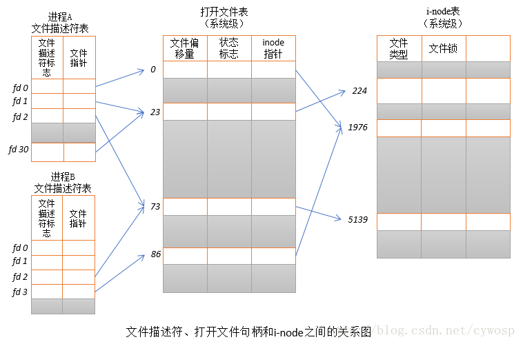

#### 前言
本部分主要说明一些计算机OS相关基础知识，后续会不断补充。文中部分内容可能来源于其他文章，所以你也可以参考文末的参考资料。

#### 1.进程 vs 线程
可以参考[进程与线程的一个简单解释](http://www.ruanyifeng.com/blog/2013/04/processes_and_threads.html),总结起来就是下面的内容:

(1)**地址空间和其它资源**:进程间相互独立，同一进程的各线程间共享。某进程内的线程在其它进程不可见。

(2)**通信**:进程间通信IPC，线程间可以直接读写进程数据段（如`全局变量`）来进行通信。但是需要借助于互斥锁或者型号量以保证数据的一致性。

(3)**调度和切换**：线程上下文切换比进程上下文切换要快得多(因为线程不拥有系统资源)。

(4)进程是**系统**进行资源分配和调度的一个独立单位。线程是进程的一个实体,是**CPU**调度和分派的基本单位,它是比进程更小的能独立运行的基本单位。线程自己基本上不拥有系统资源,只拥有一点在运行中必不可少的资源(如**程序计数器,一组寄存器和栈**),但是它可与同属一个进程的其他的线程共享进程所拥有的全部资源。

#### 2.进程同步与互斥的区别
互斥:是指**某一资源**同时只允许一个访问者对其进行访问，具有唯一性和排它性。但互斥无法限制访问者对资源的访问顺序，即访问是无序的。

同步：是指在互斥的基础上（大多数情况），通过其它机制实现访问者对资源的有序访问。在大多数情况下，同步已经实现了互斥，特别是所有写入资源的情况必定是互斥的。少数情况是指可以允许多个访问者同时访问资源。

简单地说：同步体现的是一种协作性，互斥体现的是一种排他性。

#### 3.进程间的通信方式有哪些？
管道(pipe)：管道是一种半双工的通信方式，数据只能单向流动，而且只能在具有**亲缘关系**的进程间使用。进程的亲缘关系通常是指父子进程关系。

有名管道 (named pipe) ： 有名管道也是半双工的通信方式，但是它**允许无亲缘关系**进程间的通信。

信号量(semophore) ： 信号量是一个计数器，可以用来**控制多个进程对共享资源的访问**。它常作为一种锁机制，防止某进程正在访问共享资源时，其他进程也访问该资源。因此，主要作为`进程间`以及`同一进程内不同线程之间`的同步手段。

消息队列(message queue) ： 消息队列是由消息的链表，存放在内核中并由消息队列标识符标识。消息队列克服了信号传递信息少、管道只能承载无格式字节流以及缓冲区大小受限等缺点。

信号 (sinal) ： 信号是一种比较复杂的通信方式，用于通知接收进程某个事件已经发生。

共享内存(shared memory) ：共享内存就是映射一段能被其他进程所访问的内存，这段共享内存由一个进程创建，但**多个进程都可以访问**。共享内存是最快的IPC方式，它是针对其他进程间通信方式运行效率低而专门设计的。它往往与其他通信机制，如信号量，配合使用，来实现进程间的同步和通信。

套接字( socket) ： 套解口也是一种进程间通信机制，与其他通信机制不同的是，它可用于**不同机器间**的进程通信。

#### 4.作业（或进程）的调度算法有哪些？
- 先来先服务（FCFS，First-Come-First-Served）: 
  此算法的原则是按照作业到达**后备作业队列**（或进程进入就绪队列）的先后次序来选择作业（或进程）。

- 短作业优先（SJF,Shortest Process Next）
  这种调度算法主要用于作业调度，它从作业后备队列中挑选所需运行时间（估计值）最短的作业进入主存运行。

- 时间片轮转调度算法（RR，Round-Robin）
  当某个进程执行的**时间片**用完时，调度程序便停止该进程的执行，并将它送**就绪队列**的末尾，**等待分配下一时间片**再执行。然后把处理机分配给就绪队列中新的队首进程，同时也让它执行一个时间片。这样就可以保证就绪队列中的所有进程，在一给定的时间内，均能获得一时间片处理机执行时间。

- 高响应比优先（HRRN，Highest Response Ratio Next）:
  按照高响应比（（已等待时间＋要求运行时间）/ 要求运行时间 = 1+(已等待时间/要求运行时间)）优先的原则，在每次选择作业投入运行时，先计算此时后备作业队列中每个作业的响应比RP然后选择其值最大的作业投入运行。

- 优先权(Priority)调度算法
  按照进程的优先权大小来调度，使**高优先权**进程得到优先处理的调度策略称为优先权调度算法。

- 多级队列调度算法
  多队列调度是根据作业的**性质**和**类型**的不同，将就绪队列再分为若干个子队列，所有的作业（或进程）按其性质排入相应的队列中，而不同的就绪队列采用不同的调度算法

#### 5.死锁产生的原因，死锁产生的必要条件是什么，如何预防死锁，如何避免死锁，死锁定理？
**死锁产生的原因**：
<pre>
1.竞争资源
2.进程推进顺序不当    
</pre>

**死锁产生的必要条件**：
<pre>
互斥条件：一个资源一次只能被一个进程所使用，即是排它性使用。
不剥夺条件：一个资源仅能被占有它的进程所释放，而不能被别的进程强占。
请求与保持条件：进程已经保持了至少一个资源，但又提出了新的资源要求，而该资源又已被其它进程占有，此时请求进程阻塞，但又对已经获得的其它资源保持不放。
环路等待条件：当每类资源只有一个时，在发生死锁时，必然存在一个进程-资源的环形链。
</pre>
**预防死锁**：

破坏四个必要条件之一。

死锁的避免：银行家算法，该方法允许**进程动态地申请资源**，系统在进行资源分配之前，先计算资源分配的安全性。若此次分配不会导致系统从安全状态向不安全状态转换，便可将资源分配给进程；否则不分配资源，进程必须阻塞等待。从而避免发生死锁。

**死锁定理**：S为死锁状态的充分条件是：尚且仅当S状态的资源分配图是不可完全简化的，该充分条件称为死锁定理。

**死锁的解除**：

方法1：**强制性**地从系统中**撤消**一个或多个死锁的进程以断开循环等待链，并收回分配给终止进程的全部资源供剩下的进程使用。

方法2：使用一个有效的挂起和解除机构来**挂起**一些死锁的进程，其实质是从被挂起的进程那里抢占资源以解除死锁。

#### 6.分段式存储管理、分页式存储管理，两个的区别？
分页式存储管理：分页存储管理是将一个进程的地址（**逻辑地址空间**）空间划分成若干个大小相等的区域，称为页，相应地，将内存空间划分成与页相同大小（为了保证页内偏移一致）的若干个物理块，称为块或页框（页架）。在为进程分配内存时，将进程中的若干页分别装入多个**不相邻接**的块中。

分段式存储管理：在分段存储管理方式中，作业的地址空间被划分为若干个段，每个段是**一组完整的逻辑信息**，如有主程序段、子程序段、数据段及堆栈段等，每个段都有自己的名字，都是从零开始编址的一段连续的地址空间，各段长度是不等的。

两者的区别：

页是信息的物理单位，分页是为了`实现非连续的分配，以便解决内存的碎片问题`，或者说分页是为了由于系统管理的需要。

页的大小固定是由系统确定的，`将逻辑地址划分为页号和页内地址是由机器硬件实现的`。而段的长度是不固定的，决定于用户的程序长度，通常由编译程序进行编译时根据信息的性质来划分。分页式存储管理的作业地址空间是一维的，分段式的存储管理的作业管理地址空间是`二维`的。

#### 7.页面置换算法有哪些？
(1)最佳置换算法（Optimal）：即选择那些`永不使用`的，或者是在`最长时间内`不再被访问的页面置换出去。（它是一种理想化的算法，性能最好，但在实际上难于实现）。

(2)先进先出置换算法FIFO：该算法总是淘汰最先进入内存的页面，即选择在内存中驻留时间最久的页面予以淘汰。

(3)最近最久未使用置换算法LRU（Least Recently Used）：该算法是选择最近最久未使用的页面予以淘汰，系统在每个页面设置一个访问字段，用以记录这个页面自上次被访问以来所经历的时间T，当要淘汰一个页面时，选择T最大的页面。

(4)Clock置换算法：也叫`最近未用算法NRU（Not RecentlyUsed）`。该算法为每个页面设置一位访问位，将内存中的所有页面都通过链接指针链成一个循环队列。当某页被访问时，其访问位置“1”。在选择一页淘汰时，就检查其访问位，如果是“0”，就选择该页换出；若为“1”，则重新置为“0”，暂不换出该页，在循环队列中检查下一个页面，直到访问位为“0”的页面为止。由于该算法`只有一位访问位`，只能用它表示该页是否已经使用过，而置换时是将未使用过的页面换出去，所以把该算法称为最近未用算法。最少使用置换算法LFU：该算法选择最近时期使用最少的页面作为淘汰页

#### 8.文件描述符？
**内核（kernel）**利用[文件描述符](http://blog.csdn.net/captain_mxd/article/details/52153233)（file descriptor）来访问文件。文件描述符是`非负整数`。打开现存文件或新建文件时，内核会返回一个文件描述符。读写文件也需要使用文件描述符来指定待读写的文件。

实际上，文件描述符是一个索引值，指向内核为每一个**进程**所维护的该进程打开文件的记录表。当程序打开一个现有文件或者创建一个新文件时，内核向进程返回一个文件描述符。在程序设计中，一些涉及底层的程序编写往往会围绕着文件描述符展开。但是文件描述符这一概念往往只适用于\*nix这样的操作系统。

在Linux系统中一切皆可以看成是文件，文件又可分为：普通文件、目录文件、链接文件和设备文件。文件描述符（file descriptor）是内核为了`高效管理已被打开的文件所创建的索引`，其是一个非负整数（通常是小整数），用于指代被打开的文件，所有执行I/O操作的系统调用都通过文件描述符。程序刚刚启动的时候，0是标准输入，1是标准输出，2是标准错误。如果此时去打开一个新的文件，它的文件描述符会是3。POSIX标准要求每次打开文件时（含socket）必须使用当前进程中最小可用的文件描述符号码。

每一个文件描述符会与一个打开文件相对应，同时，`不同的文件描述符也会指向同一个文件`。相同的文件可以被不同的进程打开`也可以在同一个进程中被多次打开`。系统为每一个进程维护了一个文件描述符表，该表的值都是从0开始的，所以在不同的进程中你会看到相同的文件描述符，这种情况下相同文件描述符有可能指向同一个文件，也有可能指向不同的文件。

参考资料:

[进程与线程的一个简单解释](http://www.ruanyifeng.com/blog/2013/04/processes_and_threads.html)

[进程与线程的区别](https://jingyan.baidu.com/article/624e74598efcc834e9ba5a66.html)

[操作系统原理面试题目总结](http://wenboo.site/2016/10/16/%E6%93%8D%E4%BD%9C%E7%B3%BB%E7%BB%9F%E5%8E%9F%E7%90%86%E9%9D%A2%E8%AF%95%E9%A2%98%E7%9B%AE%E6%80%BB%E7%BB%93/)

[操作系统概念（第九章） 虚拟内存](http://blog.csdn.net/u013007900/article/details/50231933)

[操作系统存储管理之分段存储](http://blog.csdn.net/qwe6112071/article/details/70500258)

[操作系统存储管理之页式存储管理深入浅出](http://blog.csdn.net/qwe6112071/article/details/70500060)

[文件描述符](https://baike.baidu.com/item/%E6%96%87%E4%BB%B6%E6%8F%8F%E8%BF%B0%E7%AC%A6/9809582?fr=aladdin)

[文件描述符](http://blog.csdn.net/captain_mxd/article/details/52153233)

[每天进步一点点——Linux中的文件描述符与打开文件之间的关系](http://blog.csdn.net/cywosp/article/details/38965239)
