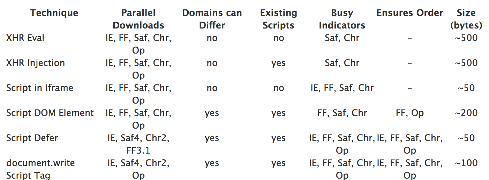

#### 1.defer,async与同步加载
```html
<script src="script.js"></script>
```
没有 defer 或 async，浏览器会立即加载并执行指定的脚本，“立即”指的是在渲染该 script 标签之下的文档元素之前，也就是说不等待后续载入的文档元素，读到就加载并执行。
```html
<script async src="script.js"></script>
```
有async，加载和渲染后续文档元素的过程将和 script.js 的加载与执行并行进行（异步）。
```html
<script defer src="myscript.js"></script>
```
有 defer，加载后续文档元素的过程将和 script.js 的加载并行进行（异步），但是 script.js 的执行要在`所有元素解析完成之后，DOMContentLoaded 事件触发之前`完成。
然后从实用角度来说呢，首先把所有脚本都丢到 </body> 之前是最佳实践，因为对于旧浏览器来说这是唯一的优化选择，此法可保证非脚本的其他一切元素能够以最快的速度得到加载和解析。参见下图:


defer和async在`网络读取（下载）这块儿`是一样的，都是异步的（相较于 HTML 解析）
它俩的差别在于脚本下载完之后何时执行，显然defer是最接近我们对于应用脚本加载和执行的要求的。
async则是一个`乱序执行`的主，反正对它来说脚本的加载和执行是紧紧挨着的，所以不管你声明的顺序如何，只要它加载完了就会立刻执行。仔细想想，async 对于应用脚本的用处不大，因为它完全不考虑依赖（哪怕是最低级的顺序执行），不过它对于那些可以不依赖任何脚本或不被任何脚本依赖的脚本来说却是非常合适的，最典型的例子：`Google Analytics`。

#### 2.遍历数组并删除项的时候要用splice而不是用delete
```js
const arr = [{id:4,name:'ql'},{id:5,name:'罄天'},{id:6,name:'liangklfangl'},{id:8,name:'liangklfangl'}];
/**
 * 将数组中id与newObj的id相等的元素的值设置为新的值newObj,
 * 但是如果arr中有些元素的id不在ids列表中，那么我们直接删除这个元素
 * @param  {[type]} arr    [description]
 * @param  {[type]} newObj [description]
 * @param  {[type]} ids    [description]
 * @return {[type]}        [description]
 */
function updateById(arr,newObj,ids){
 for(let _j=0;_j<arr.length;_j++){
   if(arr[_j].id===newObj.id){
     arr[_j]=Object.assign(arr[_j],newObj)
   }
   if(ids.indexOf(arr[_j].id)==-1){
     //从原来的数组中删除
     //这里必须使用splice，此时我们的数组的长度会同时变化，如果使用delete
     //那么只是将数组的某一项设置为undefined，所以会报错
     arr.splice(_j,1);
   }
 }
 return arr;
}

const result = updateById(arr,{id:6,title:'罄天测试'},[5,6,8]);
//更新后的结果为
//[
//   {
//     "id": 5,
//     "name": "罄天"
//   },
//   {
//     "id": 6,
//     "name": "liangklfangl",
//     "title": "罄天测试"
//   },
//   {
//     "id": 8,
//     "name": "liangklfangl"
//   }
// ]
console.log('result===',result)
```
遍历数组并删除元素的时候一定要用splice而不是delete，因为后者的数组长度不会发生变化只是将该项设置为undefined而已。

#### 3.深入理解setTimeout与setInterval
其中网上经常看到的就是下面这张图:


这张图告诉我们以下几个事实:

- 1.事件队列顺序执行

所有进入事件队列里面的函数都是顺序执行的，比如10ms Timer Starts,Mouse Click Occurs,10ms Interval Starts等，先进入到队列里面的往往按顺序先执行。因此当10ms的Timer执行完毕以后，等待在队列里面的只有Mouse Click和10ms的Interval，而鼠标事件先被推入到事件队列，因此会被先执行。但是要注意:图上Mouse Click Callback并不是要等到10ms后才能执行，而是当调用栈空的时候会立即执行。如果在Mouse Click Callback执行的时候10ms Interval时间到了，也要求执行，此时10ms的Interval只有`排队等待`了，而如果Mouse Click Callback执行时间超过了10ms，那么10ms的Interval又要求执行了，那么此时必须注意，10ms Interval根本不会插入，而是会`直接丢掉`，因为事件队列中已经有一个回调函数等待执行了!在图中采用的是30ms的时候,10ms Interval在执行的时候，又要求插入一个新的定时器，这种情况和前面的有一点不同，因为上次的定时器已经在执行了，因此事件队列中的这个setInterval回调其实已经被移出事件队列了，所以可以继续插入而不是直接drop(这是我自己的理解,原文你可以[点击这里](https://johnresig.com/blog/how-javascript-timers-work/#postcomment)),但是该文章是为了告诉我们:队列中最多有一个回调函数等待执行(执行的那个已经不在队列中，而是在调用栈中了)，那么。下面是对setInterval的说明:

<pre>
如果你每次都将setInterval的回调函数推入队列，那么当在执行耗时代码结束后将会有大量的回调函数被同时执行，而他们之间的执行间隔将会非常短。因此，聪明的浏览器会判断当前队列中是否有setInterval的回调函数`没有执行完`，如果有，那么在它执行完毕之前不会再次插入。
</pre>

- 2.setTimeout至少会延迟指定的时间
比如下面的代码:
```js
setTimeout(function(){
  /* Some long block of code... */
  setTimeout(arguments.callee, 10);
}, 10);
 
setInterval(function(){
  /* Some long block of code... */
}, 10);
```
咋一看两个代码功能是一致的，其实不是的。setTimeout会保证在前面一个回调执行后至少指定的时间才会执行后面的回调(可多不可少)。而setInterval是不管前面一个回调的具体执行时间的(同一个setInterval队列中最多1个等待执行的)。

- setTimeout定时器执行时间可能比预期的长
 如果一个定时器在执行的时候被阻塞了，那么它会继续等待`指定的时间`等待执行，因此它的实际执行时间可能比预期的要长。

- setInterval的执行间隔时间可能非常短
 setInterval如果本身的执行时间很长(超过指定的interval间隔)，那么多个回调函数之间可能会间隔很短时间执行(其实只有两个，因为setInterval最多有一个等待执行，注意是`等待`执行，在执行的不算)。

#### 4.如何使得页面的js文件能够并行加载
下面是百度首页并行加载js的图，看到这里我忽然对js并行加载产生了浓厚的兴趣。


于是google到了[stevesouders大神](http://www.stevesouders.com/blog/2009/04/27/loading-scripts-without-blocking/)关于并行加载js文件的系列文章。文中引入了下面的图:



但是文中没有对这个图做细致的区分，所以我在这里作下具体的分析，并提供相应的实例:

##### 4.1 Script in Iframe
iframe和主页面中的其他资源都是并行加载的。因为iframe常用于在页面中加入另一个页面，而该种加载js的方式就是利用了iframe的这种特性。比如下面的代码:
```html
<iframe src='A.html' width=0 height=0 frameborder=0 id=frame1></iframe>
```
这种方式使用A.html而不是A.js，这是必须的，因为iframe默认需要加载一个文档而不是一个js文件。因此你需要将外链的script脚本转换化为HTML文档中的内联脚本。和XHR Eval和XHR Injection方式一样，iframe的URL需要和主页面是同源的，因为XSS(Cross-site security)限制JS访问不同源的父文档或者子文档。即使主页面和iframe来源于同一个域，你仍然需要修改你的js来在两个文档之间建立联系。一个方法就是通过frames数组/document.getElementById来访问iframe本身。比如下面的代码:
```js
// access the iframe from the main page using "frames"
window.frames[0].createNewDiv();
// access the iframe from the main page using "getElementById"
document.getElementById('frame1').contentWindow.createNewDiv();
```
而子级iframe通过parent来访问父级页面:
```js
// access the main page from within the iframe using "parent"
function createNewDiv() {
    var newDiv = parent.document.createElement('div');
    parent.document.body.appendChild(newDiv);
}
```
下面再该出完成的实例:

将你的script代码包裹到一个iframe中，然后以iframe的方式进行加载:
```html
<iframe id="frameID" width="200" height="200"></iframe>
```
下面是js部分:
```js
var iframe = document.getElementById('frameID'),
    iframeWin = iframe.contentWindow || iframe,
    iframeDoc = iframe.contentDocument || iframeWin.document;
window.myId = 'parent';
// <1>父级窗口设置myId属性，iframe中无法获取到window.myId的值
//  即iframe脚本的运行上下文与父容器隔离
window.hello = function () {
    alert('hello from owner!');
};
// <4>ready,onload后document.write会重写iframe内容
$(iframeDoc).ready(function (event) {
    iframeDoc.open();
    iframeDoc.write('iframe here');
    iframeDoc.write('\<script>alert("hello from iframe!");\<\/script>');
    iframeDoc.write('\<script>parent.hello();\<\/script>');
    iframeDoc.write('\<script>alert(window.myId);\<\/script>');
    iframeDoc.write('\<script>alert(parent.myId);\<\/script>');
    // <2>iframe无法通过window直接访问父级iframe上的window属性，必须通过parent才行
    iframeDoc.close();
    // <3>通过DOM API互操作，要求iframe与父容器是同域的。 与前面所有DOM操作的注入方式
    // 同样会存在XSS安全问题
});
```
这种情况一般有什么用呢？其实典型的使用场景就是广告，比如第三方提供的广告是一个js文件的情况。因为浏览器一定要把外部的js抓回来并且执行完，才会继续载入网页下面的部分。如果对方放置js 的主机连线速度很慢，就会发生网页载入到一半卡住等对方的情况，因此无法直接把js通过script标签的src引入。

这种情况`最简单`的解决方式就是自己另外写一个网页，把对方提供的<script src=""><\/script>放进去，在侧栏改用<iframe>嵌入自己写的网页。但这个方法的问题就是你要有**网页空间**放置你写的网页。那么有没有办法不用浏览器**等待**把广告的js抓取回来才继续解析后面的网页，同时也不用自己在网页中添加一个广告空间(比如div)来存放自己的内容呢？我们看看下面的方法:

```js
<iframe id="_if1" scrolling="no" style="width : 100%" ><\/iframe>
<script>
  (function() {
    var iframe = document.getElementById('_if1'),
      iframeWin = iframe.contentWindow || iframe ,
      iframDoc = iframeWin.document || iframe.contentDocument;
    iframDoc.write('<html><head></head><body><script src="http://postpet.jp/webmail/blog/clock_v1_moco.js" ></sc' + 'ript><body></html>');
    // 1.写入脚本
    if(iframDoc.all) {
      // 3.以前用户判断IE，现在很多浏览器都支持
      var scArr = iframDoc.getElementsByTagName('script'),
        oSc = scArr[scArr.length - 1];  
      // 4.检查一下iframe所有的js是否已经加载完成
      _check();
      return;
      function _check() {
        var rs = oSc.readyState;
        if(rs == 'loaded' || rs == 'complete') {
          iframDoc.close();
          _height();
          return;
        }
        setTimeout(_check, 100);
      }     
    }
    iframeWin.onload = _height;
    // 2.iframe执行了onload以后将它的高度设置为内容的高度
    doc.write('<script> document.close(); </sc' + 'ript>');
    function _height() {
      // 5._height 函式的功用是把iframe 的高度撑到可以显示iframe内所有东西的高度
      iframe.style.height = iframDoc.body.scrollHeight + 'px';
    }
  })();
<\/script>
<script type="text/javascript" src="http://apps.bdimg.com/libs/jquery/1.11.1/jquery.min.js"><\/script>
// 6.即使这里没有加载jquery，通过iframe加载的js也是有jquery的
```
你可以查看[example1](./examples/example1.html),同时在页面中查看瀑布流，你也可以看到页面的js和iframe中的js(第三方广告的js)是并行加载的:


假如第三方广告提供了如下的资源:
```html
<script src="http://www.lucido-l.jp/blogparts/parts.js"><\/script>
```
同时该资源具有writeTag方法，那么我们依然可以采用这个方式来完成第三方资源和网页本身资源的并行加载:

```js
<iframe id="_if2" scrolling="no" style="width : 100%" ></iframe>
<script>
  (function() {
    var oIf = document.getElementById('_if2'),
      win = oIf.contentWindow,
      doc = oIf.contentWindow.document;
    doc.write('<html><head></head><body><script src="http://www.lucido-l.jp/blogparts/parts.js" ></sc' + 'ript>');
    if(doc.all) {
      var scArr = doc.getElementsByTagName('script'),
        oSc = scArr[scArr.length - 1];
      _check();
      return;
      function _check() {
        var rs = oSc.readyState;
        if(rs == 'loaded' || rs == 'complete') {
          doc.write('<script> writeTag(10, 13, 17, 22); </sc' + 'ript><body></html>');
          doc.close();
          _height();
          return;
        }
        setTimeout(_check, 100);
      }
    }
    win.onload = _height;
    doc.write('<script> writeTag(10, 13, 17, 22); document.close(); </sc' + 'ript><body></html>');
    function _height() {
      oIf.style.height = doc.body.scrollHeight + 'px';
    }
  })();
<\/script>
```

如果要嵌入的HTML与这类似，其实将HTML中的doc.write('<html><head></head><body><script src="... src后的网址改掉就可以了。但有个例外，如果载入的js中有再用document.write('<script...')写入其他的script tag ，那么上面的html是有问题的，可以采用下面这种方式来完成:

```js
<iframe id="_if3" scrolling="no" style="width : 100%" ></iframe>
<script>
  (function() {
    var oIf = document.getElementById('_if3'),
      win = oIf.contentWindow,
      doc = oIf.contentWindow.document;
    doc.write('<html><head></head><body><script> google_ad_client = "pub-1821434700708607"; google_ad_slot = "8156194155"; google_ad_width = 200; google_ad_height = 200; </sc' + 'ript><script src="http://pagead2.googlesyndication.com/pagead/show_ads.js"></sc' + 'ript>');
    if(doc.all) {
      // (1)假如我们知道加载的广告完成后会产生一个iframe标签，那么我们可以查看iframe完成否
      var ifArr = doc.getElementsByTagName('iframe');
      _check();
      return;
      function _check() {
        if(ifArr.length) {
          doc.close();
          // (2)关闭iframe文档流
          _height();
          return;
        }
        setTimeout(_check, 100);
      }
    }
    win.onload = _height;
    doc.write('<script> document.close(); </sc' + 'ript><body></html>');
    function _height() {
      oIf.style.height = doc.body.scrollHeight + 'px';
    }
  })();
</script>
```
这里例子的详细说明可以参考[这里](http://blog.xuite.net/vexed/tech/21851083-%E7%94%A8+JavaScript+%E6%8A%8A+script+tag+%E5%A1%9E%E9%80%B2+iframe+%E5%8A%A0%E5%BF%AB%E7%B6%B2%E9%A0%81%E8%BC%89%E5%85%A5%E9%80%9F%E5%BA%A6)。

##### 4.2 XHR Eval
该方法的完整实例如下:
```js
var xhrObj = getXHRObject();
xhrObj.onreadystatechange =function() {
        if ( xhrObj.readyState == 4 && 200 == xhrObj.status ) {
            eval(xhrObj.responseText);
        }
};
xhrObj.open('GET', 'A.js', true); 
//和主页面必须是同源的
xhrObj.send('');
function getXHRObject() {
  var xhrObj = false;
  try {
      xhrObj = new XMLHttpRequest();
  }
  catch(e){
      var progid = ['MSXML2.XMLHTTP.5.0', 'MSXML2.XMLHTTP.4.0',
'MSXML2.XMLHTTP.3.0', 'MSXML2.XMLHTTP', 'Microsoft.XMLHTTP'];
      for ( var i=0; i < progid.length; ++i ) {
          try {
              xhrObj = new ActiveXObject(progid[i]);
          }
          catch(e) {
              continue;
          }
          break;
      }
  }
  finally {
      return xhrObj;
  }
}
```
这个方法的明显特点就是**XMLHttpRequest**必须是同源策略。

##### 4.3 XHR Injection
```js
var xhrObj = getXHRObject(); 
// defined in the previous example
xhrObj.onreadystatechange =
  function() {
      if ( xhrObj.readyState == 4 ) {
          var scriptElem = document.createElement('script');
          document.getElementsByTagName('head')[0].appendChild(scriptElem);
          scriptElem.text = xhrObj.responseText;
      }
  };
xhrObj.open('GET', 'A.js', true); 
// must be same domain as main page
xhrObj.send('');
```
XHR Injection和XHR Eval一样使用XMLHttpRequest来获取js文件，但是他的不同之处在于不是使用eval而是通过创建一个script元素插入到DOM中，同时把xhr.responseText的作为script元素的text属性而完成数据加载。但是使用XHR Injection的方式明显要比eval的方法更快!

##### 4.4 Script DOM Element
该方式通过创建一个script元素，同时把src属性设置为一个URL。比如下面的代码:
```js
var scriptElem = document.createElement('script');
scriptElem.src = 'http://anydomain.com/A.js';
document.getElementsByTagName('head')[0].appendChild(scriptElem);
```
通过这种创建script标签的方式不会阻碍其他组件的下载。这种方式可以允许你从另外一个域名加载数据，因为script本身不具有同源特性。

##### 4.5 Script Defer
IE支持script的defer属性，该属性告诉浏览器当前脚本是异步加载的。这在脚本本身没有调用**document.write**，同时也不被其他脚本依赖的情况下很有用。当IE加载defer属性的脚本的时候，其允许其他资源同步加载。
```html
<script defer src='A.js'></script>
```
但是这种方式只在IE以及高版本的浏览器中适用。

##### 4.6 document.write Script Tag
这种模式，和script的defer一样，可以在IE中并行加载script资源。该方式虽然可以让js资源并行加载，但是[其他资源在script加载的过程中却仍然是阻塞的](https://www.safaribooksonline.com/library/view/even-faster-web/9780596803773/ch04.html)。
```js
document.write("<script type='text/javascript' src='A.js'><\/script>");
```
其中jquery中加载js文件是通过[$.ajax](http://blog.csdn.net/liangklfang/article/details/49638215)来完成的，你可以阅读我的这个文章。

而上面的方法的选择可以参考下面的图:


##### 4.7 百度首页并行加载js方式
回到前面百度的例子，那么他是如何实现并行加载的呢?
```js
var s="https://ss1.bdstatic.com/5eN1bjq8AAUYm2zgoY3K/r/www/cache/static/protocol/https/global/js/all_async_search_441981b.js",n="/script";document.write("<script src='"+s+"'><"+n+">")
// 1.通过document.write方法
function(){var e="https://ss1.bdstatic.com/5eN1bjq8AAUYm2zgoY3K/r/www/cache/static/protocol/https/plugins/every_cookie_4644b13.js";("Mac68K"==navigator.platform||"MacPPC"==navigator.platform||"Macintosh"==navigator.platform||"MacIntel"==navigator.platform)&&(e="https://ss1.bdstatic.com/5eN1bjq8AAUYm2zgoY3K/r/www/cache/static/protocol/https/plugins/every_cookie_mac_82990d4.js"),setTimeout(function(){$.ajax({url:e,cache:!0,dataType:"script"})},0)
// 2.通过$.ajax方法加载js脚本。1，2的脚本可以并行加载......
// 3.在上面的all_async_search_441981b.js中又并行加载了下面几个资源
Fe=$.ajax({dataType:"script",cache:!0,url:1===bds.comm.logFlagSug?"https://ss1.bdstatic.com/5eN1bjq8AAUYm2zgoY3K/r/www/cache/static/protocol/https/sug/js/bdsug_async_sam_sug_a97d823.js":"https://ss1.bdstatic.com/5eN1bjq8AAUYm2zgoY3K/r/www/cache/static/protocol/https/sug/js/bdsug_async_68cc989.js"})
// 3.1 通过$.ajax加载
```
所以从整体来说，在百度首页的同步加载js中以document.write与$.ajax居多。

#### 4.iframe跨域通信通用方法
[iframe跨域通信的通用解决方案-第二弹!（终极解决方案）](http://www.alloyteam.com/2013/11/the-second-version-universal-solution-iframe-cross-domain-communication/)

#### 5.网站为什么使用document.write加载js
比如网站http://tool.chinaz.com/Tools/unixtime.aspx加载的http://my.chinaz.com/js/uc.js

http://www.stevesouders.com/blog/2012/04/10/dont-docwrite-scripts/

https://stackoverflow.com/questions/802854/why-is-document-write-considered-a-bad-practice

http://www.stevesouders.com/blog/2009/04/27/loading-scripts-without-blocking/

https://stackoverflow.com/questions/556322/why-use-document-write

http://www.alloyteam.com/2013/11/the-second-version-universal-solution-iframe-cross-domain-communication/


#### 6.百度首页是如何同步加载js

view-source:https://www.baidu.com/

#### 7.iframe如何不阻塞主页面


参考资料:

[defer和async的区别](https://segmentfault.com/q/1010000000640869)

[How JavaScript Timers Work](https://johnresig.com/blog/how-javascript-timers-work/#postcomment)

[你真的了解setTimeout和setInterval吗？](http://qingbob.com/difference-between-settimeout-setinterval/)

[为Iframe注入脚本的不同方式比较](http://harttle.land/2016/04/14/iframe-script-injection.html)

[用JavaScript把script tag塞进iframe加快网页载入速度](http://blog.xuite.net/vexed/tech/21851083-%E7%94%A8+JavaScript+%E6%8A%8A+script+tag+%E5%A1%9E%E9%80%B2+iframe+%E5%8A%A0%E5%BF%AB%E7%B6%B2%E9%A0%81%E8%BC%89%E5%85%A5%E9%80%9F%E5%BA%A6)

[Chapter 4. Loading Scripts Without Blocking](https://www.safaribooksonline.com/library/view/even-faster-web/9780596803773/ch04.html)

[Loading Scripts Without Blocking](http://www.stevesouders.com/blog/2009/04/27/loading-scripts-without-blocking/)

[Coupling asynchronous scripts](http://www.stevesouders.com/blog/2008/12/27/coupling-async-scripts/)
