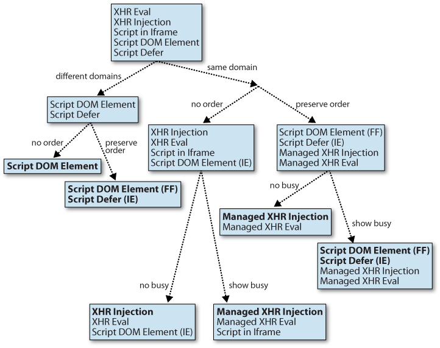
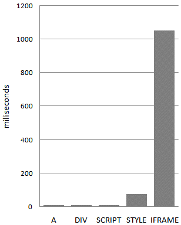

#### 1.defer,async与保证js加载完成后才调用的实现
```html
<script src="script.js"></script>
```
没有 defer 或 async，浏览器会立即加载并执行指定的脚本，“立即”指的是在渲染该 script 标签之下的文档元素之前，也就是说不等待后续载入的文档元素，读到就加载并执行。
```html
<script async src="script.js"></script>
```
有async，加载和渲染后续文档元素的过程将和 script.js 的加载与执行并行进行（异步）。
```html
<script defer src="myscript.js"></script>
```
有 defer，加载后续文档元素的过程将和 script.js 的加载并行进行（异步），但是 script.js 的执行要在`所有元素解析完成之后，DOMContentLoaded 事件触发之前`完成。
然后从实用角度来说呢，首先把所有脚本都丢到 <\/body>(body结束符) 之前是最佳实践，因为对于旧浏览器来说这是唯一的优化选择，此法可保证非脚本的其他一切元素能够以最快的速度得到加载和解析。参见下图:


defer和async在`网络读取（下载）这块儿`是一样的，都是异步的（相较于 HTML 解析）
它俩的差别在于脚本下载完之后何时执行，显然defer是最接近我们对于应用脚本加载和执行的要求的。
async则是一个`乱序执行`的主，反正对它来说脚本的加载和执行是紧紧挨着的，先下载完成的脚本必先执行。然而，因为浏览器本身是[单线程，只有一个调用栈](https://github.com/liangklfangl/react-article-bucket/blob/master/others/nodejs-QA/browser-QA.md)，所以当js下载完后执行的过程中页面DOM解析依然是阻塞的，不过它对于那些可以不依赖任何脚本或不被任何脚本依赖的脚本来说却是非常合适的，所以不管你声明的顺序如何，只要它加载完了就会立刻执行。最典型的例子：[`Google Analytics`](https://developers.google.cn/analytics/devguides/collection/analyticsjs/command-queue-reference#ready-callback)比如下面的例子:
```js
    // window,document,'script','//www.google-analytics.com/analytics.js','ga'
    (function(i, s, o, g, r, a, m) {
        i['GoogleAnalyticsObject'] = r;
        // 1.window['GoogleAnalyticsObject'] =  'ga';
        i[r] = i[r] || function() {
            (i[r].q = i[r].q || []).push(arguments)
        }, i[r].l = 1 * new Date();
        /* 2. 在 JavaScript 中，函数也是对象，这意味着函数中也可以包含属性。跟踪代码段在 ga函数对象上定义了一个值为空数据的 q 属性。在 analytics.js 库尚未加载完成之前，调用 ga() 函数会将传递给 ga() 函数的参数列表附加到 q 数组的尾部。analytics.js 加载完成(onload)后，会立即查看 ga.q 数组的内容并依次执行每条命令。然后，ga() 函数将被重新定义以立即执行之后的调用。
         * window['ga'] = window['ga'] || function(){
         *   window['ga'].q = (window['ga'].q || []).push(arguments)
         * },
         * window['ga'].l = 1 * new Date();
        */
        a = s.createElement(o),
            m = s.getElementsByTagName(o)[0];
        /**3.
         * a = document.createElement('script'),
         * m = document.getElementsByTagName('script')[0]
         */
        a.async = 1;
        /**4.async表示加载完成后就直接执行，此时DOM可能并没有解析完毕，可以继续往下解析。但是我们后续直接调用了create，send方法，此时后续分析代码可能并没有下载完成，所以会直接push到队列里面，如果onload触发了就会执行队列里面的回调并重置相应方法。
         * script.async = 1;
         */
        a.src = g;
        /**5.
         * script.src = '//www.google-analytics.com/analytics.js'
         */
        m.parentNode.insertBefore(a, m)
        /**6. Insert Analytics Script Before First Script Tag !
         * document.getElementsByTagName('script')[0].parentNode.insertBefore(document.createElement('script'),document.getElementsByTagName('script')[0])
         */
    })(window, document, 'script', '//www.google-analytics.com/analytics.js', 'ga');
    ga('create', 'UA-72788897-1', 'auto');
    ga('send', 'pageview');
    /**7.
     * 在第一条命令中，create 接受了通过第二个、第三个和第四个可选参数指定的相应 trackingId、cookieDomain 和 name 字段。send 命令接受通过第二个可选参数指定的 hitType。
     * 所有命令均接受普遍适用的 fieldsObject 参数，该这种参数可用于指定任何字段。例如，可将上述跟踪代码段中的两条命令改写为：
      ga('create', {
        trackingId: 'UA-XXXXX-Y',
        cookieDomain: 'auto'
      });
      ga('send', {
        hitType: 'pageview'
      });
     */
```
。至于defer和async的支持情况可以使用[caniuse](https://caniuse.com/#search=defer)进行查看。

#### 2.遍历数组并删除项的时候要用splice而不是用delete
```js
const arr = [{id:4,name:'ql'},{id:5,name:'罄天'},{id:6,name:'liangklfangl'},{id:8,name:'liangklfangl'}];
/**
 * 将数组中id与newObj的id相等的元素的值设置为新的值newObj,
 * 但是如果arr中有些元素的id不在ids列表中，那么我们直接删除这个元素
 * @param  {[type]} arr    [description]
 * @param  {[type]} newObj [description]
 * @param  {[type]} ids    [description]
 * @return {[type]}        [description]
 */
function updateById(arr,newObj,ids){
 for(let _j=0;_j<arr.length;_j++){
   if(arr[_j].id===newObj.id){
     arr[_j]=Object.assign(arr[_j],newObj)
   }
   if(ids.indexOf(arr[_j].id)==-1){
     //从原来的数组中删除
     //这里必须使用splice，此时我们的数组的长度会同时变化，如果使用delete
     //那么只是将数组的某一项设置为undefined，所以会报错
     arr.splice(_j,1);
   }
 }
 return arr;
}

const result = updateById(arr,{id:6,title:'罄天测试'},[5,6,8]);
//更新后的结果为
//[
//   {
//     "id": 5,
//     "name": "罄天"
//   },
//   {
//     "id": 6,
//     "name": "liangklfangl",
//     "title": "罄天测试"
//   },
//   {
//     "id": 8,
//     "name": "liangklfangl"
//   }
// ]
console.log('result===',result)
```
遍历数组并删除元素的时候一定要用splice而不是delete，因为后者的数组长度不会发生变化只是将该项设置为undefined而已。

#### 3.深入理解setTimeout与setInterval
其中网上经常看到的就是下面这张图:


这张图告诉我们以下几个事实:

- 1.事件队列顺序执行

所有进入事件队列里面的函数都是顺序执行的，比如10ms Timer Starts,Mouse Click Occurs,10ms Interval Starts等，先进入到队列里面的往往按顺序先执行。因此当10ms的Timer执行完毕以后，等待在队列里面的只有Mouse Click和10ms的Interval，而鼠标事件先被推入到事件队列，因此会被先执行。但是要注意:图上Mouse Click Callback并不是要等到10ms后才能执行，而是当调用栈空的时候会立即执行。如果在Mouse Click Callback执行的时候10ms Interval时间到了，也要求执行，此时10ms的Interval只有`排队等待`了，而如果Mouse Click Callback执行时间超过了10ms，那么10ms的Interval又要求执行了，那么此时必须注意，10ms Interval根本不会插入，而是会`直接丢掉`，因为事件队列中已经有一个回调函数等待执行了!在图中采用的是30ms的时候,10ms Interval在执行的时候，又要求插入一个新的定时器，这种情况和前面的有一点不同，因为上次的定时器已经在执行了，因此事件队列中的这个setInterval回调其实已经被移出事件队列了，所以可以继续插入而不是直接drop(这是我自己的理解,原文你可以[点击这里](https://johnresig.com/blog/how-javascript-timers-work/#postcomment)),但是该文章是为了告诉我们:队列中最多有一个回调函数等待执行(执行的那个已经不在队列中，而是在调用栈中了)，那么。下面是对setInterval的说明:

<pre>
如果你每次都将setInterval的回调函数推入队列，那么当在执行耗时代码结束后将会有大量的回调函数被同时执行，而他们之间的执行间隔将会非常短。因此，聪明的浏览器会判断当前队列中是否有setInterval的回调函数`没有执行完`，如果有，那么在它执行完毕之前不会再次插入。
</pre>

- 2.setTimeout至少会延迟指定的时间
比如下面的代码:
```js
setTimeout(function(){
  /* Some long block of code... */
  setTimeout(arguments.callee, 10);
}, 10);
 
setInterval(function(){
  /* Some long block of code... */
}, 10);
```
咋一看两个代码功能是一致的，其实不是的。setTimeout会保证在前面一个回调执行后至少指定的时间才会执行后面的回调(可多不可少)。而setInterval是不管前面一个回调的具体执行时间的(同一个setInterval队列中最多1个等待执行的)。

- setTimeout定时器执行时间可能比预期的长
 如果一个定时器在执行的时候被阻塞了，那么它会继续等待`指定的时间`等待执行，因此它的实际执行时间可能比预期的要长。

- setInterval的执行间隔时间可能非常短
 setInterval如果本身的执行时间很长(超过指定的interval间隔)，那么多个回调函数之间可能会间隔很短时间执行(其实只有两个，因为setInterval最多有一个等待执行，注意是`等待`执行，在执行的不算)。

#### 4.如何使得页面的js文件能够并行加载
下面是百度首页并行加载js的图，看到这里我忽然对js并行加载产生了浓厚的兴趣。


以前的认知是:'如果脚本通过<script type="text/javascript" src=''></script>这种方式加载，它会阻塞页面中处于该标签后面所有资源的加载以及后续页面的渲染，直到脚本加载并执行完成。因此才有了将script内容放到body最后的[最佳实践](http://stevesouders.com/hpws/move-scripts.php)'。后面google到了[stevesouders大神](http://www.stevesouders.com/blog/2009/04/27/loading-scripts-without-blocking/)关于并行加载js文件的系列文章。文中引入了下面的图:


但是文中没有对这个图做细致的区分，所以我在这里作下具体的分析，并提供相应的实例:

##### 4.1 Script in Iframe
iframe和主页面中的其他资源都是并行加载的。因为iframe常用于在页面中加入另一个页面，而该种加载js的方式就是利用了iframe的这种特性。比如下面的代码:
```html
<iframe src='A.html' width=0 height=0 frameborder=0 id=frame1></iframe>
```
这种方式使用A.html而不是A.js，这是必须的，因为iframe默认需要加载一个文档而不是一个js文件。因此你需要将外链的script脚本转换化为HTML文档中的内联脚本(下面使用的iframe是没有src属性的,同时通过iframe加载的js是可以在页面中直接使用的，比如iframe加载jQuery，在页面中可以直接使用$)。和XHR Eval和XHR Injection方式一样，iframe的URL需要和主页面是同源的，因为XSS(Cross-site security)限制JS访问不同源的父文档或者子文档。即使主页面和iframe来源于同一个域，你仍然需要修改你的js来在两个文档之间建立联系。一个方法就是通过frames数组/document.getElementById来访问iframe本身。比如下面的代码:
```js
// access the iframe from the main page using "frames"
window.frames[0].createNewDiv();
// access the iframe from the main page using "getElementById"
document.getElementById('frame1').contentWindow.createNewDiv();
```
而子级iframe通过parent来访问父级页面:
```js
// access the main page from within the iframe using "parent"
function createNewDiv() {
    var newDiv = parent.document.createElement('div');
    parent.document.body.appendChild(newDiv);
}
```
下面再该出完成的实例:

将你的script代码包裹到一个iframe中，然后以iframe的方式进行加载:
```html
<iframe id="frameID" width="200" height="200"></iframe>
```
下面是js部分:
```js
var iframe = document.getElementById('frameID'),
    iframeWin = iframe.contentWindow || iframe,
    iframeDoc = iframe.contentDocument || iframeWin.document;
window.myId = 'parent';
// <1>父级窗口设置myId属性，iframe中无法获取到window.myId的值
//  即iframe脚本的运行上下文与父容器隔离
window.hello = function () {
    alert('hello from owner!');
};
// <4>ready,onload后document.write会重写iframe内容
$(iframeDoc).ready(function (event) {
    iframeDoc.open();
    iframeDoc.write('iframe here');
    iframeDoc.write('\<script>alert("hello from iframe!");\<\/script>');
    iframeDoc.write('\<script>parent.hello();\<\/script>');
    iframeDoc.write('\<script>alert(window.myId);\<\/script>');
    iframeDoc.write('\<script>alert(parent.myId);\<\/script>');
    // <2>iframe无法通过window直接访问父级iframe上的window属性，必须通过parent才行
    iframeDoc.close();
    // <3>通过DOM API互操作，要求iframe与父容器是同域的。 与前面所有DOM操作的注入方式
    // 同样会存在XSS安全问题
});
```
这种情况一般有什么用呢？其实典型的使用场景就是广告，比如第三方提供的广告是一个js文件的情况。因为浏览器一定要把外部的js抓回来并且执行完，才会继续载入网页下面的部分。如果对方放置js 的主机连线速度很慢，就会发生网页载入到一半卡住等对方的情况，因此无法直接把js通过script标签的src引入。

这种情况`最简单`的解决方式就是自己另外写一个网页，把对方提供的<script src=""><\/script>放进去，在侧栏改用<iframe>嵌入自己写的网页。但这个方法的问题就是你要有**网页空间**放置你写的网页。那么有没有办法不用浏览器**等待**把广告的js抓取回来才继续解析后面的网页，同时也不用自己在网页中添加一个广告空间(比如div)来存放自己的内容呢？我们看看下面的方法:

```js
<iframe id="_if1" scrolling="no" style="width : 100%" ><\/iframe>
<script>
  (function() {
    var iframe = document.getElementById('_if1'),
      iframeWin = iframe.contentWindow || iframe ,
      iframDoc = iframeWin.document || iframe.contentDocument;
    iframDoc.write('<html><head></head><body><script src="http://postpet.jp/webmail/blog/clock_v1_moco.js" ></sc' + 'ript><body></html>');
    // 1.写入脚本
    if(iframDoc.all) {
      // 3.以前用户判断IE，现在很多浏览器都支持
      var scArr = iframDoc.getElementsByTagName('script'),
        oSc = scArr[scArr.length - 1];  
      // 4.检查一下iframe所有的js是否已经加载完成
      _check();
      return;
      function _check() {
        var rs = oSc.readyState;
        if(rs == 'loaded' || rs == 'complete') {
          iframDoc.close();
          _height();
          return;
        }
        setTimeout(_check, 100);
      }     
    }
    iframeWin.onload = _height;
    // 2.iframe执行了onload以后将它的高度设置为内容的高度
    doc.write('<script> document.close(); </sc' + 'ript>');
    function _height() {
      // 5._height 函式的功用是把iframe 的高度撑到可以显示iframe内所有东西的高度
      iframe.style.height = iframDoc.body.scrollHeight + 'px';
    }
  })();
<\/script>
<script type="text/javascript" src="http://apps.bdimg.com/libs/jquery/1.11.1/jquery.min.js"><\/script>
// 6.即使这里没有加载jquery，通过iframe加载的js也是有jquery的
```
查看[example1](./examples/example1.html),同时在页面中查看瀑布流，你也可以看到页面的js和iframe中的js(第三方广告的js)是并行加载的:


假如第三方广告提供了如下的资源:
```html
<script src="http://www.lucido-l.jp/blogparts/parts.js"><\/script>
```
同时该资源具有writeTag方法，那么我们依然可以采用这个方式来完成第三方资源和网页本身资源的并行加载:

```js
<iframe id="_if2" scrolling="no" style="width : 100%" ></iframe>
<script>
  (function() {
    var oIf = document.getElementById('_if2'),
      win = oIf.contentWindow,
      doc = oIf.contentWindow.document;
    doc.write('<html><head></head><body><script src="http://www.lucido-l.jp/blogparts/parts.js" ></sc' + 'ript>');
    if(doc.all) {
      var scArr = doc.getElementsByTagName('script'),
        oSc = scArr[scArr.length - 1];
      _check();
      return;
      function _check() {
        var rs = oSc.readyState;
        if(rs == 'loaded' || rs == 'complete') {
          doc.write('<script> writeTag(10, 13, 17, 22); </sc' + 'ript><body></html>');
          doc.close();
          _height();
          return;
        }
        setTimeout(_check, 100);
      }
    }
    win.onload = _height;
    doc.write('<script> writeTag(10, 13, 17, 22); document.close(); </sc' + 'ript><body></html>');
    function _height() {
      oIf.style.height = doc.body.scrollHeight + 'px';
    }
  })();
<\/script>
```

如果要嵌入的HTML与这类似，其实将HTML中的doc.write('<html><head></head><body><script src="... src后的网址改掉就可以了。但有个例外，如果载入的js中有再用document.write('<script...')写入其他的script tag ，那么上面的html是有问题的，可以采用下面这种方式来完成:

```js
<iframe id="_if3" scrolling="no" style="width : 100%" ></iframe>
<script>
  (function() {
    var oIf = document.getElementById('_if3'),
      win = oIf.contentWindow,
      doc = oIf.contentWindow.document;
    doc.write('<html><head></head><body><script> google_ad_client = "pub-1821434700708607"; google_ad_slot = "8156194155"; google_ad_width = 200; google_ad_height = 200; </sc' + 'ript><script src="http://pagead2.googlesyndication.com/pagead/show_ads.js"></sc' + 'ript>');
    if(doc.all) {
      // (1)假如我们知道加载的广告完成后会产生一个iframe标签，那么我们可以查看iframe完成否
      var ifArr = doc.getElementsByTagName('iframe');
      _check();
      return;
      function _check() {
        if(ifArr.length) {
          doc.close();
          // (2)关闭iframe文档流
          _height();
          return;
        }
        setTimeout(_check, 100);
      }
    }
    win.onload = _height;
    doc.write('<script> document.close(); </sc' + 'ript><body></html>');
    function _height() {
      oIf.style.height = doc.body.scrollHeight + 'px';
    }
  })();
</script>
```
这里例子的详细说明可以参考[这里](http://blog.xuite.net/vexed/tech/21851083-%E7%94%A8+JavaScript+%E6%8A%8A+script+tag+%E5%A1%9E%E9%80%B2+iframe+%E5%8A%A0%E5%BF%AB%E7%B6%B2%E9%A0%81%E8%BC%89%E5%85%A5%E9%80%9F%E5%BA%A6)。其实，这个方法不仅仅是js是并行加载的，你仔细查看[实例3](./examples/example3.html)，你会发现，在前面的jquery.js还没有加载完成的情况下，后面的image已经开始加载了，所以说，这种方法根本不会阻塞页面其他资源如image,stylesheet,iframe的同步加载。如下图(每次查看效果记得disable cache，同时查看的是[TTFB](../computer-QA/network-QA.md)):


##### 4.2 XHR Eval
该方法的完整实例如下:
```js
var xhrObj = getXHRObject();
xhrObj.onreadystatechange =function() {
        if ( xhrObj.readyState == 4 && 200 == xhrObj.status ) {
            eval(xhrObj.responseText);
        }
};
xhrObj.open('GET', 'A.js', true); 
//和主页面必须是同源的
xhrObj.send('');
function getXHRObject() {
  var xhrObj = false;
  try {
      xhrObj = new XMLHttpRequest();
  }
  catch(e){
      var progid = ['MSXML2.XMLHTTP.5.0', 'MSXML2.XMLHTTP.4.0',
'MSXML2.XMLHTTP.3.0', 'MSXML2.XMLHTTP', 'Microsoft.XMLHTTP'];
      for ( var i=0; i < progid.length; ++i ) {
          try {
              xhrObj = new ActiveXObject(progid[i]);
          }
          catch(e) {
              continue;
          }
          break;
      }
  }
  finally {
      return xhrObj;
  }
}
```
这个方法的明显特点就是**XMLHttpRequest**必须是同源策略。

##### 4.3 XHR Injection
```js
var xhrObj = getXHRObject(); 
// defined in the previous example
xhrObj.onreadystatechange =
  function() {
      if ( xhrObj.readyState == 4 ) {
          var scriptElem = document.createElement('script');
          document.getElementsByTagName('head')[0].appendChild(scriptElem);
          scriptElem.text = xhrObj.responseText;
      }
  };
xhrObj.open('GET', 'A.js', true); 
// must be same domain as main page
xhrObj.send('');
```
XHR Injection和XHR Eval一样使用XMLHttpRequest来获取js文件，但是他的不同之处在于不是使用eval而是通过创建一个script元素插入到DOM中，同时把xhr.responseText的作为script元素的text属性而完成数据加载。但是使用XHR Injection的方式明显要比eval的方法更快!

##### 4.4 Script DOM Element
该方式通过创建一个script元素，同时把src属性设置为一个URL。比如下面的代码:
```js
var scriptElem = document.createElement('script');
scriptElem.src = 'http://anydomain.com/A.js';
document.getElementsByTagName('head')[0].appendChild(scriptElem);
```
通过这种创建script标签的方式不会阻碍其他组件的下载。这种方式可以允许你从另外一个域名加载数据，因为script本身不具有同源特性。

##### 4.5 Script Defer
IE支持script的defer属性，该属性告诉浏览器当前脚本是异步加载的。这在脚本本身没有调用**document.write**，同时也不被其他脚本依赖的情况下很有用。当IE加载defer属性的脚本的时候，其允许其他资源同步加载。
```html
<script defer src='A.js'></script>
```
但是这种方式只在[IE以及高版本的浏览器中](https://caniuse.com/#search=defer)适用。

##### 4.6 document.write Script Tag
这种模式，和script的defer一样，可以在IE中并行加载script资源。该方式虽然可以让js资源并行加载，但是[其他资源在script加载的过程中却仍然是阻塞的](https://www.safaribooksonline.com/library/view/even-faster-web/9780596803773/ch04.html)。(经过在chrome52中的测试结果并不会阻塞其他的资源，详见[例子](./examples/document.write.html))。但是这种方式不能用于加载有依赖关系的资源(百度实例见4.7),用法如下:
```js
document.write("<script type='text/javascript' src='A.js'><\/script>");
```
其中jquery中加载js文件是通过[$.ajax](http://blog.csdn.net/liangklfang/article/details/49638215)来完成的，你可以阅读我的这个文章。

而上面的方法的选择可以参考下面的图:




##### 4.7 百度首页并行加载js方式
回到前面百度的例子，那么他是如何实现并行加载的呢?
```js
var s="https://ss1.bdstatic.com/5eN1bjq8AAUYm2zgoY3K/r/www/cache/static/protocol/https/global/js/all_async_search_441981b.js",n="/script";document.write("<script src='"+s+"'><"+n+">")
// 1.通过document.write方法
function(){var e="https://ss1.bdstatic.com/5eN1bjq8AAUYm2zgoY3K/r/www/cache/static/protocol/https/plugins/every_cookie_4644b13.js";("Mac68K"==navigator.platform||"MacPPC"==navigator.platform||"Macintosh"==navigator.platform||"MacIntel"==navigator.platform)&&(e="https://ss1.bdstatic.com/5eN1bjq8AAUYm2zgoY3K/r/www/cache/static/protocol/https/plugins/every_cookie_mac_82990d4.js"),setTimeout(function(){$.ajax({url:e,cache:!0,dataType:"script"})},0)
// 2.通过$.ajax方法加载js脚本。1，2的脚本可以并行加载......
// 3.在上面的all_async_search_441981b.js中又并行加载了下面几个资源
Fe=$.ajax({dataType:"script",cache:!0,url:1===bds.comm.logFlagSug?"https://ss1.bdstatic.com/5eN1bjq8AAUYm2zgoY3K/r/www/cache/static/protocol/https/sug/js/bdsug_async_sam_sug_a97d823.js":"https://ss1.bdstatic.com/5eN1bjq8AAUYm2zgoY3K/r/www/cache/static/protocol/https/sug/js/bdsug_async_68cc989.js"})
// 3.1 通过$.ajax加载
```
所以从整体来说，在百度首页的异步加载js中以document.write与$.ajax居多。其实你仔细看百度首页的瀑布流图:

[瀑布流](./images/jquery.png)

你会发现jquery本身就是同步加载的，而其他的资源却是异步加载的,加载jquery代码的逻辑是:
```html
<script type="text/javascript" src="https://ss1.bdstatic.com/5eN1bjq8AAUYm2zgoY3K/r/www/cache/static/protocol/https/jquery/jquery-1.10.2.min_65682a2.js"></script>
```

##### 4.8 内联脚本和异步加载脚本存在依赖关系的情况
这种情况可以通过以下方式来解决:

(1)window.onload/[Asynchronous Script Loading](http://www.stevesouders.com/blog/2008/12/27/coupling-async-scripts/):内联脚本可以通过监听onload事件来完成，但是这个方式有一个问题就是内联脚本必须等待onload事件触发后才能执行，而不能尽快执行。
```js
window.onload = function(){
 // 异步脚本加载完成后开始执行这里的逻辑
}
```

(2)script的onreadystatechange:内联脚本可以监听onreadystatechange和onload事件(为了兼容所有的浏览器应该实现两个方法)，这种实现代码比较长同时也比较复杂，但是可以保证内联代码可以在异步加载的外链脚本加载完成后尽快执行。比如下面的代码(建议使用jquery的[$.getScript](http://blog.csdn.net/liangklfang/article/details/49638215)):
```js
function loadJS(src, callback) {
    var s = document.createElement('script');
    s.src = src;
    s.async = true;
    s.onreadystatechange = s.onload = function() {
        var state = s.readyState;
        if (!callback.done && (!state || /loaded|complete/.test(state))) {
            callback.done = true;
            callback();
        }
    };
    document.getElementsByTagName('head')[0].appendChild(s);
}
loadJS('/script/script.js', function() { 
  // put your code here to run after script is loaded
});
```
(3)提供回调的方式(和第一种方式类型):修改外链脚本，当它加载完成后通知内联脚本执行特定的回调。如果你可以同时处理外链脚本和内联脚本的情况下这个方式是有效的。
```js
var script = document.createElement('script');
script.src = "sorttable-async.js";
script.text = "sorttable.init()"; 
// 使用text属性需要考虑浏览器的兼容
// this is explained in the next section
document.getElementsByTagName('head')[0].appendChild(script);
```
这种方式有一点需要说明:默认的[sorttable](https://kryogenix.org/code/browser/sorttable/sorttable.js)本身在onload上添加了一个init方法:
```js
window.onload = sorttable.init;
```
这样的话，当外部脚本加载完成后，我们可以通过调用该方法来尽快完成需要的功能。但是这种方式有一个限制:我必须明确知道这个暴露的API是什么？那么有没有更加灵活的方式呢？
(4)Degrading Script Tags

比如下面的代码:
```js
<script src="jquery.js">
jQuery("p").addClass("pretty");
</script>
```
这样内联的脚本必须等待外部的脚本加载完成后才会执行，这种方式有很多优点:首先，我们只需要一个script标签即可;从代码上看,内部脚本依赖于外部脚本是很明显的;更加安全,因为如果外链脚本加载失败，那么内联脚本根本不会执行。这种方式在外部脚本是异步加载的情况下也是适用的，但是我需要同时修改内联的脚本和外链的脚本。对于内联脚本来说，我只需要添加**script.text**属性，对于外链脚本我需要添加下面的代码:
```js
//1.下面是内联的脚本
var script = document.createElement('script');
script.src = "sorttable-async.js";
script.text = "sorttable.init()"; 
// 使用text属性需要考虑浏览器的兼容
document.getElementsByTagName('head')[0].appendChild(script);
//2.下面是需要在外链代码中添加的脚本
var scripts = document.getElementsByTagName("script");
var cntr = scripts.length;
while ( cntr ) {
    var curScript = scripts[cntr-1];
    if ( -1 != curScript.src.indexOf('sorttable-async.js') ) {
        eval( curScript.innerHTML );
        break;
    }
    cntr--;
}
```
这段代码迭代页面中所有的脚本，如果发现sorttable-async.js已经加载在页面中，那么直接执行内部的代码即可，这个实例中就是sorttable.init方法。

##### 4.9 document.write的问题
<pre>
(1)document.write在XHTML中不适用
(2)document.write只有在页面加载(onload之前)的情况下适用，否则会重写整个页面
(3)document.write在遇到的时候就会执行，不能在指定的Node中插入元素
(4)document.write写入的都是序列化的文本，这和操作DOM的方式还是有区别的。容易产生bug
</pre>
但是这种方式对于如Google Analytics来说是最好的。因为他们不用担心该方法会覆盖原有的页面的onload事件，或者想方设法去添加自己的onload事件。因为遇到该脚本后就会异步加载它并执行，而且这种方式浏览器兼容也比较好。
```html
<body>
    <!--[if lte IE 9]>
        <p class="browserupgrade">You are using an <strong>outdated</strong> browser. Please <a href="https://browsehappy.com/">upgrade your browser</a> to improve your experience and security.</p>
    <![endif]-->
    <!-- Add your site or application content here -->
    <p>Hello world! This is HTML5 Boilerplate.</p>
    <script src="js/vendor/modernizr-{{MODERNIZR_VERSION}}.min.js"></script>
    <script src="https://code.jquery.com/jquery-{{JQUERY_VERSION}}.min.js" integrity="{{JQUERY_SRI_HASH}}" crossorigin="anonymous"></script>
     <!--1.采用document.write并行加载资源，但是并不是按顺序执行的。不适用于依赖关系的代码-->
    <script>window.jQuery || document.write('<script src="js/vendor/jquery-{{JQUERY_VERSION}}.min.js"><\/script>')</script>
    <script src="js/plugins.js"></script>
    <script src="js/main.js"></script>
    <!-- Google Analytics: change UA-XXXXX-Y to be your site's ID. -->
    <script>
        window.ga=function(){ga.q.push(arguments)};ga.q=[];ga.l=+new Date;
        ga('create','UA-XXXXX-Y','auto');ga('send','pageview')
    </script>
    <!--2.第三方资源异步加载，并尽可能延迟执行-->
    <script src="https://www.google-analytics.com/analytics.js" async defer></script>
</body>
```
更多讨论你可以[查看这个](https://stackoverflow.com/questions/802854/why-is-document-write-considered-a-bad-practice)讨论。

#### 5.iframe相关内容总结
##### 5.1 iframe创建成本很高


通过上图知道:创建100个不同类型的元素，创建iframe的时间花销是创建如script,style标签的1-2个量级。虽然我们页面中并不会有如此多的iframe，但是从另一方面来说iframe的时间花销确实要比普通元素高得多。

##### 5.2 Iframes阻塞主页面的onload
window的onload方法应该尽快触发，这样浏览器很多与[加载中](https://www.safaribooksonline.com/library/view/even-faster-web/9780596803773/ch04.html)相关的图标就会停止，比如status bar,cursor, tab icon,progress bar等。同时该事件的触发也能让用户知道当前页面已经加载完成，如果onload迟迟未触发就会让用户感觉当前的页面加载缓慢。

window的onload事件必须等到iframe中所有的资源都加载完成才行。在SF和Chrome中，动态设置iframe的src的值能够避免这种阻塞行为。

##### 5.3 和主页面共享连接池
浏览器针对某一个服务器只会打开有限的链接，比如一些老的浏览器，包括[IF6&7](http://www.stevesouders.com/blog/2008/03/20/roundup-on-parallel-connections/),FF2等只会针对一个域名打开两个连接。当然针对新的浏览器比如SF3或者Opera 9+针对一个域名会打开4个连接，而Chrome 1+,,IE 8,FF3会打开[6个连接](chrome://net-internals/#events)。

我们可能期望iframe有自己的连接池，但是现实是残酷的。对于大多数的浏览器两者**共享**同一个连接池，这也就是意味着iframe可能占用所有的可用连接进而阻塞主页面资源的加载。
如果iframe中的资源和主页面中资源同样重要，或者更重要，那么并没有问题，反之就不合理了。当然，这个问题可以通过当重要资源加载完毕后动态设置iframe的src来解决

#### 5.4 iframe跨域通信
对于现代浏览器，postMessage API还是无可撼动的。IE6/7下，使用的是一个被认为是bug或安全漏洞的特性，即navigator对象在父窗口和iframe之间是**共享**的。基于这一点，我们可以在父窗口中，在navigator对象上注册一个消息回调函数；在iframe中，调用navigator上的这个函数并传入参数。此时可看作，iframe往父窗口的一个函数传递了一个参数，并在父窗口的上下文中执行了，那么就相当于iframe向父窗口发送了一条消息。反之亦然。

这种方式的好处也是很明显的：
<pre>
(1)该方案不依赖浏览器的各项设计，不受设置影响，同时完美支持HTTPS
(2)不用创建多余iframe，基于接口调用，不需要轮询，性能大幅提升
(3)良好的接口封装，所有窗口对象统一对待
(4)多iframe也不怕，navigator对象的共享，让iframe之间直接通信成为可能
</pre>
下面是具体的代码:
```js
window.Messenger = (function(){
    // 消息前缀, 建议使用自己的项目名, 避免多项目之间的冲突
    // !注意消息前缀应使用字符串类型
    var prefix = "[PROJECT_NAME]",
        supportPostMessage = 'postMessage' in window;
    // Target 类, 消息对象
    function Target(target, name, prefix){
        var errMsg = '';
        if(arguments.length < 2){
            errMsg = 'target error - target and name are both required';
        } else if (typeof target != 'object'){
            errMsg = 'target error - target itself must be window object';
        } else if (typeof name != 'string'){
            errMsg = 'target error - target name must be string type';
        }
        if(errMsg){
            throw new Error(errMsg);
        }
        this.target = target;
        this.name = name;
        this.prefix = prefix;
    }
    // 往 target 发送消息, 出于安全考虑, 发送消息会带上前缀
    if ( supportPostMessage ){
        // IE8+ 以及现代浏览器支持
        Target.prototype.send = function(msg){
            this.target.postMessage(this.prefix + '|' + this.name + '__Messenger__' + msg, '*');
        };
    } else {
        // 兼容IE 6/7
        Target.prototype.send = function(msg){
          // 主页面注册了事件到window.navigator上，iframe调用send方法时主页面调用
          // window.navigator上的方法
            var targetFunc = window.navigator[this.prefix + this.name];
            if ( typeof targetFunc == 'function' ) {
                targetFunc(this.prefix + msg, window);
            } else {
                throw new Error("target callback function is not defined");
            }
        };
    }
    // 信使类
    // 创建Messenger实例时指定, 必须指定Messenger的名字, (可选)指定项目名, 以避免Mashup类应用中的冲突
    // !注意: 父子页面中projectName必须保持一致, 否则无法匹配
    function Messenger(messengerName, projectName){
        this.targets = {};
        this.name = messengerName;
        this.listenFunc = [];
        this.prefix = projectName || prefix;
        this.initListen();
    }
    // 添加一个消息Target对象
    Messenger.prototype.addTarget = function(target, name){
        var targetObj = new Target(target, name,  this.prefix);
        this.targets[name] = targetObj;
    };
    // 初始化消息监听，IE6&7通过window.navigator绑定事件
    Messenger.prototype.initListen = function(){
        var self = this;
        // 接受到消息的值
        var generalCallback = function(msg){
            if(typeof msg == 'object' && msg.data){
                msg = msg.data;
            }
            var msgPairs = msg.split('__Messenger__');
            var msg = msgPairs[1];
            var pairs = msgPairs[0].split('|');
            var prefix = pairs[0];
            var name = pairs[1];
            for(var i = 0; i < self.listenFunc.length; i++){
                if (prefix + name === self.prefix + self.name) {
                    self.listenFunc[i](msg);
                }
            }
        };
        if ( supportPostMessage ){
            if ( 'addEventListener' in document ) {
                window.addEventListener('message', generalCallback, false);
            } else if ( 'attachEvent' in document ) {
                window.attachEvent('onmessage', generalCallback);
            }
        } else {
            // 兼容IE 6/7
            // window.navigator上绑定回调事件
            window.navigator[this.prefix + this.name] = generalCallback;
        }
    };
    // 监听消息
    Messenger.prototype.listen = function(callback){
        var i = 0;
        var len = this.listenFunc.length;
        var cbIsExist = false;
        for (; i < len; i++) {
            if (this.listenFunc[i] == callback) {
                cbIsExist = true;
                break;
            }
        }
        if (!cbIsExist) {
            this.listenFunc.push(callback);
        }
    };
    // 注销监听
    Messenger.prototype.clear = function(){
        this.listenFunc = [];
    };
    // 广播消息，遍历Target并发送消息
    Messenger.prototype.send = function(msg){
        var targets = this.targets,
            target;
        for(target in targets){
            if(targets.hasOwnProperty(target)){
                targets[target].send(msg);
            }
        }
    };
    return Messenger;
})()
```
#### 5.5 iframe阻塞主页面onload事件的解决方法
[iframe加载性能提升](http://www.aaronpeters.nl/blog/iframe-loading-techniques-performance?utm_source=feedburner&utm_medium=feed&utm_campaign=Feed:+aaronpeters+(Aaron+Peters))的文章指出了好几种提升iframe性能的方法，其中大部分方法的不足在于会阻塞主页面的onload事件，同时会显示资源加载中，使得用户感知网页加载非常慢。比如[这个例子](./examples/dynamic-insert.html)：
```html
<script>
    //doesn't block the load event
  function createIframe(){
    console.log('onload已经触发了');
    //(1) 你会发现页面这句代码，即onload已经早早就触发了
    var i = document.createElement("iframe");
    var a = Math.random() + "";
    var t = a * 10000000000000;
    i.src = "http://1.cuzillion.com/bin/resource.cgi?type=gif&sleep=2&n=1&t=" + t;
    // (2)iframe设置src为图片表示加载图片，产生的DOM结构为:
    // <body style="margin: 0px;"></body>
    // (3)iframe设置为css，那么iframe原样显示css内容
    //  <iframe src="./antd.css"></iframe>
    i.scrolling = "auto";
    i.frameborder = "0";
    i.width = "200px";
    i.height = "100px";
    document.getElementById("test1").appendChild(i);
  };
  //(2)DOMContentLoaded早已经触发了，chrome控制台的蓝线被绘制出来
  if (window.addEventListener)
  window.addEventListener("load", createIframe, false);
  else if (window.attachEvent)
  window.attachEvent("onload", createIframe);
  else window.onload = createIframe;
</script>
````
这个方法的明显之处在于:主页面onload后才创建一个iframe，通过该iframe去加载指定的资源。我们首先看看页面加载的瀑布流:


很显然瀑布流也显示onload后才去加载iframe内容。但是该方法有一个明显的不足:Chrome中DOMContentLoaded(蓝色的线)早已显示出来，但是在iframe加载的过程中上面的onload句柄createIframe虽然已经被调用了(打印了log)，但是浏览器的onload线(红线)并没有绘制出来，同时浏览器一直显示有资源在**加载中**的图标。文中最后提供了一个方法：
```js
<script>
(function(d){
  var iframe = d.body.appendChild(d.createElement('iframe')),
  doc = iframe.contentWindow.document;
  // style the iframe with some CSS
  iframe.style.cssText = "position:absolute;width:200px;height:100px;left:0px;";
  doc.open().write('<body onload="' + 
  'var d = document;d.getElementsByTagName(\'head\')[0].' + 
  'appendChild(d.createElement(\'script\')).src' + 
  '=\'\/path\/to\/file\'">');
  doc.close(); 
  //iframe onload event happens
  })(document);
</script>
```
完整的实例代码[点击这里](./examples/dynamic-async.html)，此时我们可以查看瀑布流：


你会发现页面图片早早的下载完了，同时onload也已经触发(但是红线在iframe中资源加载完成后chrome才绘制出来)，页面**不再显示资源加载中**，而js文件在onload后才开始加载。这样的页面会使得用户感觉到明显的速度加快。看到这里是不是幡然醒悟，这不是就前面我说的"Script in Iframe"吗？该js和主页面的内容就是并行加载的，同时也不会阻塞主页面的onload事件。

#### 6.onload事件所有的资源都加载完成了吗


其实蓝线表示DOMContentLoaded，而红线表示onload被触发。那我的问题是:onload触发后所有的资源就已经确定加载完了吗?我认为答案是否，我们看看百度首页的加载瀑布流:


在onload后依然有资源在加载，一般表示使用的是js动态加载的资源，而且这些资源并没有阻塞主页面的onload事件(比如上面iframe的onload未阻塞主页面onload的情况)。这些资源加载完成后会造成页面的重绘或者重排。所以，当在网速特别慢的情况下，你会发现页面部分绘制出来的情况。


参考资料:

[defer和async的区别](https://segmentfault.com/q/1010000000640869)

[How JavaScript Timers Work](https://johnresig.com/blog/how-javascript-timers-work/#postcomment)

[你真的了解setTimeout和setInterval吗？](http://qingbob.com/difference-between-settimeout-setinterval/)

[为Iframe注入脚本的不同方式比较](http://harttle.land/2016/04/14/iframe-script-injection.html)

[用JavaScript把script tag塞进iframe加快网页载入速度](http://blog.xuite.net/vexed/tech/21851083-%E7%94%A8+JavaScript+%E6%8A%8A+script+tag+%E5%A1%9E%E9%80%B2+iframe+%E5%8A%A0%E5%BF%AB%E7%B6%B2%E9%A0%81%E8%BC%89%E5%85%A5%E9%80%9F%E5%BA%A6)

[Chapter 4. Loading Scripts Without Blocking](https://www.safaribooksonline.com/library/view/even-faster-web/9780596803773/ch04.html)

[Loading Scripts Without Blocking](http://www.stevesouders.com/blog/2009/04/27/loading-scripts-without-blocking/)

[Coupling asynchronous scripts](http://www.stevesouders.com/blog/2008/12/27/coupling-async-scripts/)

[Why is document.write considered a “bad practice”?](https://stackoverflow.com/questions/802854/why-is-document-write-considered-a-bad-practice)

[why-use-document-write](https://stackoverflow.com/questions/556322/why-use-document-write
)

[Using Iframes Sparingly](https://www.stevesouders.com/blog/2009/06/03/using-iframes-sparingly/)

[Roundup on Parallel Connections](http://www.stevesouders.com/blog/2008/03/20/roundup-on-parallel-connections/)

[iframe跨域通信的通用解决方案-第二弹!（终极解决方案）](http://www.alloyteam.com/2013/11/the-second-version-universal-solution-iframe-cross-domain-communication/)

[跨文档通信解决方案](https://github.com/biqing/MessengerJS)

[Iframe loading techniques and performance](http://www.aaronpeters.nl/blog/iframe-loading-techniques-performance?utm_source=feedburner&utm_medium=feed&utm_campaign=Feed:+aaronpeters+(Aaron+Peters))
