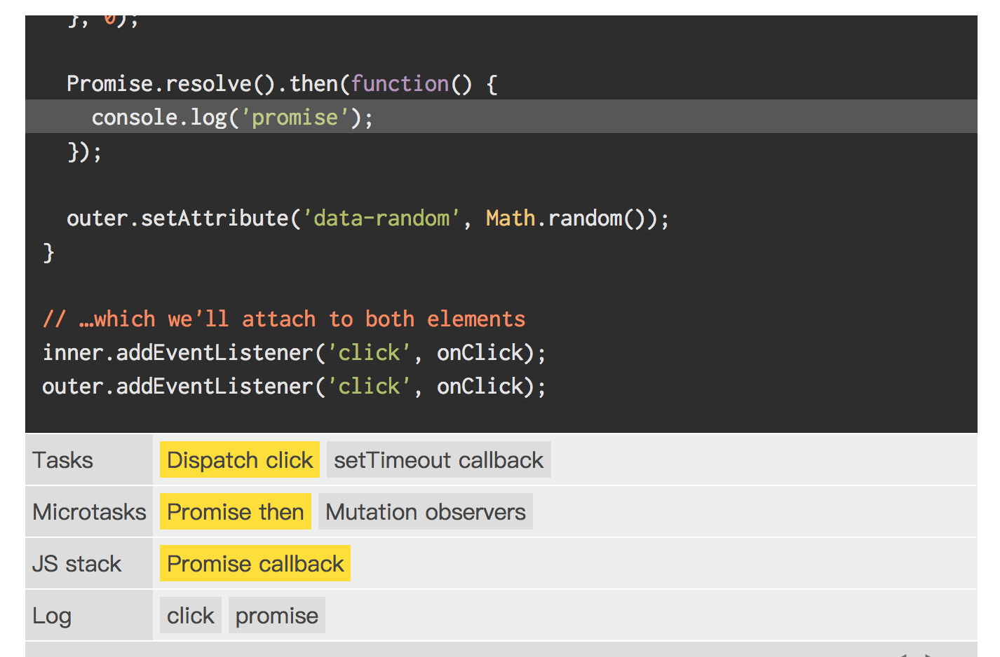
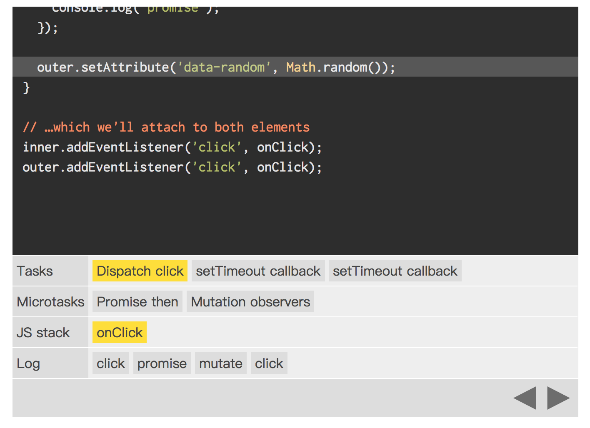
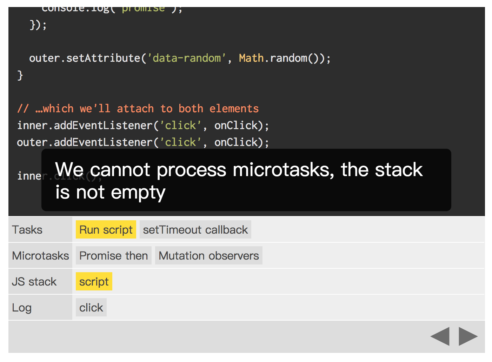
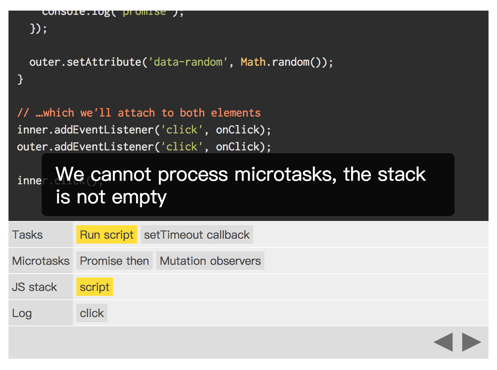

#### 1.浏览器的事件循环详解（Event Loop）？
一个事件循环有一个或者多个任务队列（task queues）。任务队列是task的有序列表，这些task是以下工作的对应算法：`Events(比如下面的例子中的click事件的触发就是Task)`，Parsing，Callbacks，Using a resource，Reacting to DOM manipulation。

每一个任务都来自一个特定的`任务源`（task source）。所有来自一个特定任务源并且属于特定事件循环的任务，通常必须被加入到同一个任务队列中，但是来自不同任务源的任务可能会放在不同的任务队列中。

举个例子，用户代理有一个处理鼠标和键盘事件的任务队列。用户代理可以给这个队列比其他队列多3/4的执行时间，以确保交互的响应而不让其他任务队列饿死（starving），并且不会乱序处理任何一个任务队列的事件。

`每个事件循环`都有一个进入microtask检查点（performing a microtask checkpoint）的flag标志，这个标志初始为false。它被用来组织反复调用‘进入microtask检查点’的算法。总结一下，一个事件循环里有很多个任务队列（task queues）来自不同任务源，每一个任务队列里的任务是严格按照先进先出的顺序执行的，但是不同任务队列的任务的执行顺序是不确定的。按我的理解就是，浏览器会自己调度不同任务队列。网上很多文章会提到macrotask这个概念，其实就是指代了标准里阐述的task。

标准同时还提到了microtask的概念，也就是微任务。看一下标准阐述的事件循环的进程模型：
<pre>
1.选择当前要执行的任务队列，选择一个最先进入任务队列的任务，如果`没有任务可以选择(如果任务已经执行完毕，直接跳转到microtasks步骤，否则执行第2步)`，则会跳转至microtask的执行步骤。
2.将事件循环的当前运行任务设置为已选择的任务。
3.运行任务。
4.将事件循环的当前运行任务设置为null。
5.将运行完的任务从任务队列中移除。
6.microtasks步骤：进入microtask检查点（performing a microtask checkpoint ）。
7.更新界面渲染。
8.返回第一步。   
</pre>

执行进入microtask检查点时，用户代理会执行以下步骤：
<pre>
1.设置进入microtask检查点的标志为true。
2.当事件循环的微任务队列不为空时：选择一个最先进入microtask队列的microtask；设置事件循环的当前运行任务为已选择的microtask；运行microtask；设置事件循环的当前运行任务为null；将运行结束的microtask从microtask队列中移除。
3.对于相应事件循环的每个环境设置对象（environment settings object）,通知它们哪些promise为rejected。
4.清理indexedDB的事务。
5.设置进入microtask检查点的标志为false。    
</pre>


现在我们知道了。在事件循环中，用户代理会不断从`task队列`中按顺序取task执行，每执行完一个task都会检查microtask队列是否为空（执行完一个task的具体标志是`函数执行栈`为空），如果不为空则会一次性执行完所有microtask。然后再进入下一个循环去task队列中取下一个task执行...

那么哪些行为属于task或者microtask呢？标准没有阐述，但各种技术文章总结都如下：
<pre>
macrotasks: script(整体代码), setTimeout, setInterval, setImmediate, I/O, UI rendering
microtasks: process.nextTick, Promises, Object.observe(废弃), MutationObserver
</pre>

比如下面例子:
```js
console.log('script start');
setTimeout(function() {
  console.log('setTimeout');
}, 0);
Promise.resolve().then(function() {
  console.log('promise1');
}).then(function() {
  console.log('promise2');
});
console.log('script end');
```
运行结果是：
<pre>
script start
script end
promise1
promise2
setTimeout  
</pre>

解释如下:

1.一开始task队列中只有script，则script中所有函数放入函数执行栈执行，代码按顺序执行。
接着遇到了`setTimeout`,它的作用是0ms后将回调函数放入task队列中，也就是说这个函数将在`下一个事件循环`中执行（注意这时候setTimeout执行完毕就返回了）。

2.接着遇到了Promise，按照前面所述Promise属于microtask，所以第一个.then()会放入microtask队列。

3.当所有script代码执行完毕后，此时`函数执行栈(下面的例子的onclick调用函数执行栈不为空)`为空。开始检查microtask队列，此时队列不为空,执行.then()的回调函数输出'promise1'，由于.then()返回的依然是promise,所以第二个.then()会放入microtask队列继续执行,输出'promise2'。

4.此时microtask队列为空了，进入下一个事件循环，检查task队列发现了setTimeout的回调函数，立即执行回调函数输出'setTimeout'，代码执行完毕。

下面再给出一个例子:
```html
<div class="outer">
  <div class="inner"></div>
</div>
```
下面是js代码:
```js
// Let's get hold of those elements
var outer = document.querySelector('.outer');
var inner = document.querySelector('.inner');
// Let's listen for attribute changes on the
// outer element
new MutationObserver(function() {
  console.log('mutate');
}).observe(outer, {
  attributes: true
});
// Here's a click listener…
function onClick() {
  console.log('click');
  setTimeout(function() {
    console.log('timeout');
  }, 0);
  Promise.resolve().then(function() {
    console.log('promise');
  });
  outer.setAttribute('data-random', Math.random());
}
// …which we'll attach to both elements
inner.addEventListener('click', onClick);
outer.addEventListener('click', onClick);
```
此时打印结果为:
<pre>
click
promise
mutate
click
promise
mutate
timeout
timeout    
</pre>
解释一下过程：

点击inner输出'click'，Promise和设置outer属性会依次把Promise和MutationObserver推入microtask队列，setTimeout则会推入task队列。此时`执行栈为空`，虽然后面还有冒泡触发，但是此时microtask队列会先执行，所以依次输入'promise'和'mutate'。接下来事件冒泡再次触发事件，过程和开始一样。接着代码执行完毕，此时进入下一次事件循环，执行task队列中的任务，输出两个'timeout'。

好了，如果你理解了这个，那么现在换一下事件触发的方式。在上面的代码后面加上
```js
inner.click()
```
运行结果为:
<pre>
click
click
promise
mutate
promise
timeout
timeout
</pre>
造成这个差异的结果是什么呢？在前面的例子中，微任务是在事件处理函数之间来执行的。但是，如果你直接调用了`.click()`函数，那么事件是`同步触发`的，因此，此时调用`click()`方法的代码在多次回调的时候一直是在执行栈中的。这样，我们能够保证我们在执行js代码的时候不会被微任务打断。这样，我们在多次回调函数的过程中也就不会触发微任务的执行，微任务的执行被推迟到多个事件处理函数执行之后。上面对于执行过程的分析，可能会有如下的图表:



其中有一点需要注意:那就是"JS stack"部分，当Promise回调执行的时候其中就是"Promise callback"，而当Mutation observers被执行的时候就会是Mutation callback。也就是说JS stack中存放的是当前执行栈中执行的代码。同时，还有一点要注意:比如上面的inner/outer点击的事件例子，因为click会冒泡，`第一次click执行完毕以后会继续执行outer元素的click事件`,此时的事件执行过程会变成下面的状态:



而对于上面的`.onclick()`例子来说，初始的js stack状态为:


如果继续往下执行，你会看到如下的状态:



如果再继续执行，onClick事件处理函数又会继续放入"js Stack"中，而和上面通过手动点击触发click的不同之处在于:



即:"因为JS Stack没有处于空的状态，所以无法执行微任务，而本质原因在于此时`事件的触发是同步的`!"。

参考资料:

[Tasks, microtasks, queues and schedules](https://jakearchibald.com/2015/tasks-microtasks-queues-and-schedules/)

[什么是浏览器的事件循环（Event Loop）？](https://segmentfault.com/a/1190000010622146)
