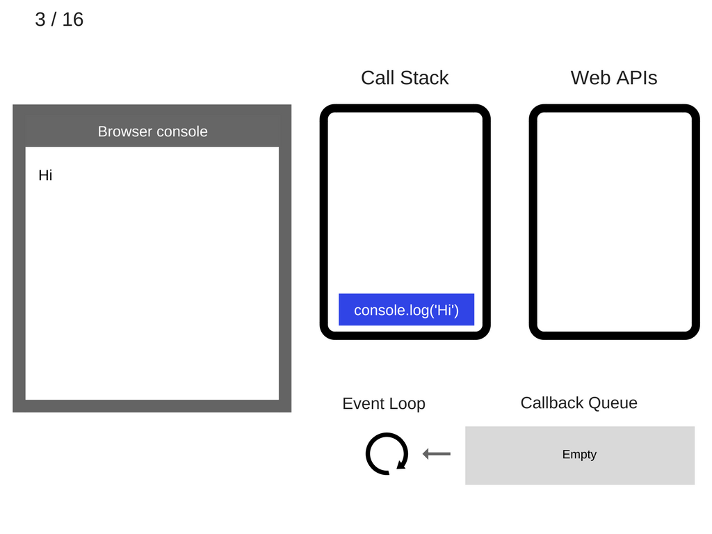
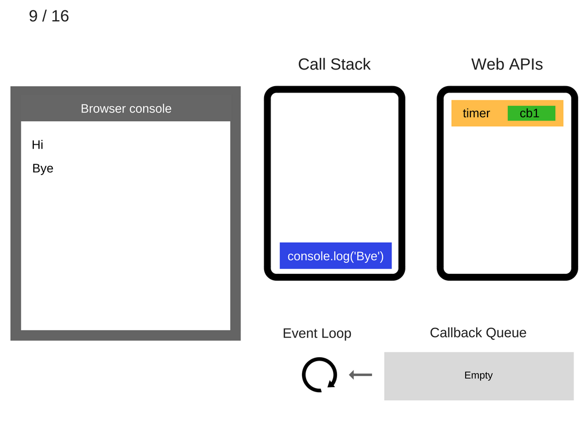
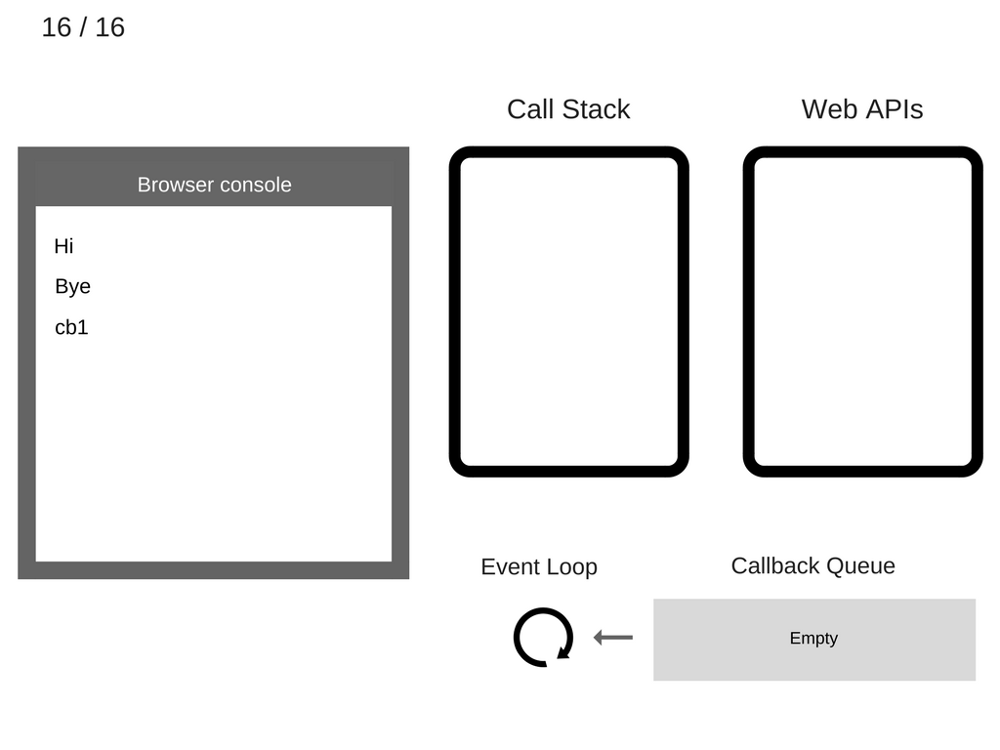

#### 1.生产者与消费者理解事件循环
工作线程是生产者，主线程是消费者(只有一个消费者)。工作线程执行`异步任务(产生事件)`，执行完成后把对应的回调函数封装成为一条消息放在消息队列中。主线程源源不断的从消息队列中取消息并执行。当消息队列为空的时候主线程会阻塞，直到消息队列再次非空。
```js
while(true){
  var message = queue.get();
  execute(message);
}
```
#### 2.浏览器的事件循环深入详解（Event Loop）？
一个事件循环有一个或者多个任务队列（task queues）。任务队列是task的有序列表，这些task是以下工作的对应算法：`Events(比如下面的例子中的click事件的触发就是Task)`，Parsing，Callbacks，Using a resource，Reacting to DOM manipulation。

每一个任务都来自一个特定的`任务源`（task source）。所有来自一个特定任务源并且属于特定事件循环的任务，通常必须被加入到同一个任务队列中，但是来自不同任务源的任务可能会放在不同的任务队列中。

举个例子，用户代理有一个处理鼠标和键盘事件的任务队列。用户代理可以给这个队列比其他队列多3/4的执行时间，以确保交互的响应而不让其他任务队列饿死（starving），并且不会乱序处理任何一个任务队列的事件。

`每个事件循环`都有一个进入microtask检查点（performing a microtask checkpoint）的flag标志，这个标志初始为false。它被用来组织反复调用‘进入microtask检查点’的算法。总结一下，一个事件循环里有很多个任务队列（task queues）来自不同任务源，每一个任务队列里的任务是严格按照先进先出的顺序执行的，但是不同任务队列的任务的执行顺序是不确定的。按我的理解就是，浏览器会自己调度不同任务队列。网上很多文章会提到macrotask这个概念，其实就是指代了标准里阐述的task。

标准同时还提到了microtask的概念，也就是微任务。看一下标准阐述的事件循环的进程模型：
<pre>
1.选择当前要执行的任务队列，选择一个最先进入任务队列的任务，如果`没有任务可以选择(如果任务已经执行完毕，直接跳转到microtasks步骤，否则执行第2步)`，则会跳转至microtask的执行步骤。
2.将事件循环的当前运行任务设置为已选择的任务。
3.运行任务。
4.将事件循环的当前运行任务设置为null。
5.将运行完的任务从任务队列中移除。
6.microtasks步骤：进入microtask检查点（performing a microtask checkpoint ）。
7.更新界面渲染。
8.返回第一步。   
</pre>

执行进入microtask检查点时，用户代理会执行以下步骤：
<pre>
1.设置进入microtask检查点的标志为true。
2.当事件循环的微任务队列不为空时：选择一个最先进入microtask队列的microtask；设置事件循环的当前运行任务为已选择的microtask；运行microtask；设置事件循环的当前运行任务为null；将运行结束的microtask从microtask队列中移除。
3.对于相应事件循环的每个环境设置对象（environment settings object）,通知它们哪些promise为rejected。
4.清理indexedDB的事务。
5.设置进入microtask检查点的标志为false。    
</pre>


现在我们知道了。在事件循环中，用户代理会不断从`task队列`中按顺序取task执行，每执行完一个task都会检查microtask队列是否为空（执行完一个task的具体标志是`函数执行栈`为空），如果不为空则会一次性执行完所有microtask。然后再进入下一个循环去task队列中取下一个task执行...

那么哪些行为属于task或者microtask呢？标准没有阐述，但各种技术文章总结都如下：
<pre>
macrotasks: script(整体代码), setTimeout, setInterval, setImmediate, I/O, UI rendering
microtasks: process.nextTick, Promises, Object.observe(废弃), MutationObserver
</pre>

比如下面例子:
```js
console.log('script start');
setTimeout(function() {
  console.log('setTimeout');
}, 0);
Promise.resolve().then(function() {
  console.log('promise1');
}).then(function() {
  console.log('promise2');
});
console.log('script end');
```
运行结果是：
<pre>
script start
script end
promise1
promise2
setTimeout  
</pre>

解释如下:

1.一开始task队列中只有script，则script中所有函数放入函数执行栈执行，代码按顺序执行。
接着遇到了`setTimeout`,它的作用是0ms后将回调函数放入task队列中，也就是说这个函数将在`下一个事件循环`中执行（注意这时候setTimeout执行完毕就返回了）。

2.接着遇到了Promise，按照前面所述Promise属于microtask，所以第一个.then()会放入microtask队列。

3.当所有script代码执行完毕后，此时`函数执行栈(下面的例子的onclick调用函数执行栈不为空)`为空。开始检查microtask队列，此时队列不为空,执行.then()的回调函数输出'promise1'，由于.then()返回的依然是promise,所以第二个.then()会放入microtask队列继续执行,输出'promise2'。

4.此时microtask队列为空了，进入下一个事件循环，检查task队列发现了setTimeout的回调函数，立即执行回调函数输出'setTimeout'，代码执行完毕。

下面再给出一个例子:
```html
<div class="outer">
  <div class="inner"></div>
</div>
```
下面是js代码:
```js
// Let's get hold of those elements
var outer = document.querySelector('.outer');
var inner = document.querySelector('.inner');
// Let's listen for attribute changes on the
// outer element
new MutationObserver(function() {
  console.log('mutate');
}).observe(outer, {
  attributes: true
});
// Here's a click listener…
function onClick() {
  console.log('click');
  setTimeout(function() {
    console.log('timeout');
  }, 0);
  Promise.resolve().then(function() {
    console.log('promise');
  });
  outer.setAttribute('data-random', Math.random());
}
// …which we'll attach to both elements
inner.addEventListener('click', onClick);
outer.addEventListener('click', onClick);
```
此时打印结果为:
<pre>
click
promise
mutate
click
promise
mutate
timeout
timeout    
</pre>
解释一下过程：

点击inner输出'click'，Promise和设置outer属性会依次把Promise和MutationObserver推入microtask队列，setTimeout则会推入task队列。此时`执行栈为空`，虽然后面还有冒泡触发，但是此时microtask队列会先执行，所以依次输入'promise'和'mutate'。接下来事件冒泡再次触发事件，过程和开始一样。接着代码执行完毕，此时进入下一次事件循环，执行task队列中的任务，输出两个'timeout'。

好了，如果你理解了这个，那么现在换一下事件触发的方式。在上面的代码后面加上
```js
inner.click()
```
运行结果为:
<pre>
click
click
promise
mutate
promise
timeout
timeout
</pre>
造成这个差异的结果是什么呢？在前面的例子中，微任务是在事件处理函数之间来执行的。但是，如果你直接调用了`.click()`函数，那么事件是`同步触发`的，因此，此时调用`click()`方法的代码在多次回调的时候一直是在执行栈中的。这样，我们能够保证我们在执行js代码的时候不会被微任务打断。这样，我们在多次回调函数的过程中也就不会触发微任务的执行，微任务的执行被推迟到多个事件处理函数执行之后。上面对于执行过程的分析，可能会有如下的图表:


其中有一点需要注意:那就是"JS stack"部分，当Promise回调执行的时候其中就是"Promise callback"，而当Mutation observers被执行的时候就会是Mutation callback。也就是说JS stack中存放的是当前执行栈中执行的代码。同时，还有一点要注意:比如上面的inner/outer点击的事件例子，因为click会冒泡，`第一次click执行完毕以后会继续执行outer元素的click事件`,此时的事件执行过程会变成下面的状态:


而对于上面的`.onclick()`例子来说，初始的js stack状态为:


如果继续往下执行，你会看到如下的状态:


如果再继续执行，onClick事件处理函数又会继续放入"js Stack"中，而和上面通过手动点击触发click的不同之处在于:


即:"因为JS Stack没有处于空的状态，所以无法执行微任务，而本质原因在于此时`事件的触发是同步的`!"。


#### 3.代码角度理解浏览器的事件循环？
##### 3.1 Callback Stack调用流程
例如，当你的javascript代码发起了一个Ajax请求去获取服务端的数据，你在回调函数中设置了response对象，此时相当于JS Engine告诉宿主环境:"Hi,我现在要暂停执行了，当你完成了这个网络请求同时获取到了数据，记得调用回调函数"。此时，我们的浏览器会监听是否有网络请求返回，当有数据返回了，那么它就会将我们的回调函数插入到事件循环中(Event Loop)。比如下图:


其实这里面最重要的就是:`Web API`。本质上，它们代表了特定的线程，我们无法直接访问它，但是我们可以调用它。他们是浏览器中那部分与并发相关的内容，如果你是Nodejs开发者，它们代表的是C++相关的API内容。那么事件循环到底指的的是什么?看下图:


其实Event Loop只干一件事:监听`Call Stack`和`Callback队列`，如果Call Stack已经空了，那么他就会从Callback队列中拿出第一个事件，然后将它推入到Call Stack中执行！每一个过程就是Event Loop中一次Tick，每一个事件就是一个函数回调。我们给出下面的代码执行过程:
```js
console.log('Hi');
setTimeout(function cb1() { 
    console.log('cb1');
}, 5000);
console.log('Bye');
```
首先第一个状态是浏览器的console控制台是空的，同时Call Stack的状态是空的:


接着`console.log('Hi')`被添加到Call Stack中:


然后`console.log('Hi')`被执行了，浏览器控制台打印出"Hi":



`console.log('Hi')`被执行完成后，将会从Call Stack中被移除:


接着`setTimeout(function cb1() { ... })`被添加到Call Stack中:


接着`setTimeout(function cb1() { ... })`被执行了，此时浏览器创建了一个Web APIs中的一个`Timer`,这个Timer将会为你处理倒计时操作:


接着`setTimeout(function cb1() { ... })`被执行完毕，同时从Call Stack中被移除:


接着`console.log('Bye')`被添加到Call Stack中:


然后`console.log('Bye')`被执行了，打印出'Bye':



接着`console.log('Bye')`从Call Stack中被移除了:


在5000ms以后，`Timer完成了`，然后将cb1这个回调函数从`Web APIs`推入到回调函数队列(Callback Queue)准备执行。


然后，`Event Loop(只干一件事:监听`Call Stack`和`Callback队列`，如果Call Stack已经空了，那么他就会从Callback队列中拿出第一个事件，然后将它推入到Call Stack中执行)`从回调队列中拿出cb1函数，并将它推入到调用栈Call Stack。如下图:


此时cb1被执行了，同时添加`console.log('cb1')`到Call Stack中:


此时，我们的`console.log('cb1')`被执行了，并打印`cb1`:


然后，我们的`console.log('cb1')`从Call Stack中被移除:


最后，我们的`cb1`回调函数也会从Call Stack中被移除:



而最终将所有流程串联起来的gif将会得到下面的图片:


##### 3.2 setTimeout如何工作
`setTimeout()`不会自动将回调放到`事件循环队列`中，而是设置一个Timer。当Timer到期，JS执行环境将会将回调放到事件循环队列中，事件循环的后续Tick将会自动执行该回调。比如下面的代码:
```js
setTimeout(myCallback, 1000);
```
并不表示`myCallback`将会在1000ms后执行，而是在1000ms后添加到事件循环队列。而事件循环队列可能有更早的回调已经被添加进去，因此此时的`myCallback`可能需要等待一段时间执行。而常见的`setTimeout(callback,0)`表示将回调函数推迟到Call Stack为空的时候执行。比如下面的例子:
```js
console.log('Hi');
setTimeout(function() {
    console.log('callback');
}, 0);
console.log('Bye');
```
此时`setTimeout`的第二个参数设置为0，此时浏览器的console将会打印如下的信息:
<pre>
Hi
Bye
callback
</pre>


#### 4.JS引擎 vs 执行环境 vs Call Stack
##### 4.1 内存堆和调用栈
我们的JS引擎包含两个部分:
<pre>
* Memory Heap — 和内存分配有关
* Call Stack — 代码执行时候的栈帧(数据栈中的数据帧)
</pre>

具体见下面:


##### 4.2 Runtime执行环境
在日常的开发中我们可能会遇到如`setTimeout`的方法，这些方法并不是JS引擎提供的。那么这些方法从哪里来的呢?请看下面的图:


因此，我们不仅含有JS引擎，真实的JS运行环境可能包含更多的内容。比如这里的`Web APIS`,这部分的内容`是浏览器`本身提供的，比如DOM(`上面的onload,onclick,onDown都与事件有关`)，AJAX,setTimeout等等。同时，我们还有广为人知的事件循环Event Loop和回调队列。

##### 4.3 Callback Stack调用栈(异步回调解决耗时调用)
JS是单线程的编程语言，这也意味着它只有一个Call Stack调用栈。因此，在同一时间只能做一件事情。调用栈是一个数据结构，其真实的记录`当前运行的代码`，如果进入一个函数，那么将该函数放在调用栈的顶部，如果函数返回了，那么该函数将会从调用栈顶部被移除，这些都是Call Stack完成的事情。比如下面的代码:
```js
function multiply(x, y) {
    return x * y;
}
function printSquare(x) {
    var s = multiply(x, x);
    console.log(s);
}
printSquare(5);
```
此时调用栈将会经历下面的过程:


上面的每一个状态都被称为栈帧(数据栈中的数据帧)。这也表明了当异常发生以后，stack track是如何构建的。比如下面的例子:
```js
function foo() {
    throw new Error('SessionStack will help you resolve crashes :)');
}
function bar() {
    foo();
}
function start() {
    bar();
}
start();
```
这个代码如果在chrome中运行，将会打印如下的错误栈(比如文件是foo.js):


因为JS只有一个堆栈，因此可能会看到如下的错误:

(1)“Blowing the stack(堆栈溢出)” — 当超过Call Stack最大的值，一般如死循环。比如下面的例子:
```js
function foo() {
    foo();
}
foo();
```
此时的调用栈如下:


(2)并发和事件循环(Concurrency & the Event Loop)

如果调用栈中某一个函数的执行消耗了大量的时间，此时浏览器无法去处理其他的事情，就会出现阻塞。比如无法render，也无法执行其他的js代码。此时浏览器可能出现下面的界面要求你终止网页:


那么，我们有什么方法解决在我们执行耗时的js的时候不会阻塞UI渲染？此时就需要我们的异步回调了(请参考上面的`第3点事件循环`内容)。


#### 5.V8中的js代码是如何执行的？
V8引擎一开始是为了提升在浏览中js的执行速度而设计的。为了提升速度，V8将js代码翻译为`机器码(是电脑的CPU可直接解读的数据,计算机可以直接执行，并且执行速度最快的代码)`，而`不是使用一个解析器`。和其他浏览器，如SpiderMonkey，Rhino (Mozilla)一样，通过实现JIT (Just-In-Time)编译器，它在js代码执行的过程中将它转化为机器码。而和其他浏览器不一样的地方是，V8不会产生`字节码(字节码是一种中间码，它比机器码更抽象，需要直译器转译后才能成为机器码的中间代码。字节码的典型应用为Java bytecode)`，或者其他的`中间码`。

在V5.9之前V8使用了两个Compiler:

<pre>
  full-codegen:一个很简单但是很快的解析器，用于产生简单但是运行相对较慢的机器码
  Crankshaft:一个复杂的(Just-In-Time)优化的解析器，用于产生高度优化后的机器码
</pre>

V8引擎在内部也使用了多个线程:
<pre>
主线程:获取你的代码，编译并执行
其他线程:编译代码，这样当其他线程在优化代码的时候主线程能够保持执行
Profiler线程:告诉执行环境那个方法消耗了大量的时间，这样Crankshaft编译器能够优化它
垃圾回收线程:用于垃圾回收
</pre>

当首次执行JS代码的时候，V8使用full-codegen这个解析器将解析后的JS代码直接转化为机器码。这样，V8能够快速执行机器码。注意:V8不会使用中间码，因此不需要一个编译器(类似于java虚拟机)。

当你的代码执行了一段时间，我们的`Profile线程`已经收集了足够多的数据,可以用于判断哪些方法应该被优化。此时，Crankshaft在一个新的线程中开始优化代码。它将JS的AST抽象语法树转化为更高级别的static single-assignment (SSA)，也被称为`Hydrogen`。同时对Hydrogen进行优化，很多类型的优化都是在此时完成的。

参考资料:

[Tasks, microtasks, queues and schedules](https://jakearchibald.com/2015/tasks-microtasks-queues-and-schedules/)

[什么是浏览器的事件循环（Event Loop）？](https://segmentfault.com/a/1190000010622146)

[JS 单线程和事件循环](https://www.cnblogs.com/SamWeb/p/6434889.html)

[精读《Javascript 事件循环与异步》](https://zhuanlan.zhihu.com/p/30744300)

[How JavaScript works: Event loop and the rise of Async programming + 5 ways to better coding with async/await](https://blog.sessionstack.com/how-javascript-works-event-loop-and-the-rise-of-async-programming-5-ways-to-better-coding-with-2f077c4438b5)

[How JavaScript works: an overview of the engine, the runtime, and the call stack](https://blog.sessionstack.com/how-does-javascript-actually-work-part-1-b0bacc073cf)

[How JavaScript works: inside the V8 engine + 5 tips on how to write optimized code](https://blog.sessionstack.com/how-javascript-works-inside-the-v8-engine-5-tips-on-how-to-write-optimized-code-ac089e62b12e)

[How JavaScript works: memory management + how to handle 4 common memory leaks](https://blog.sessionstack.com/how-javascript-works-memory-management-how-to-handle-4-common-memory-leaks-3f28b94cfbec)

[机器码和字节码](https://www.cnblogs.com/qiumingcheng/p/5400265.html)
